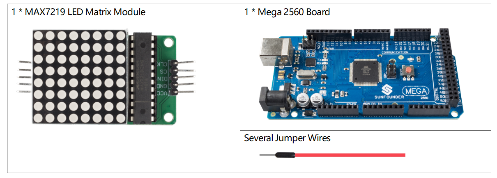
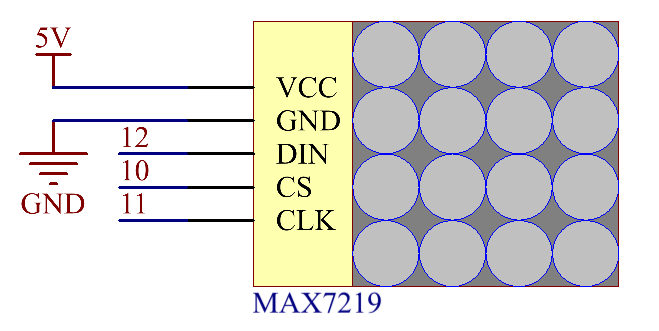
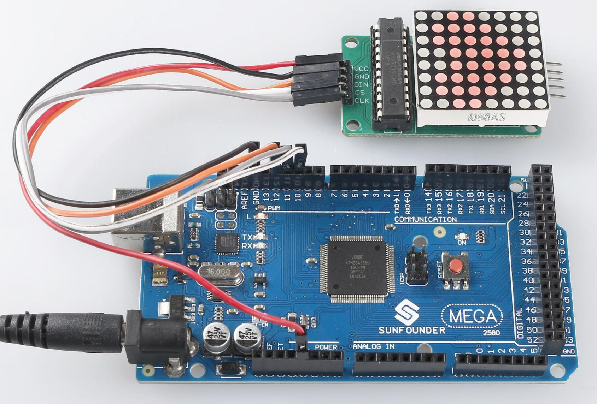

.. note:: 

    Ciao, benvenuto nella comunità di appassionati di SunFounder Raspberry Pi & Arduino & ESP32 su Facebook! Approfondisci Raspberry Pi, Arduino ed ESP32 con altri appassionati.

    **Perché unirti?**

    - **Supporto esperto**: Risolvi problemi post-vendita e sfide tecniche con l'aiuto della nostra comunità e del nostro team.
    - **Impara e condividi**: Scambia consigli e tutorial per migliorare le tue competenze.
    - **Anteprime esclusive**: Ottieni accesso anticipato a nuovi annunci di prodotti e anteprime.
    - **Sconti speciali**: Approfitta di sconti esclusivi sui nostri prodotti più recenti.
    - **Promozioni festive e concorsi**: Partecipa a concorsi e promozioni speciali durante le festività.

    👉 Sei pronto a esplorare e creare con noi? Clicca su [|link_sf_facebook|] e unisciti oggi!

.. _ar_matrix_module:

2.8 Modulo Matrice LED
======================

Panoramica
------------

In questa lezione imparerai a utilizzare il Modulo Matrice LED. 
Il Modulo Matrice LED utilizza il driver MAX7219 per gestire la 
matrice LED 8 x 8.

Componenti Necessari
-----------------------

* :ref:`cpn_mega2560`
* :ref:`cpn_wires`
* :ref:`cpn_matrix_module`

Circuito con Fritzing
-----------------------

In questo esempio, colleghiamo il pin VCC del MAX7219 a 5V, GND a terra, 
DIN al pin digitale 12, CS al pin digitale 10 e CLK al pin digitale 11.

.. image:: img/image443.png

Schema del Circuito
---------------------

Codice
--------

.. note::

    * Puoi aprire direttamente il file ``2.8_ledMatrix.ino`` che si trova nel percorso ``sunfounder_vincent_kit_for_arduino\code\2.8_ledMatrix``.
    * Qui viene utilizzata la libreria ``LedControl``, che puoi installare tramite il **Library Manager**.

        .. image:: img/lib_ledcontrol.png
            :align: center
    

.. raw:: html

    <iframe src=https://create.arduino.cc/editor/sunfounder01/189a15e4-a81f-43f2-8618-3d565901f285/preview?embed style="height:510px;width:100%;margin:10px 0" frameborder=0></iframe>

Dopo aver caricato il codice, vedrai che i LED si accendono in sequenza in una colonna, una riga, un punto o che appare un'immagine sulla matrice LED.

Analisi del Codice
-------------------

Grazie alla libreria LedControl.h, è possibile utilizzare facilmente la matrice LED.

.. code-block:: arduino

    #include "LedControl.h"

**Funzioni della Libreria**：

.. code-block:: arduino

    LedControl(int dataPin,int clockPin,int csPin,int numDevices)

Crea un'istanza del tipo LedControl attraverso cui comunichiamo con i dispositivi MAX7219. L'inizializzazione di un LedControl richiede 4 argomenti.

* ``dataPin,clockPin,csPin``: I primi 3 argomenti sono i numeri di pin sull'Arduino che sono collegati al MAX7219. Puoi scegliere liberamente qualsiasi pin digitale sull'Arduino, ma poiché alcuni pin vengono utilizzati per la comunicazione seriale o hanno un LED collegato, è meglio evitare i pin 0, 1 e 13.

* ``numDevices``: Il quarto argomento è il numero di dispositivi MAX7219 in cascata che stai utilizzando con questo LedControl. La libreria può gestire fino a 8 dispositivi da una singola variabile LedControl.

.. code-block:: arduino

    void shutdown(int addr, bool b)

* ``addr``: L'indirizzo del display da controllare.
* ``b``: Se true, il dispositivo entra in modalità power-down. Se false, il dispositivo entra in modalità operativa normale.

.. code-block:: arduino

    void setIntensity(int addr, int intensity)

Questo metodo consente di controllare la luminosità in 16 livelli discreti. 
Valori più grandi rendono il display più luminoso fino al massimo di 15.

* ``addr``: L'indirizzo del display da controllare.
* ``intensity``: La luminosità del display. Sono validi solo valori compresi tra 0 (più scuro) e 15 (più luminoso).

.. code-block:: arduino

    void clearDisplay(int addr)

Spegne tutti i LED.

* ``addr``: L'indirizzo del display da controllare.

.. code-block:: arduino

    void setLed(int addr, int row, int col, boolean state)

Imposta lo stato di un singolo LED.

* ``addr``: L'indirizzo del display da controllare.
* ``row``: La riga del LED (0..7).
* ``col``: La colonna del LED (0..7).
* ``state``: Se true, il LED è acceso; se false, è spento.

.. code-block:: arduino

    void setRow(int addr, int row, byte value)

Imposta lo stato di tutti gli 8 LED in una riga.

* ``addr``: L'indirizzo del display da controllare.
* ``row``: La riga da impostare (0..7).
* ``value``: Ogni bit impostato a 1 accenderà il LED corrispondente. (ad es. B01000000 accenderà il secondo LED).

.. code-block:: arduino

    void setColumn(int addr, int col, byte value)

Imposta lo stato di tutti gli 8 LED in una colonna.

* ``addr``: L'indirizzo del display da controllare.
* ``col``: La colonna da impostare (0..7).
* ``value``: Ogni bit impostato a 1 accenderà il LED corrispondente. (ad es. B01000000 accenderà il secondo LED).

Immagine del Fenomeno
------------------------

