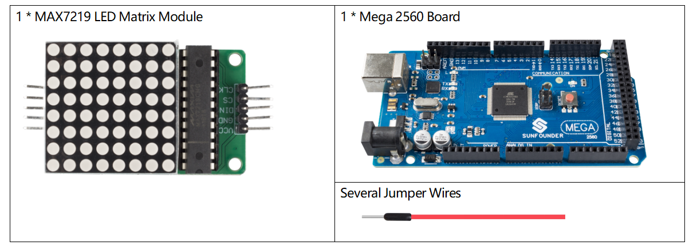

.. _ar_matrix_module:

2.8 LED-Matrix-Modul
======================

Überblick
---------------------

In dieser Lektion lernen Sie das LED-Matrix-Modul kennen. Das LED-Matrix-Modul verwendet den MAX7219-Treiber zur Ansteuerung der 8 x 8 LED-Matrix.

Erforderliche Komponenten
-------------------------------

* :ref:`cpn_mega2560`
* :ref:`cpn_wires`
* :ref:`cpn_matrix_module`

Fritzing-Schaltung
--------------------------

In diesem Beispiel wird der VCC-Pin von MAX7219 mit 5 V, GND mit Masse, DIN mit Digital-Pin 12, CS mit Digital-Pin 10, CLK mit Digital-Pin 11 verbunden.

Schematische Darstellung
---------------------------------

.. image:: img/image444.png

Code
-------

.. note::

    * Sie können die Datei ``2.8_ledMatrix.ino`` unter dem Pfad ``sunfounder_vincent_kit_for_arduino\code\2.8_ledMatrix`` direkt öffnen.
    * Oder kopieren Sie diesen Code in Arduino IDE 1/2.
    * Laden Sie dann :ref:`ar_upload_code` auf das Board hoch.
    * Bitte stellen Sie sicher, dass Sie die Bibliothek ``LedControl`` hinzugefügt haben, detaillierte Anleitungen finden Sie unter :ref:`add_libraries_ar`.

.. raw:: html

    <iframe src=https://create.arduino.cc/editor/sunfounder01/189a15e4-a81f-43f2-8618-3d565901f285/preview?embed style="height:510px;width:100%;margin:10px 0" frameborder=0></iframe>

Nachdem die Codes hochgeladen wurden, können Sie sehen, dass die LEDs in der Reihenfolge einer Spalte, einer Zeile oder eines Punktes aufleuchten oder dass ein Bild auf der LED-Matrix erscheint.

Code-Analyse
---------------

Durch den Aufruf der Bibliothek LedControl.h können Sie die LED-Matrix einfach verwenden.

.. code-block:: arduino

    #include "LedControl.h"

**Bibliotheksfunktionen:**

.. code-block:: arduino

    LedControl(int dataPin,int clockPin,int csPin,int numDevices)

Erstellen Sie eine Instanz vom Typ LedControl, über die wir mit den MAX7219-Geräten sprechen. Die Initialisierung eines LedControl benötigt 4 Argumente.

* ``dataPin,clockPin,csPin``: Die ersten 3 Argumente sind die Pin-Nummern auf dem Arduino, die mit dem MAX7219 verbunden sind. Sie können jeden der digitalen IO-Pins auf dem Arduino frei wählen, aber da einige der Pins auch für die serielle Kommunikation verwendet werden oder eine LED daran angeschlossen ist, vermeiden Sie am besten Pin 0,1 und 13.
* ``numDevices``: Das vierte Argument ist die Anzahl der kaskadierten MAX7219-Geräte, die Sie mit dieser LedControl verwenden. Die Bibliothek kann bis zu 8 Geräte von einer einzigen LedControl-Variablen aus ansprechen.

.. code-block:: arduino

    void shutdown(int addr, bool b)

* ``addr``: Die Adresse des zu steuernden Displays.
* ``b``: Wenn wahr, geht das Gerät in den Power-Down-Modus. Wenn das falsche Gerät in den Normalbetrieb geht.

.. code-block:: arduino

    void setIntensity(int addr, int intensity)

Mit der Methode können Sie die Helligkeit in 16 diskreten Schritten steuern. Größere Werte machen die Anzeige heller bis maximal 15.

* ``addr``: Die Adresse des zu steuernden Displays.
* ``intensity``: die Helligkeit des Displays. Nur Werte zwischen 0 (am dunkelsten) und 15 (am hellsten) sind gültig.

.. code-block:: arduino

    void clearDisplay(int addr)

Danach sind alle LEDs aus.

* ``addr``: Die Adresse des zu steuernden Displays.

.. code-block:: arduino

    void setLed(int addr, int row, int col, boolean state)

Stellen Sie den Status einer einzelnen LED ein.

* ``addr``: Die Adresse des zu steuernden Displays.
* ``row``: Die Zeile der Led (0..7).
* ``col``: Die Spalte der LED (0..7).
* ``state``:Bei True ist die LED eingeschaltet, bei False ist sie ausgeschaltet.

.. code-block:: arduino

    void setRow(int addr, int row, byte value)

Setzen Sie alle 8 LEDs in einer Reihe auf einen neuen Zustand.

* ``addr``: Die Adresse des zu steuernden Displays.
* ``row``: Zeile die gesetzt werden soll (0..7).
* ``value``: EJedes auf 1 gesetzte Bit lässt die entsprechende LED leuchten (z. B. B01000000 leuchtet die 2.).

.. code-block:: arduino

    void setColumn(int addr, int col, byte value)

Setzen Sie alle 8 LEDs in einer Reihe auf einen neuen Zustand.

* ``addr``: Die Adresse des zu steuernden Displays.
* ``col``: Spalte die gesetzt werden soll (0..7).
* ``value``: Jedes auf 1 gesetzte Bit lässt die entsprechende LED leuchten (z. B. B01000000 leuchtet die 2.).

Phänomen Bild
------------------

