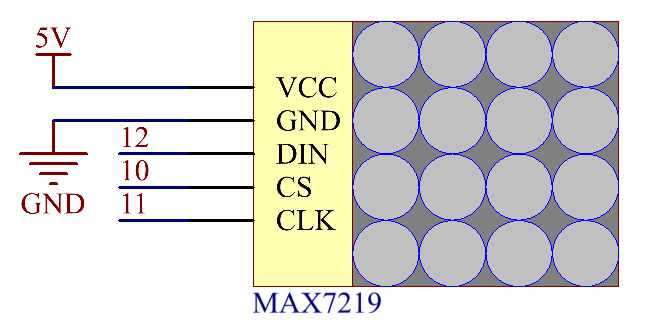

.. _ar_matrix_module:

2.8 LED Matrix Module
======================

Overview
--------

In this lesson, you will learn about LED Matrix Module. LED Matrix
Module uses the MAX7219 driver to drive the 8 x 8 LED Matrix.

Components Required
-------------------

.. image:: img/list_2.8.png

* :ref:`cpn_mega2560`
* :ref:`cpn_wires`
* :ref:`cpn_matrix_module`

Fritzing Circuit
----------------

In this example, we get the VCC pin of MAX7219 connected to 5V, GND to
ground, DIN to digital pin 12, CS to digital pin 10, CLK to digital pin11.

.. image:: img/image443.png

Schematic Diagram
-----------------

Code
----

.. note::

    * You can open the file ``2.8_ledMatrix.ino`` under the path of ``sunfounder_vincent_kit_for_arduino\code\2.8_ledMatrix`` directly.
    * Or copy this code into Arduino IDE 1/2.
    * Then :ref:`ar_upload_code` to the board.
    * Please make sure you have added the library called ``LedControl``, detailed tutorials refer to :ref:`add_libraries_ar`.

.. raw:: html

    <iframe src=https://create.arduino.cc/editor/sunfounder01/189a15e4-a81f-43f2-8618-3d565901f285/preview?embed style="height:510px;width:100%;margin:10px 0" frameborder=0></iframe>

After the codes are uploaded, you can see that the LEDs turn on in the sequence of a column, a row or a dot or there is a picture appearing on the LED matrix.  

Code Analysis
-------------

By calling the library LedControl.h, you can easily use the LED matrix.

.. code-block:: arduino

    #include "LedControl.h"

**Library Functions**：

.. code-block:: arduino

    LedControl(int dataPin,int clockPin,int csPin,int numDevices)

Create an instance of type LedControl through which we talk to the
MAX7219 devices. The initialization of an LedControl takes 4 arguments.

* ``dataPin,clockPin,csPin``: The first 3 arguments are the pin-numbers on the Arduino that are connected to the MAX7219. You are free to choose any of the digital IO-pins on the arduino, but since some of the pins are also used for serial communication or have a led attached to them its best to avoid pin 0,1 and 13.

* ``numDevices``: The fourth argument is the number of cascaded MAX7219 devices you're using with this LedControl. The library can address up to 8 devices from a single LedControl-variable.

.. code-block:: arduino

    void shutdown(int addr, bool b)

* ``addr``: The address of the display to control.
* ``b``: If true the device goes into power-down mode. If false device goes into normal operation.

.. code-block:: arduino

    void setIntensity(int addr, int intensity)

Themethod lets you control brightness in 16 discrete steps. Larger
values make the display brighter up to the maximum of 15.

* ``addr``: The address of the display to control.
* ``intensity``: the brightness of the display. Only values between 0(darkest) and 15(brightest) are valid.

.. code-block:: arduino

    void clearDisplay(int addr)

All LEDs off after this one.

* ``addr``: The address of the display to control.

.. code-block:: arduino

    void setLed(int addr, int row, int col, boolean state)

Set the status of a single Led.

* ``addr``: The address of the display to control.
* ``row``: The row of the Led (0..7).
* ``col``: The column of the Led (0..7).
* ``state``: If true the led is switched on, if false it is switched off.

.. code-block:: arduino

    void setRow(int addr, int row, byte value)

Set all 8 LEDs in a row to a new state.

* ``addr``: The address of the display to control.
* ``row``: Row which is to be set (0..7).
* ``value``: Each bit set to 1 will light up the corresponding Led.(e.g. B01000000 will light up the 2nd).

.. code-block:: arduino

    void setColumn(int addr, int col, byte value)

Set all 8 LEDs in a row to a new state.

* ``addr``: The address of the display to control.
* ``col``: Column which is to be set (0..7).
* ``value``: Each bit set to 1 will light up the corresponding Led.(e.g. B01000000 will light up the 2nd).

Phenomenon Picture
------------------

.. image:: img/image109.jpeg