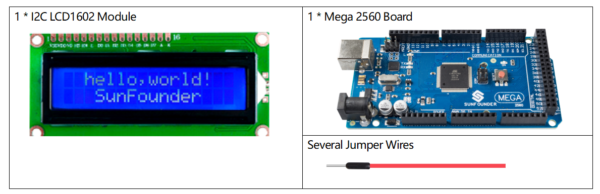
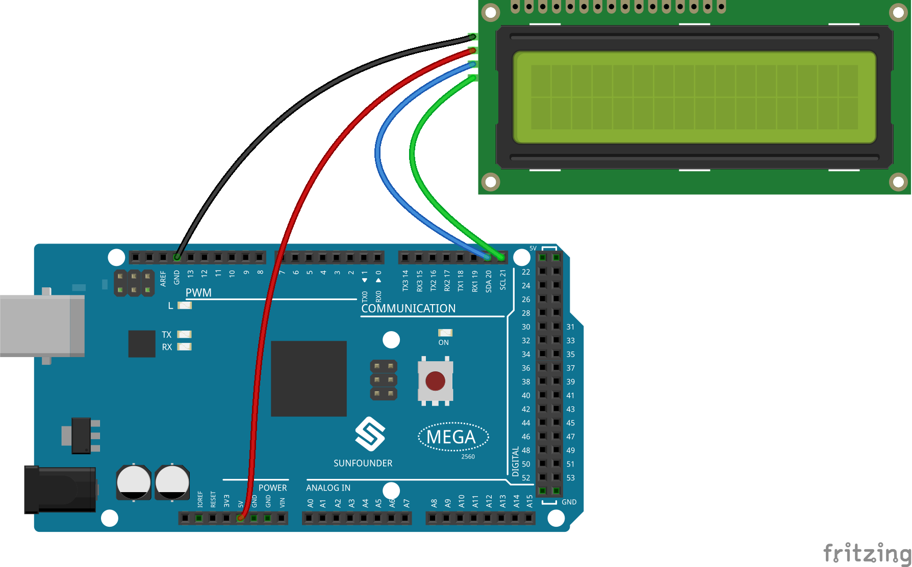
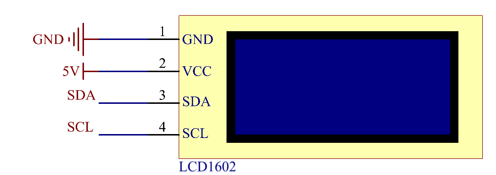
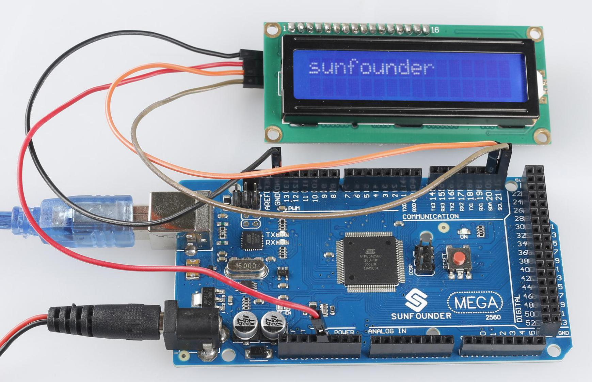

.. note:: 

    Bonjour et bienvenue dans la communauté des passionnés de Raspberry Pi, Arduino et ESP32 de SunFounder sur Facebook ! Plongez dans l’univers du Raspberry Pi, d'Arduino et de l'ESP32 avec d'autres passionnés.

    **Pourquoi nous rejoindre ?**

    - **Assistance d'experts** : Résolvez vos problèmes post-achat et défis techniques grâce à l'aide de notre communauté et de notre équipe.
    - **Apprendre et partager** : Échangez des astuces et tutoriels pour améliorer vos compétences.
    - **Aperçus exclusifs** : Accédez en avant-première aux annonces de nouveaux produits et aux aperçus.
    - **Réductions spéciales** : Profitez de réductions exclusives sur nos derniers produits.
    - **Promotions et concours festifs** : Participez à des concours et promotions durant les fêtes.

    👉 Prêt à explorer et créer avec nous ? Cliquez sur [|link_sf_facebook|] et rejoignez-nous dès aujourd'hui !

.. _ar_lcd1602:

2.9 Module LCD1602 I2C
========================

Aperçu
----------

Dans cette leçon, vous allez apprendre à utiliser le LCD1602. Le LCD1602, 
ou écran à cristaux liquides de type caractères 1602, est un module à matrice 
de points permettant d'afficher des lettres, des chiffres, des caractères, etc.

Composants requis
-------------------

* :ref:`cpn_mega2560`
* :ref:`cpn_wires`
* :ref:`cpn_i2c_lcd1602`

Schéma de connexion
-----------------------

Dans cet exemple, connectez la première broche GND du LCD1602 à la masse, 
la deuxième broche VCC à 5V, la troisième broche SDA à la broche SDA 20 et 
la quatrième broche SCL à la broche SCL 21.

Schéma électronique
----------------------

.. note::
    Les broches SDA et SCL de la carte Mega2560 correspondent aux broches 20 et 21.

Code
----

.. note::

    * Vous pouvez ouvrir directement le fichier ``2.9_i2clcd1602.ino`` situé dans le chemin ``sunfounder_vincent_kit_for_arduino\code\2.9_i2clcd1602``.
    * La bibliothèque ``LiquidCrystal I2C`` est utilisée ici, vous pouvez l'installer via le **Gestionnaire de Bibliothèques**.

        .. image:: img/lib_liquidcrystal_i2c.png
            :align: center

.. raw:: html

    <iframe src=https://create.arduino.cc/editor/sunfounder01/ca004845-7cd3-4fec-a85c-732a1a23c8b6/preview?embed style="height:510px;width:100%;margin:10px 0" frameborder=0></iframe>

Téléversez le code sur la carte Mega2560, le contenu que vous saisissez dans le moniteur série sera affiché sur le LCD. 

.. note::
    Pour le code ASCII et l'entrée de caractères dans le moniteur série, référez-vous à :ref:`ar_serial_read`.

Analyse du Code
----------------

En utilisant la bibliothèque LiquidCrystal_I2C.h, vous pouvez facilement contrôler le LCD.

.. code-block:: arduino

    #include "LiquidCrystal_I2C.h"

**Fonctions de la bibliothèque：**

.. code-block:: arduino

    LiquidCrystal_I2C(uint8_t lcd_Addr,uint8_t lcd_cols,uint8_t lcd_rows)

Crée une nouvelle instance de la classe LiquidCrystal_I2C qui représente un 
LCD particulier attaché à votre carte Arduino.

* ``lcd_Addr``: L'adresse du LCD, par défaut 0x27.
* ``lcd_cols``: Le LCD1602 a 16 colonnes.
* ``lcd_rows``: Le LCD1602 a 2 lignes.

.. code-block:: arduino

    void init()

Initialise le LCD.

.. code-block:: arduino

    void backlight()

Allume le rétroéclairage (optionnel).

.. code-block:: arduino

    void nobacklight()

Éteint le rétroéclairage (optionnel).

.. code-block:: arduino

    void display()

Allume l'affichage LCD.

.. code-block:: arduino

    void nodisplay()

Éteint rapidement l'affichage LCD.

.. code-block:: arduino

    void clear()

Efface l'affichage et place le curseur à zéro.

.. code-block:: arduino

    void setCursor(uint8_t col,uint8_t row)

Positionne le curseur à col, ligne.

.. code-block:: arduino

    void print(data,BASE)

Affiche du texte sur le LCD.

* ``data``: Les données à afficher (char, byte, int, long ou string).
* ``BASE (optionnel)``: La base dans laquelle imprimer les nombres : BIN pour binaire (base 2), DEC pour décimal (base 10), OCT pour octal (base 8), HEX pour hexadécimal (base 16).

Illustration du Phénomène
-------------------------------

