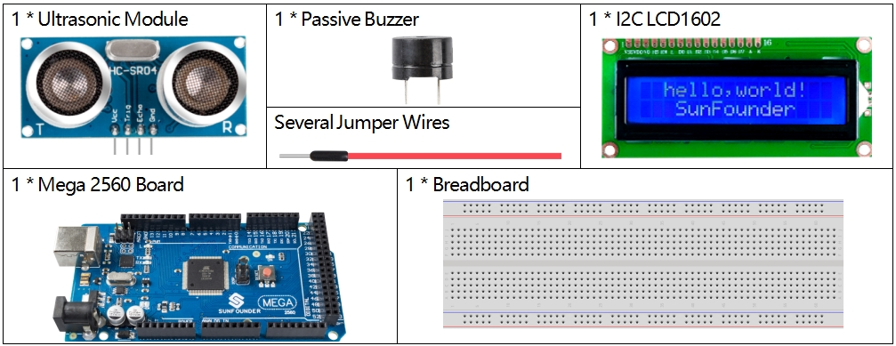
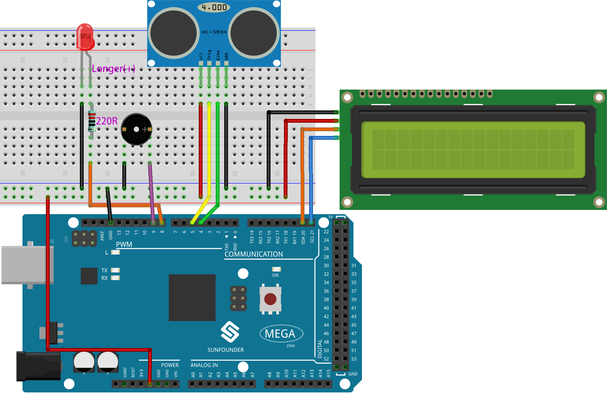
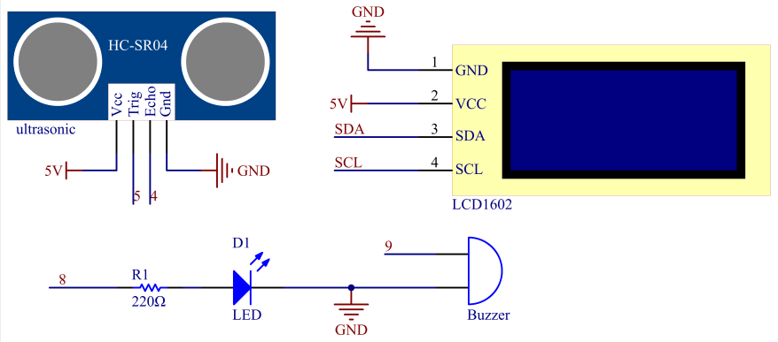
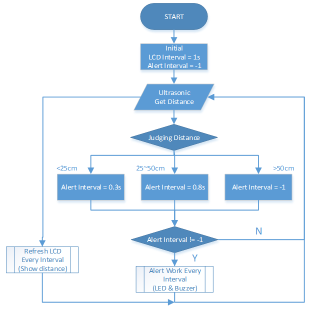
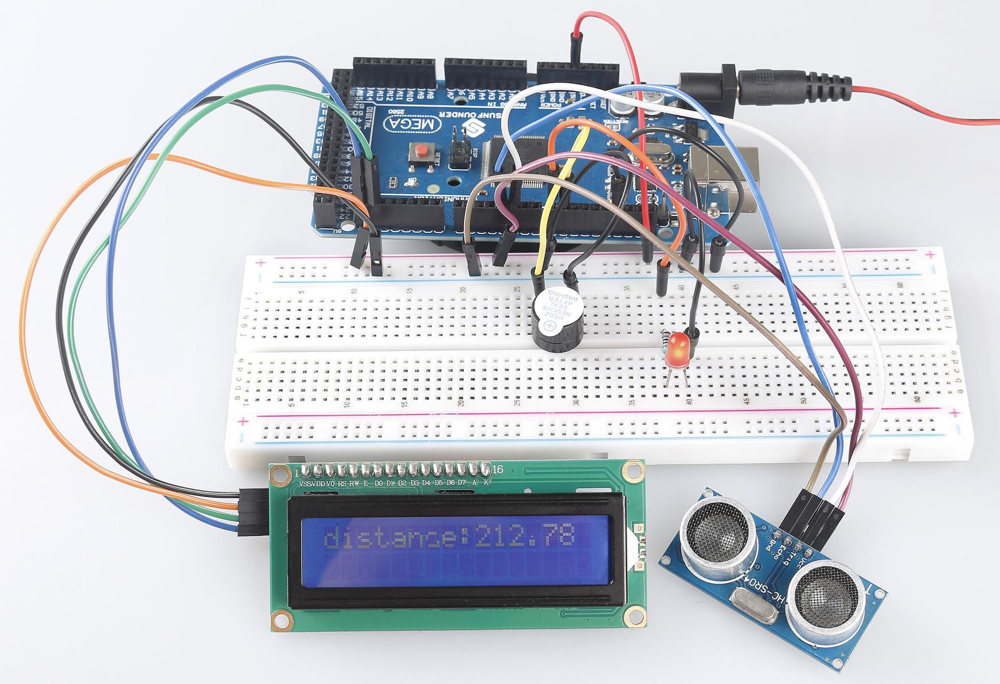

.. _ar_reversing_aid:

3.1 Reversing Aid
===================

Overview
-------------

With the development of science and technology, a lot of high-tech
products have been installed in cars, among which the reversing assist
system is one of them. Here we use ultrasonic sensors, LCD, LED and
buzzer to make a simple ultrasonic reversing assist system.

Components Required
-------------------------

* :ref:`cpn_mega2560`
* :ref:`cpn_breadboard`
* :ref:`cpn_wires`
* :ref:`cpn_buzzer`
* :ref:`cpn_i2c_lcd1602`
* :ref:`cpn_ultrasonic`

Fritzing Circuit
----------------------

In this example, the wiring is shown below.

Schematic Diagram
----------------------

Code
------------

.. note::

    * You can open the file ``3.1_reversingAid.ino`` under the path of ``sunfounder_vincent_kit_for_arduino\code\3.1_reversingAid`` directly.
    * Or copy this code into Arduino IDE 1/2.
    * Then :ref:`ar_upload_code` to the board.
    * Please make sure you have added the ``LiquidCrystal_I2C`` library, detailed tutorials refer to :ref:`add_libraries_ar`.

.. raw:: html

   <iframe src=https://create.arduino.cc/editor/sunfounder01/4bbcea82-c6cd-4658-90ce-9bcd291c58d4/preview?embed style="height:510px;width:100%;margin:10px 0" frameborder=0></iframe>

Example Explanation
---------------------------

In this project, we need to avoid the interference between the LCD
screen and the alarm system as much as possible (for example, the LED
flicker time is too long and the LCD refresh is delayed), so please
avoid using the delay() statement and use two separate intervals to
control the working frequency of the LCD and alarm system respectively.
Its workflow is shown in the flow chart. For analysis of Interval
function, refer to :ref:`ar_interval`.

Phenomenon Picture
-------------------------

