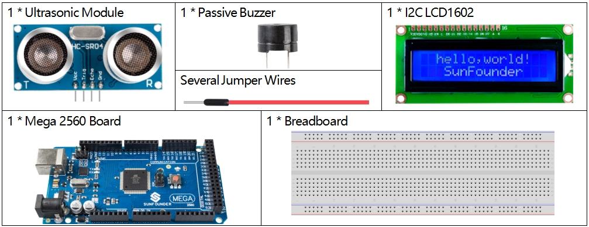
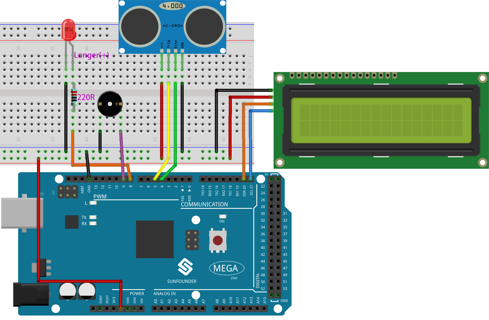
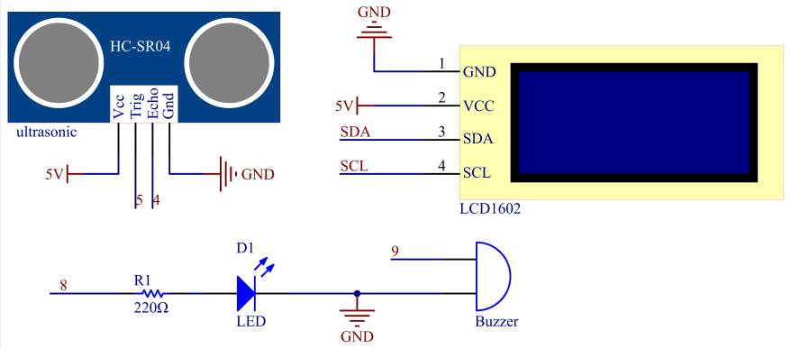

.. note:: 

    Ciao, benvenuto nella community SunFounder Raspberry Pi & Arduino & ESP32 su Facebook! Approfondisci Raspberry Pi, Arduino ed ESP32 insieme ad altri appassionati.

    **Perché unirsi?**

    - **Supporto esperto**: Risolvi problemi post-vendita e sfide tecniche con l'aiuto della nostra community e del nostro team.
    - **Impara e condividi**: Scambia suggerimenti e tutorial per migliorare le tue competenze.
    - **Anteprime esclusive**: Accedi in anteprima agli annunci di nuovi prodotti.
    - **Sconti speciali**: Approfitta di sconti esclusivi sui nostri prodotti più recenti.
    - **Promozioni e omaggi festivi**: Partecipa a omaggi e promozioni speciali durante le festività.

    👉 Pronto per esplorare e creare con noi? Clicca [|link_sf_facebook|] e unisciti oggi stesso!

.. _ar_reversing_aid:

3.1 Sistema di Assistenza al Parcheggio
=======================================

Panoramica
-------------

Con lo sviluppo della scienza e della tecnologia, molte innovazioni hi-tech 
sono state integrate nelle automobili, tra cui il sistema di assistenza al 
parcheggio. Qui utilizziamo sensori ultrasonici, LCD, LED e buzzer per creare 
un semplice sistema di assistenza al parcheggio basato su ultrasuoni.

Componenti necessari
-------------------------

* :ref:`cpn_mega2560`
* :ref:`cpn_breadboard`
* :ref:`cpn_wires`
* :ref:`cpn_buzzer`
* :ref:`cpn_i2c_lcd1602`
* :ref:`cpn_ultrasonic`

Circuito Fritzing
----------------------

In questo esempio, il cablaggio è mostrato di seguito.

Schema elettrico
----------------------

Codice
-------------

.. note::

    * Puoi aprire direttamente il file ``3.1_reversingAid.ino`` nella cartella ``sunfounder_vincent_kit_for_arduino\code\3.1_reversingAid``.
    * Qui viene utilizzata la libreria ``LiquidCrystal I2C``, che puoi installare dal **Library Manager**.

        .. image:: img/lib_liquidcrystal_i2c.png
            :align: center

.. raw:: html

   <iframe src=https://create.arduino.cc/editor/sunfounder01/4bbcea82-c6cd-4658-90ce-9bcd291c58d4/preview?embed style="height:510px;width:100%;margin:10px 0" frameborder=0></iframe>

Spiegazione dell'Esempio
----------------------------

Questo codice ci aiuta a creare un semplice dispositivo di misurazione della distanza che misura la distanza tra oggetti e fornisce feedback tramite un display LCD e un buzzer.

La funzione ``loop()`` contiene la logica principale del programma e viene eseguita continuamente. Analizziamola nel dettaglio.

#. Ciclo per leggere la distanza e aggiornare i parametri

    Nella funzione ``loop``, il codice legge la distanza misurata dal modulo ultrasonico e aggiorna il parametro dell'intervallo in base alla distanza.

    .. code-block:: arduino

        // Aggiorna la distanza
        distance = readDistance();

        // Aggiorna gli intervalli in base alla distanza
        if (distance <= 10) {
            intervals = 300;
        } else if (distance <= 20) {
            intervals = 500;
        } else if (distance <= 50) {
            intervals = 1000;
        } else {
            intervals = 2000;
        }

#. Controlla se è il momento di emettere un segnale acustico

    Il codice calcola la differenza tra il tempo corrente e l'ultimo segnale acustico emesso. Se la differenza è maggiore o uguale al tempo dell'intervallo, attiva il buzzer e aggiorna il tempo dell'ultimo segnale.

    .. code-block:: arduino

        unsigned long currentMillis = millis();
        if (currentMillis - previousMillis >= intervals) {
            Serial.println("Beeping!");
            beep();
            previousMillis = currentMillis;
        }

#. Aggiorna il display LCD

    Il codice cancella il display LCD e visualizza "Dis:" e la distanza corrente in centimetri sulla prima riga.

    .. code-block:: arduino

        lcd.clear();
        lcd.setCursor(0, 0);
        lcd.print("Dis: ");
        lcd.print(distance);
        lcd.print(" cm");

        delay(100);
