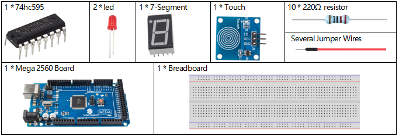
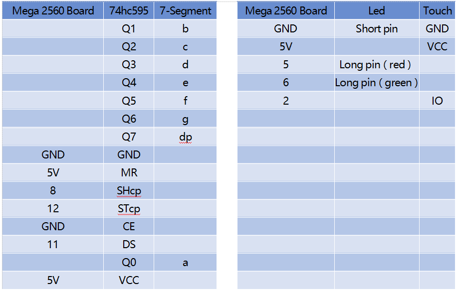
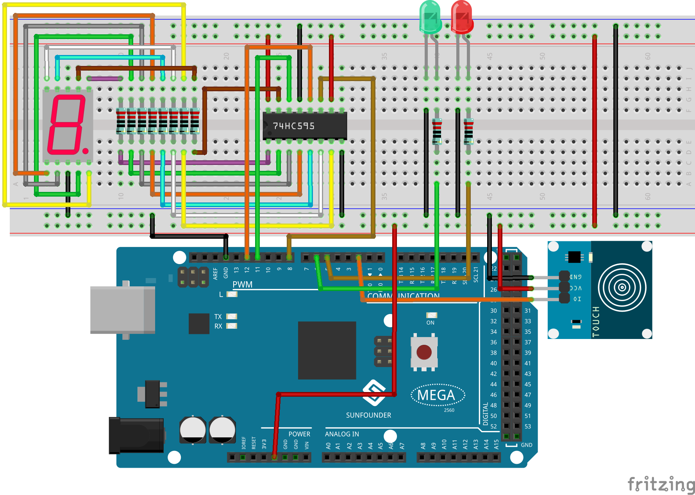
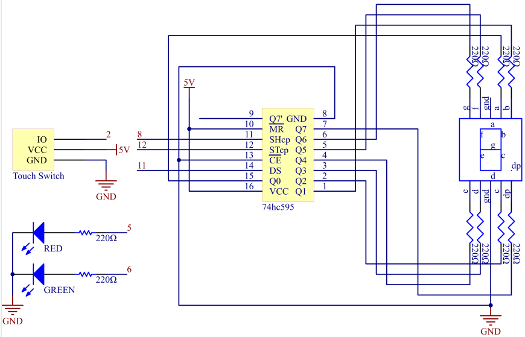
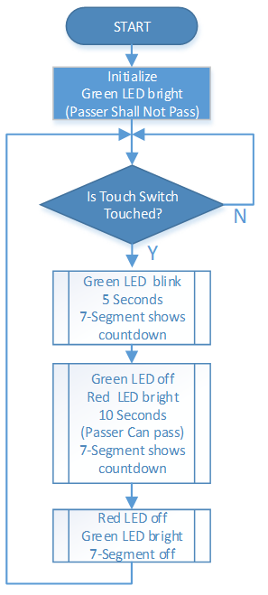
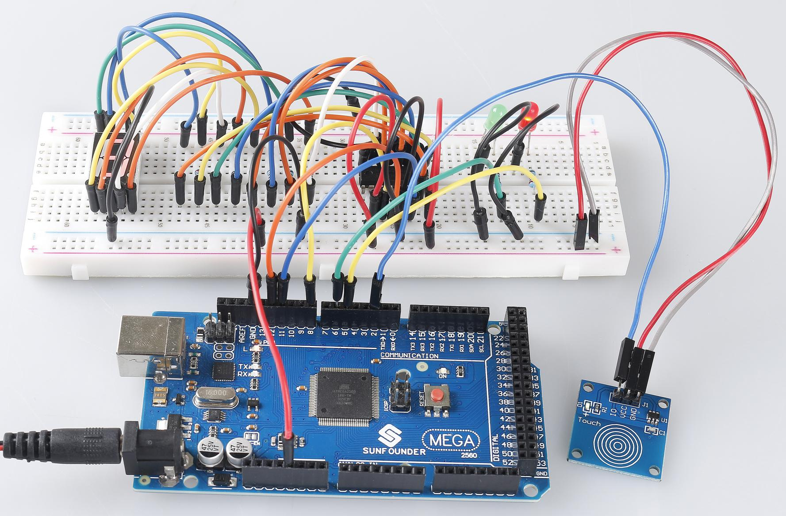

.. note:: 

    Bonjour et bienvenue dans la communauté des passionnés de Raspberry Pi, Arduino et ESP32 sur Facebook, animée par SunFounder ! Explorez plus en profondeur l'univers de Raspberry Pi, Arduino et ESP32 avec d'autres passionnés.

    **Pourquoi nous rejoindre ?**

    - **Support d'experts** : Résolvez vos problèmes après-vente et vos défis techniques avec l'aide de notre communauté et de notre équipe.
    - **Apprendre et partager** : Échangez des conseils et des tutoriels pour améliorer vos compétences.
    - **Aperçus exclusifs** : Bénéficiez d'un accès anticipé aux annonces de nouveaux produits et d'aperçus exclusifs.
    - **Réductions spéciales** : Profitez de réductions exclusives sur nos derniers produits.
    - **Promotions festives et concours** : Participez à des concours et des promotions pendant les fêtes.

    👉 Prêt à explorer et créer avec nous ? Cliquez sur [|link_sf_facebook|] et rejoignez-nous dès aujourd'hui !

.. _ar_pedestrian:

3.2 Bouton de traversée piétonne
===================================

Aperçu
---------

Lorsque les piétons traversent la rue, ils n'ont qu'à appuyer sur le bouton 
situé sur le lampadaire du feu de signalisation pour que le feu vert au-dessus 
de la voie de circulation se transforme en rouge, permettant ainsi aux piétons 
de traverser en toute sécurité. Ce système résout de manière efficace le problème 
de la traversée des piétons. En outre, lorsque aucun piéton ne presse le bouton, 
le feu destiné aux véhicules reste toujours vert, ce qui améliore considérablement 
l'efficacité de l'utilisation de la route et la capacité de circulation.

Composants requis
-------------------

* :ref:`cpn_mega2560`
* :ref:`cpn_breadboard`
* :ref:`cpn_wires`
* :ref:`cpn_resistor`
* :ref:`cpn_led`
* :ref:`cpn_74hc595`
* :ref:`cpn_7_segment`
* :ref:`cpn_touch`

Circuit Fritzing
------------------

Dans cet exemple, les composants 74HC595, 7-segment, LED et le capteur tactile 
sont connectés selon le schéma ci-dessous.

**Schéma de câblage**
------------------------

Code
--------

.. note::

    * Vous pouvez ouvrir directement le fichier ``3.2_pedestrianCrossingButton.ino`` situé dans le dossier ``sunfounder_vincent_kit_for_arduino\code\3.2_pedestrianCrossingButton``.

.. raw:: html

   <iframe src=https://create.arduino.cc/editor/sunfounder01/16418135-17f6-48d6-8ddf-c7bcd9858dbe/preview?embed style="height:510px;width:100%;margin:10px 0" frameborder=0></iframe>

Explication de l'exemple
--------------------------

Le flux de travail du projet est présenté dans le diagramme suivant. 
La fonction d'affichage des chiffres sur le 7-segment est réalisée 
en écrivant des données sur 8 bits dans le 74HC595. Lorsqu'il est 
nécessaire d'afficher le chiffre « 0 », les broches abcdef de l'afficheur 
segmenté seront reliées au niveau haut. Les broches g et dp doivent être 
reliées au niveau bas pour écrire « 0x3f » (B00111111) dans le code. 
Voici les codes complets pour l'affichage des chiffres sur un afficheur 
7 segments.

=========== ================== ========
**Numbers** **Common Cathode** 
\           (DP)GFEDCBA        Hex Code
0           00111111           0x3f
1           00000110           0x06
2           01011011           0x5b
3           01001111           0x4f
4           01100110           0x66
5           01101101           0x6d
6           01111101           0x7d
7           00000111           0x07
8           01111111           0x7f
9           01101111           0x6f
=========== ================== ========

Image de phénomène
------------------------

