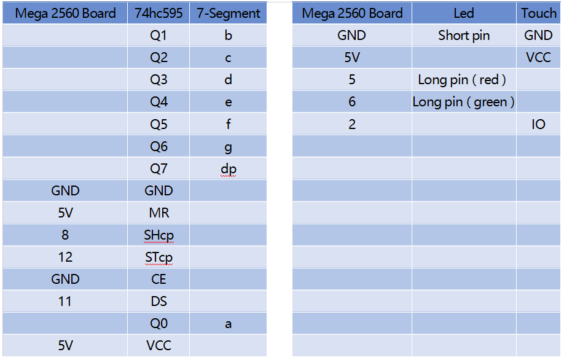
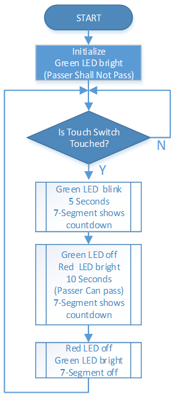

.. _ar_pedestrian:

3.2 Fußgängerüberwegtaste
================================

Überblick
-------------

Wenn Fußgänger die Straße überqueren, müssen sie nur den Knopf am Laternenpfahl der Signallampe am Straßenrand berühren, und das grüne Licht über der Fahrspur wird rot, dann können Fußgänger sicher passieren. Damit wird die schwierige Situation der Bürgerinnen und Bürger, die die Straße überqueren, umfassend gelöst. Gleichzeitig ist, wenn kein Fußgänger zu drücken ist, die Ampel über der Fahrspur, die zum Überholen von Fahrzeugen eingestellt ist, immer grün, wodurch die Nutzungseffizienz der Straße und die Verkehrskapazität erheblich verbessert werden.

Erforderliche Komponenten
-------------------------------

.. image:: img/Part_three_2.png
    :align: center

* :ref:`cpn_mega2560`
* :ref:`cpn_breadboard`
* :ref:`cpn_wires`
* :ref:`cpn_resistor`
* :ref:`cpn_led`
* :ref:`cpn_74hc595`
* :ref:`cpn_7_segment`
* :ref:`cpn_touch`

Fritzing-Schaltung
----------------------

In diesem Beispiel sind 74hc595, 7-Segment, LED, Touchsensor gemäß Tabelle anzuschließen.

Schematische Darstellung
----------------------------

.. image:: img/image270.png
   :align: center

Code
--------------

.. note::

    * Sie können die Datei ``3.2_pedestrianCrossingButton.ino`` unter dem Pfad ``sunfounder_vincent_kit_for_arduino\code\3.2_pedestrianCrossingButton`` direkt öffnen.
    * Oder kopieren Sie diesen Code in Arduino IDE. 

.. raw:: html

   <iframe src=https://create.arduino.cc/editor/sunfounder01/16418135-17f6-48d6-8ddf-c7bcd9858dbe/preview?embed style="height:510px;width:100%;margin:10px 0" frameborder=0></iframe>

Example Explanation
-------------------------

Der Ablauf des Projekts ist wie im Flussdiagramm dargestellt. Die Funktion der Zahlenanzeige von 7-Segment wird durch Schreiben von 8-Bit-Daten in 74HC595 realisiert. Wenn es erforderlich ist, 「0」 anzuzeigen, werden die Pins abcdef der Segmentanzeige mit dem hohen Pegel verbunden. Die Pins g und dp müssen mit niedrigem Pegel verbunden werden, um「0x3f」(B00111111) in die Codes zu schreiben. Die vollständigen Codes für die Zahlenanzeige von 7-Segment sind wie folgt.

=========== ================== ========
**Numbers** **Common Cathode** 
\           (DP)GFEDCBA        Hex Code
0           00111111           0x3f
1           00000110           0x06
2           01011011           0x5b
3           01001111           0x4f
4           01100110           0x66
5           01101101           0x6d
6           01111101           0x7d
7           00000111           0x07
8           01111111           0x7f
9           01101111           0x6f
=========== ================== ========

Phänomen Bild
-------------------------

