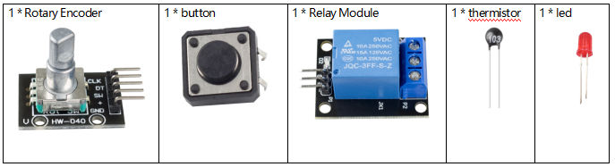
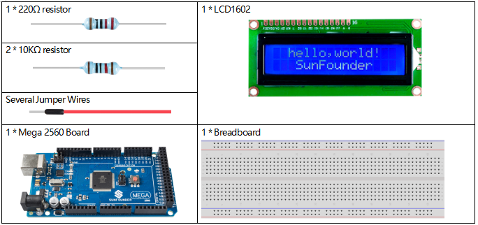
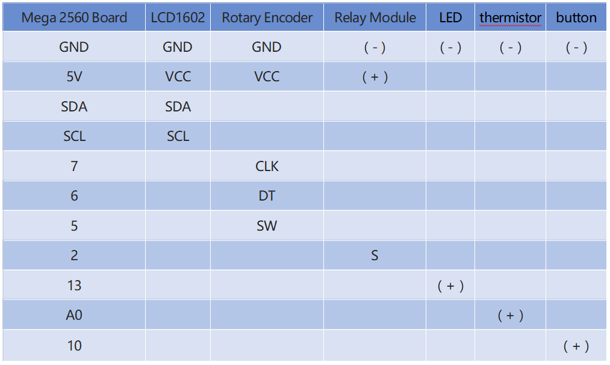
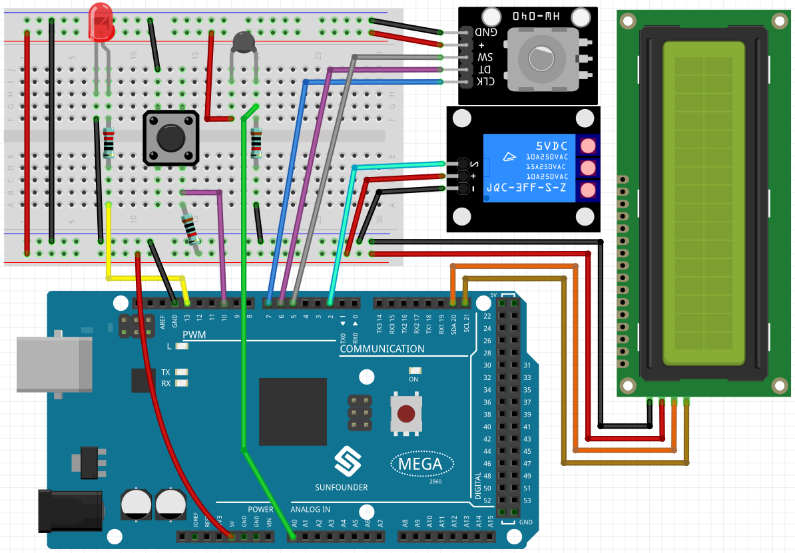
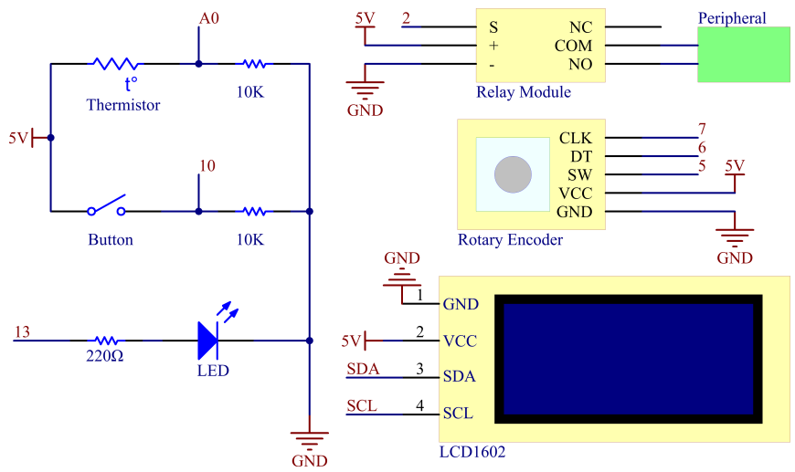
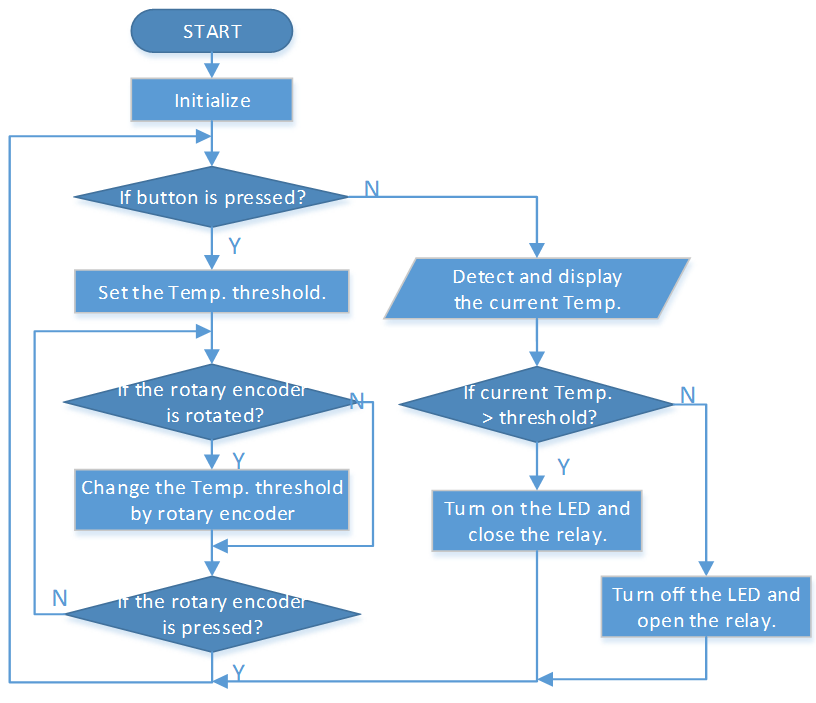
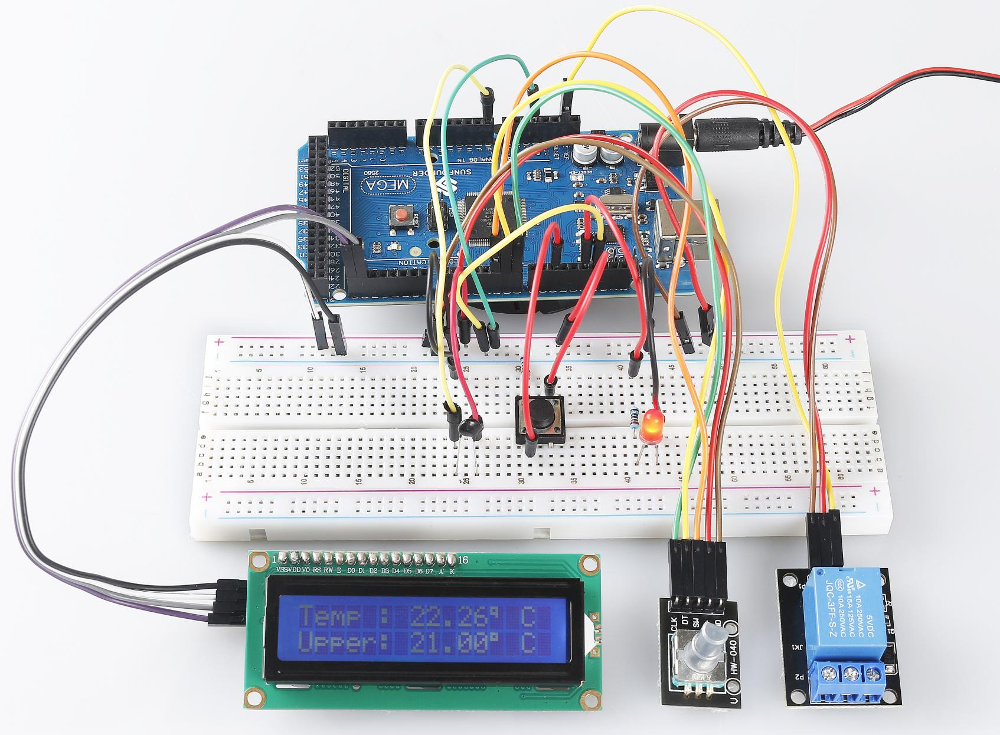

.. note:: 

    Ciao, benvenuto nella community SunFounder Raspberry Pi & Arduino & ESP32 su Facebook! Approfondisci Raspberry Pi, Arduino ed ESP32 insieme ad altri appassionati.

    **Perché unirsi?**

    - **Supporto esperto**: Risolvi problemi post-vendita e sfide tecniche con l'aiuto della nostra community e del nostro team.
    - **Impara e condividi**: Scambia suggerimenti e tutorial per migliorare le tue competenze.
    - **Anteprime esclusive**: Accedi in anteprima agli annunci di nuovi prodotti.
    - **Sconti speciali**: Approfitta di sconti esclusivi sui nostri prodotti più recenti.
    - **Promozioni e omaggi festivi**: Partecipa a omaggi e promozioni speciali durante le festività.

    👉 Pronto per esplorare e creare con noi? Clicca [|link_sf_facebook|] e unisciti oggi stesso!

.. _ar_overheat_monitor:

3.3 Monitoraggio del Surriscaldamento
=======================================

Panoramica
------------------

Potresti voler realizzare un dispositivo di monitoraggio del surriscaldamento 
applicabile a diverse situazioni. Quando la temperatura della stanza supera i 
30°C in estate, il ventilatore elettrico o il condizionatore d'aria si accendono 
automaticamente. Se il frigorifero smette di raffreddare, viene emesso un allarme. 
Quando la CPU si surriscalda, il sistema di raffreddamento a liquido si attiva. 
Successivamente, utilizzeremo un termistore, un relè, un pulsante, un encoder 
rotativo e un LCD per creare un dispositivo intelligente di monitoraggio della 
temperatura con una soglia regolabile. Puoi adattarlo alla scena desiderata 
collegando diversi dispositivi periferici al relè e utilizzando un encoder 
rotativo per regolare la soglia di alta temperatura.

Componenti necessari
-------------------------

* :ref:`cpn_mega2560`
* :ref:`cpn_breadboard`
* :ref:`cpn_wires`
* :ref:`cpn_resistor`
* :ref:`cpn_led`
* :ref:`cpn_button`
* :ref:`cpn_i2c_lcd1602`
* :ref:`cpn_rotary`

Circuito Fritzing
-----------------------

In questo esempio, i moduli dei componenti sono collegati come mostrato 
nella tabella.

Schema elettrico
-------------------------

Codice
--------------

.. note::

    * Puoi aprire direttamente il file ``3.3_overheatMonitor.ino`` nella cartella ``sunfounder_vincent_kit_for_arduino\code\3.3_overheatMonitor``.
    * Qui viene utilizzata la libreria ``LiquidCrystal I2C``, installabile dal **Library Manager**.

        .. image:: img/lib_liquidcrystal_i2c.png
            :align: center

.. raw:: html

   <iframe src=https://create.arduino.cc/editor/sunfounder01/ed5a53dd-9d6d-43f7-b5f1-c240a1c320fb/preview?embed style="height:510px;width:100%;margin:10px 0" frameborder=0></iframe>

Spiegazione dell'Esempio
--------------------------

Il diagramma di flusso del progetto è il seguente:

Utilizzando la libreria EEPROM.h, la soglia di alta temperatura viene 
salvata nell'EEPROM per evitare che il valore venga reimpostato dopo il 
riavvio del MCU.

**Funzioni della Libreria：**

.. code-block:: arduino

    void write(address,value)

Scrive un byte nell'EEPROM.

.. code-block:: arduino

    void Read(address)

Legge un byte dall'EEPROM. Le posizioni che non sono mai state scritte 
hanno il valore di 255.

.. code-block:: arduino

    void update(address,value)

Scrive un byte nell'EEPROM. Il valore viene scritto solo se differisce 
da quello già salvato allo stesso indirizzo.

.. code-block:: arduino

    void put(address,value)

Scrive qualsiasi tipo di dato o oggetto nell'EEPROM.

.. code-block:: arduino

    void get(address)

Legge qualsiasi tipo di dato o oggetto dall'EEPROM.

Immagine del Fenomeno
------------------------

