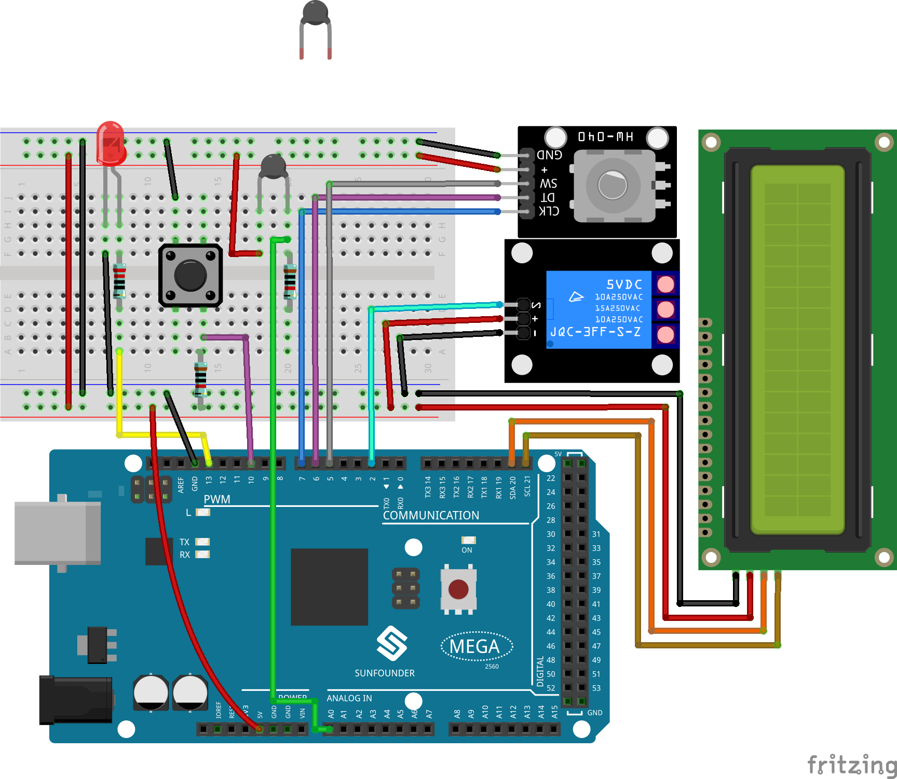
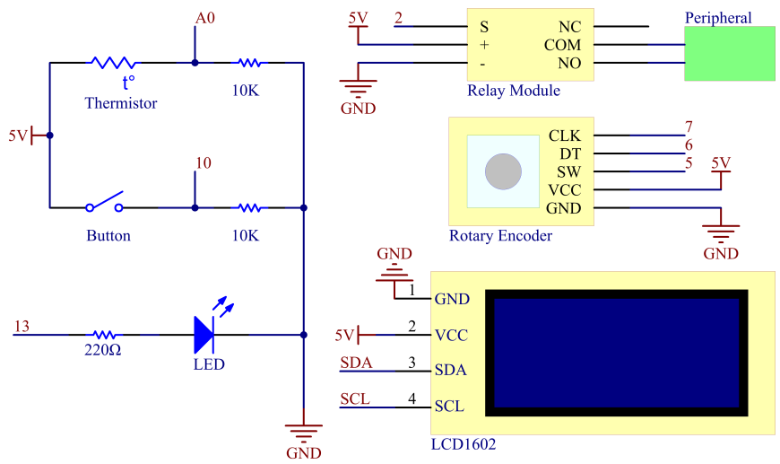

.. _ar_overheat_monitor:

3.3 Überhitzungsüberwachung
=================================

Überblick
-----------------

Vielleicht möchten Sie ein Überhitzungsüberwachungsgerät herstellen, das für verschiedene Situationen gilt. Wenn die Raumtemperatur im Sommer über 30 °C liegt, wird der elektrische Ventilator oder die Klimaanlage automatisch eingeschaltet. Wenn der Kühlschrank aufhört zu kühlen, wird ein Alarm ausgegeben. Wenn die CPU überhitzt wird, schaltet sich das Wasserkühlungssystem ein. Als nächstes verwenden wir Thermistor, Relais, Knopf, Drehgeber und LCD, um ein intelligentes Temperaturüberwachungsgerät herzustellen, dessen Schwellenwert einstellbar ist. Sie können es für die gewünschte Szene anpassen, indem Sie verschiedene Peripheriegeräte in das Relais einsetzen und mit einem Drehgeber den Schwellenwert für hohe Temperaturen einstellen.

Erforderliche Komponenten
------------------------------

* :ref:`cpn_mega2560`
* :ref:`cpn_breadboard`
* :ref:`cpn_wires`
* :ref:`cpn_resistor`
* :ref:`cpn_led`
* :ref:`cpn_button`
* :ref:`cpn_i2c_lcd1602`
* :ref:`cpn_rotary`

Fritzing-Schaltung
-----------------------

In diesem Beispiel werden die Komponentenmodule wie in der Tabelle gezeigt verbunden.

Schematische Darstellung
---------------------------

Code
--------------

.. note::

    * Sie können die Datei ``3.3_overheatMonitor.ino`` unter dem Pfad ``sunfounder_vincent_kit_for_arduino\code\3.3_overheatMonitor`` direkt öffnen.
    * Oder kopieren Sie diesen Code in Arduino IDE 1/2.
    * Laden Sie dann :ref:`ar_upload_code` auf das Board hoch.
    * Bitte stellen Sie sicher, dass Sie die Bibliothek ``LiquidCrystal_I2C`` hinzugefügt haben, detaillierte Anleitungen finden Sie unter :ref:`add_libraries_ar`.

.. raw:: html

   <iframe src=https://create.arduino.cc/editor/sunfounder01/ed5a53dd-9d6d-43f7-b5f1-c240a1c320fb/preview?embed style="height:510px;width:100%;margin:10px 0" frameborder=0></iframe>

Example Explanation
-------------------------

Das Flussdiagramm des Projekts sieht wie folgt aus:

Durch die Verwendung der EEPROM.h-Bibliothek wird die Hochtemperaturschwelle im EEPROM gespeichert, um zu vermeiden, dass der Wert nach dem Neustart der MCU zurückgesetzt wird.

**Bibliotheksfunktionen:**

.. code-block:: arduino

    void write(address,value)

Schreiben Sie ein Byte in das EEPROM.

.. code-block:: arduino

    void Read(address)

Liest ein Byte aus dem EEPROM. Orte, die noch nie geschrieben wurden, haben den Wert 255.

.. code-block:: arduino

    void update(address,value)

Schreiben Sie ein Byte in das EEPROM. Der Wert wird nur geschrieben, wenn er sich von dem unterscheidet, der bereits an derselben Adresse gespeichert ist.

.. code-block:: arduino

    void put(address,value)

Schreiben Sie einen beliebigen Datentyp oder ein beliebiges Objekt in das EEPROM.

.. code-block:: arduino

    void get(address)

Lesen eines beliebigen Datentyps oder Objekts aus dem EEPROM.

Phänomen Bild
------------------------

