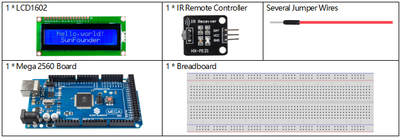
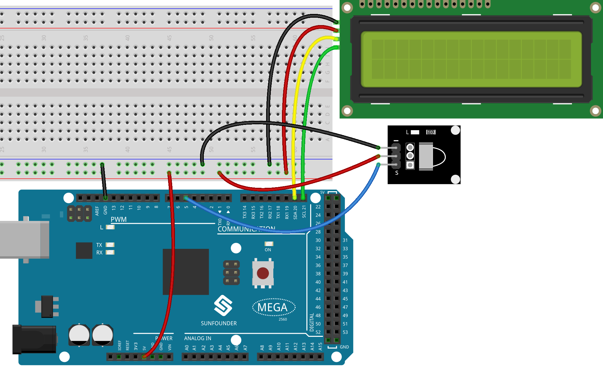
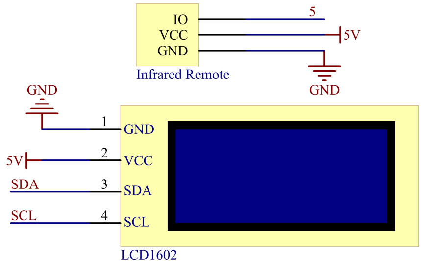
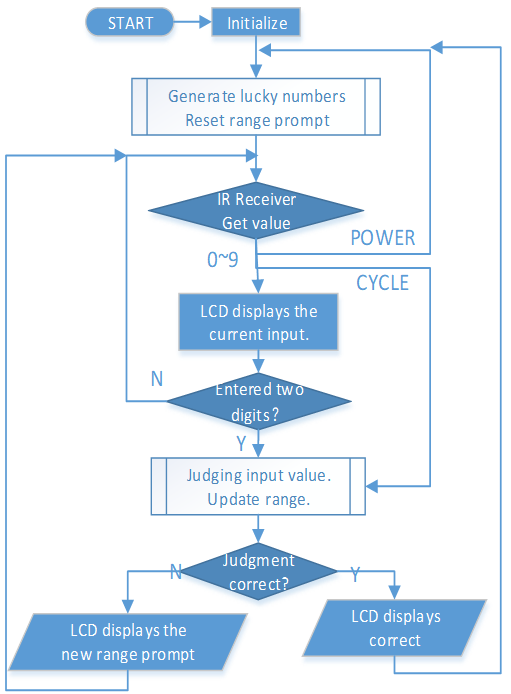
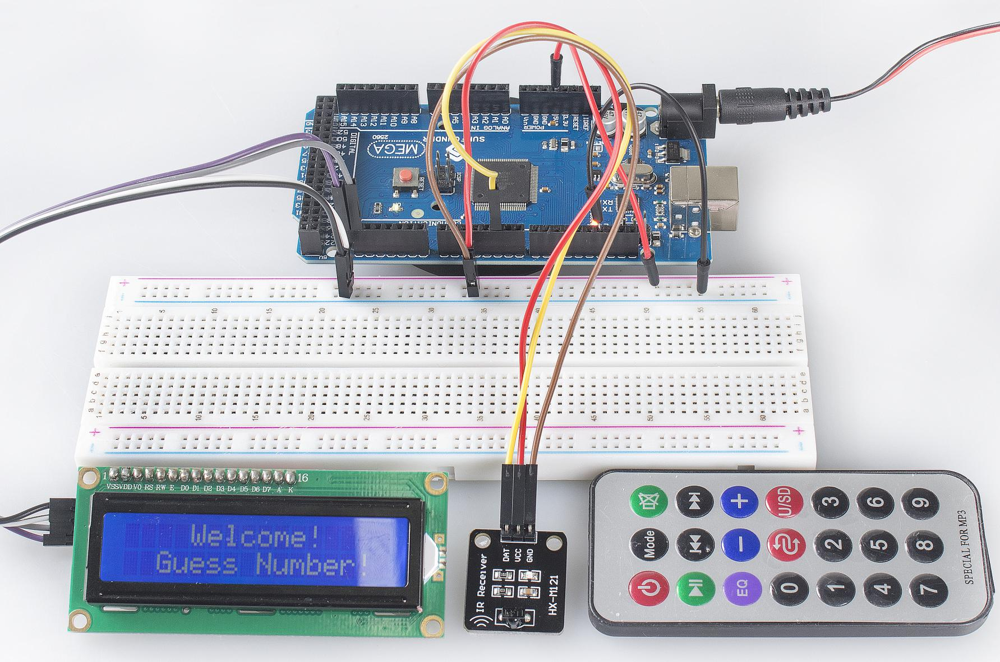

.. _ar_guess_number:

3.4 Schätzzahl
==================

Überblick
----------------

„Zahlen erraten“ ist ein unterhaltsames Partyspiel, bei dem Sie und Ihre Freunde abwechselnd eine Zahl (0~99) eingeben. Die Reichweite wird mit der Eingabe der Zahl kleiner, bis ein Spieler das Rätsel richtig beantwortet. Dann wird der Spieler besiegt und bestraft. Wenn zum Beispiel die Glückszahl 51 ist, die die Spieler nicht sehen können, und der Spieler ① 50 eingibt, ändert sich die Eingabeaufforderung des Zahlenbereichs auf 50~99; wenn der Spieler ② 70 eingibt, kann der Zahlenbereich 50~70 sein; wenn der Spieler ③ 51 eingibt, hat er oder sie Pech. Hier verwenden wir die IR-Fernbedienung, um Zahlen einzugeben, und verwenden LCD, um Ergebnisse auszugeben.

Erforderliche Komponenten
-----------------------------

* :ref:`cpn_mega2560`
* :ref:`cpn_breadboard`
* :ref:`cpn_wires`
* :ref:`cpn_i2c_lcd1602`
* :ref:`cpn_receive`

Fritzing-Schaltung
---------------------

In diesem Beispiel ist die Verdrahtung des LCD1602 und des Infrarot-Empfangsmoduls wie folgt.

Schematische Darstellung
----------------------------

Code
--------------

.. note::

   * Sie können die Datei ``3.4_guessNumber.ino`` unter dem Pfad ``sunfounder_vincent_kit_for_arduino\code\3.4_guessNumber`` direkt öffnen.
   * Oder kopieren Sie diesen Code in Arduino IDE. 
   * Die Bibliotheken ``LiquidCrystal I2C`` und ``IRremote`` werden hier verwendet. Sie können beide Bibliotheken über den **Library Manager** installieren.

.. raw:: html

   <iframe src=https://create.arduino.cc/editor/sunfounder01/7bfbecaf-8e6c-4868-95d2-ab09f8d818a7/preview?embed style="height:510px;width:100%;margin:10px 0" frameborder=0></iframe>

Example Explanation
---------------------------

Damit das Zahlenratespiel lebendig und lustig wird, müssen wir die folgenden Funktionen erreichen:

1. Die Glückszahl wird angezeigt, wenn wir das Spiel starten und zurücksetzen, und die Eingabeaufforderung für den Zahlenbereich wird auf 0 ~ 99 zurückgesetzt.

2. Das LCD zeigt die eingegebene Nummer und die Eingabeaufforderung für den Nummernbereich an.

3. Nach Eingabe von zwei Ziffern erscheint automatisch die Ergebnisbeurteilung.

4. Wenn Sie eine einzelne Ziffer eingeben, können Sie die CYCLE-Taste (die Taste in der Mitte des Controllers) drücken, um die Ergebnisbewertung zu starten.

5. Wenn die Antwort nicht erraten wird, wird die Eingabeaufforderung für den neuen Zahlenbereich angezeigt (wenn die Glückszahl 51 ist und Sie 50 eingeben, ändert sich die Eingabeaufforderung für den Zahlenbereich in 50~99).

6. Das Spiel wird nach dem Erraten der Glückszahl automatisch zurückgesetzt, sodass der Spieler eine neue Runde spielen kann.

7. Das Spiel kann durch direktes Drücken der POWER-Taste (die Taste in der oberen linken Ecke) zurückgesetzt werden.

Abschließend wird der Arbeitsablauf des Projekts im Flussdiagramm dargestellt.

Phänomen Bild
-----------------------

