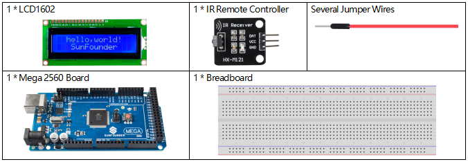
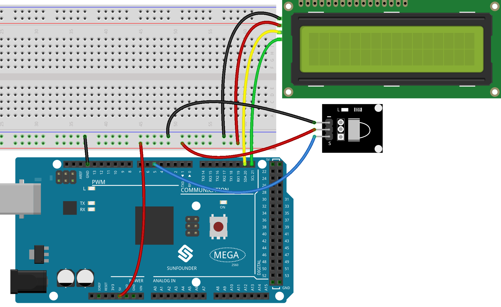
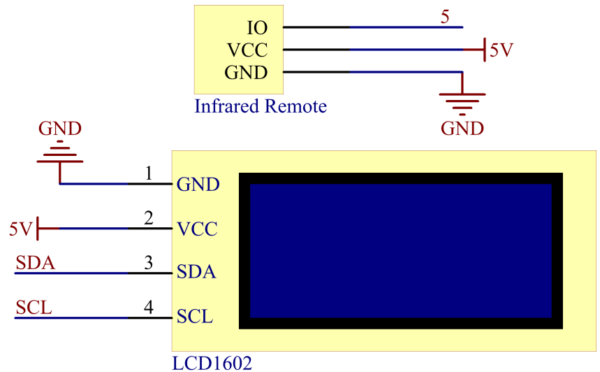
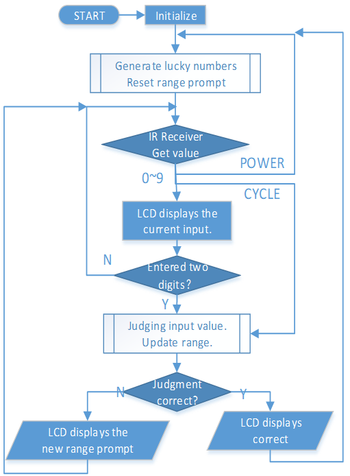
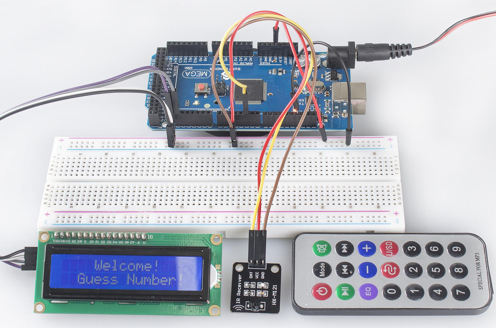

.. note:: 

    Hola, ¡bienvenido a la comunidad de entusiastas de SunFounder Raspberry Pi, Arduino y ESP32 en Facebook! Profundiza en Raspberry Pi, Arduino y ESP32 junto a otros entusiastas.

    **¿Por qué unirse?**

    - **Soporte de expertos**: Resuelve problemas posventa y desafíos técnicos con ayuda de nuestra comunidad y equipo.
    - **Aprende y Comparte**: Intercambia consejos y tutoriales para mejorar tus habilidades.
    - **Avances exclusivos**: Accede anticipadamente a anuncios de nuevos productos y adelantos.
    - **Descuentos especiales**: Disfruta de descuentos exclusivos en nuestros productos más recientes.
    - **Promociones y sorteos festivos**: Participa en sorteos y promociones especiales por festividades.

    👉 ¿Listo para explorar y crear con nosotros? Haz clic en [|link_sf_facebook|] y únete hoy mismo.

.. _ar_guess_number:

3.4 Adivina el Número
=======================

Descripción general
----------------------

"Adivina el Número" es un divertido juego de fiesta en el que tú y tus 
amigos se turnan para ingresar un número (0~99). El rango se reducirá 
con cada número ingresado hasta que un jugador adivine correctamente el 
número secreto. Ese jugador será considerado el perdedor y recibirá un 
castigo. Por ejemplo, si el número de la suerte es 51 (oculto para los 
jugadores) y el jugador 1 ingresa 50, el rango de números cambiará a 50~99; 
si el jugador 2 ingresa 70, el rango se reducirá a 50~70; si el jugador 
3 ingresa 51, será el desafortunado perdedor. En este proyecto, utilizamos 
un control remoto por infrarrojos para ingresar los números y una pantalla 
LCD para mostrar los resultados.

Componentes necesarios
--------------------------

* :ref:`cpn_mega2560`
* :ref:`cpn_breadboard`
* :ref:`cpn_wires`
* :ref:`cpn_i2c_lcd1602`
* :ref:`cpn_receive`

Circuito Fritzing
----------------------

En este ejemplo, las conexiones del LCD1602 y el módulo receptor infrarrojo 
son las siguientes.

Diagrama esquemático
------------------------

Código
----------------

.. note::

    * Puedes abrir el archivo ``3.4_guessNumber.ino`` en la ruta ``sunfounder_vincent_kit_for_arduino\code\3.4_guessNumber`` directamente.
    * Aquí se utilizan las librerías ``LiquidCrystal I2C`` e ``IRremote``, que puedes instalar desde el **Administrador de Librerías**.

.. raw:: html

   <iframe src=https://create.arduino.cc/editor/sunfounder01/7bfbecaf-8e6c-4868-95d2-ab09f8d818a7/preview?embed style="height:510px;width:100%;margin:10px 0" frameborder=0></iframe>

Explicación del Ejemplo
------------------------

Para que el juego "Adivina el Número" sea más divertido y emocionante, 
necesitamos lograr las siguientes funciones:

1. El número de la suerte se mostrará al iniciar y reiniciar el juego, 
   y el rango de números se restablecerá a 0 ~ 99.

2. El LCD mostrará el número ingresado y el rango de números actualizado.

3. Después de ingresar dos dígitos, se emitirá automáticamente un juicio de 
   resultado.

4. Si ingresas un solo dígito, puedes presionar la tecla CYCLE (la tecla en el 
   centro del control remoto) para iniciar el juicio de resultado.

5. Si no se adivina el número, se mostrará el nuevo rango de números (por 
   ejemplo, si el número de la suerte es 51 y se ingresa 50, el rango de números 
   cambiará a 50~99).

6. El juego se reiniciará automáticamente después de adivinar el número de la 
   suerte, permitiendo al jugador iniciar una nueva ronda.

7. El juego se puede reiniciar directamente presionando el botón POWER (el botón 
   en la esquina superior izquierda).

En conclusión, el flujo de trabajo del proyecto se muestra en el diagrama de flujo.

Imagen del Fenómeno
------------------------

