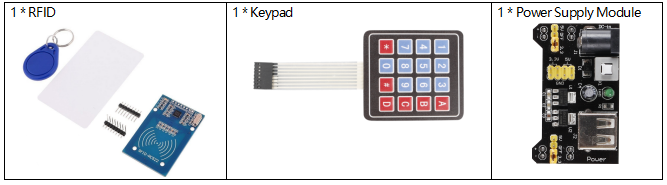
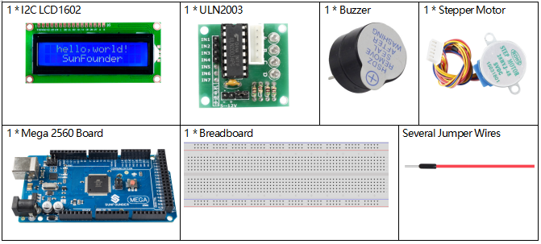
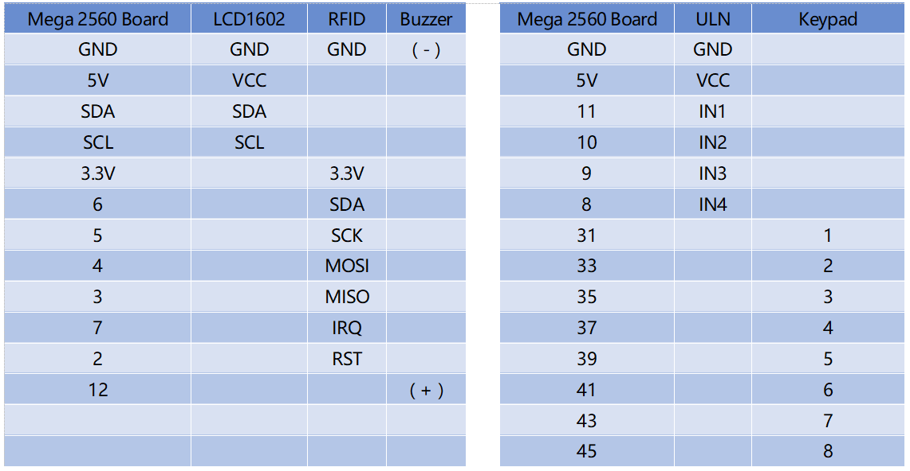
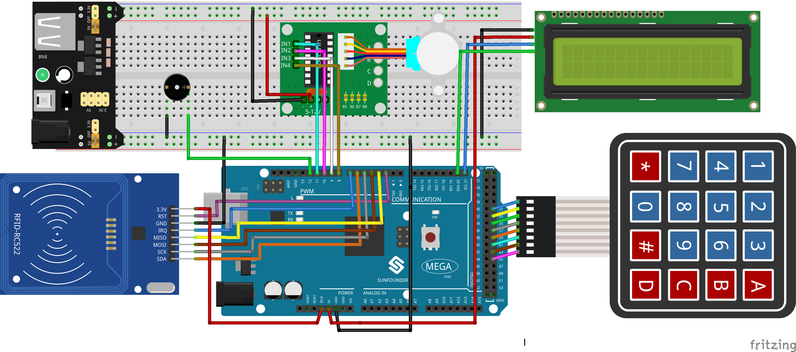
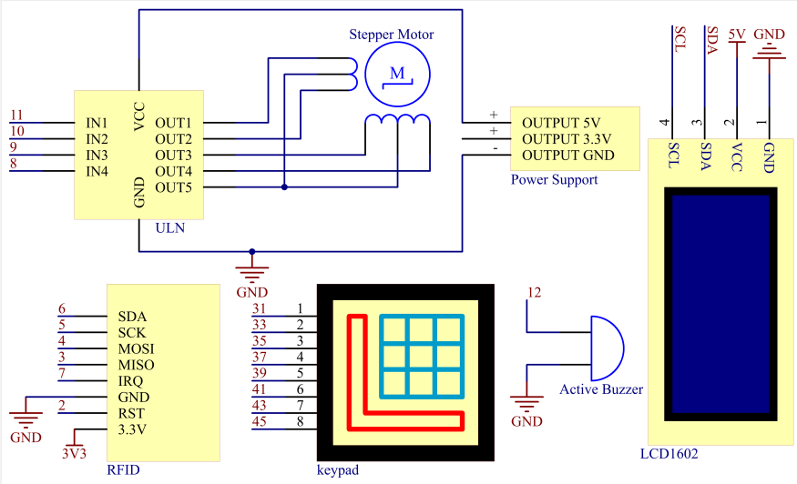
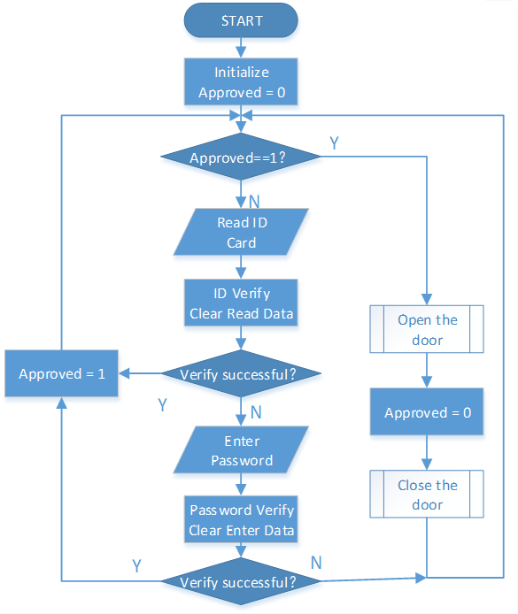
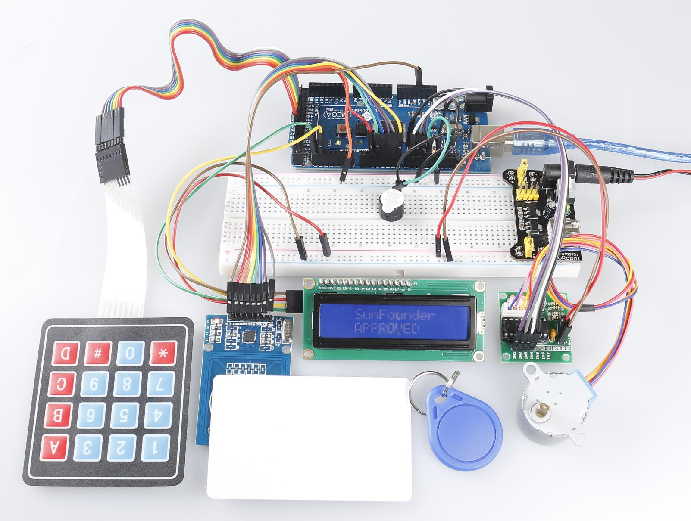

.. _ar_access_system:

3.5 Zugangskontrollsystem
==========================

Überblick
------------

Das Zutrittskontrollsystem ist das System zur Kontrolle des Eingangskanals, das auf der Grundlage des traditionellen Türschlosses entwickelt wurde. Das traditionelle mechanische Türschloss ist nur ein einfaches mechanisches Gerät, und egal wie vernünftig das strukturelle Design ist, wie stark das Material ist, Menschen können es immer mit verschiedenen Mitteln öffnen. Der Schlüssel zum Ein- und Ausgang (wie ein Bürogebäude, ein Hotelzimmer) ist umständlich. Wenn der Schlüssel fehlt oder ersetzt wird, ist das Schloss durch den Schlüssel zu ersetzen. Um diese Probleme zu lösen, sind das elektronische Magnetkartenschloss und das elektronische codierte Schloss vorhanden, die das Verwaltungsniveau des Zugangskanals bis zu einem gewissen Grad angehoben haben, und dann tritt die Kanalverwaltung in das elektronische Zeitalter ein.

Erforderliche Komponenten
-----------------------------

* :ref:`cpn_mega2560`
* :ref:`cpn_breadboard`
* :ref:`cpn_wires`
* :ref:`cpn_buzzer`
* :ref:`cpn_i2c_lcd1602`
* :ref:`cpn_stepper_motor`
* :ref:`cpn_keypad`
* :ref:`cpn_power_module`

Fritzing-Schaltung
-----------------------

In diesem Beispiel wird das Stromversorgungsmodul verwendet, um das Steckbrett mit Strom zu versorgen. Wir verbinden GND des Mega 2560 Boards mit der Kathodenschiene des Steckbretts, GND von ULN2003 mit der Kathodenschiene des Steckbretts, VCC mit 5 V OUTPUT des Netzteils und den Schrittmotor mit OUT1-OUT5 von ULN.

Schematische Darstellung
----------------------------------

Code
--------------

.. note::

    * Sie können die Datei ``3.5_accessControlSystem.ino`` unter dem Pfad ``sunfounder_vincent_kit_for_arduino\code\3.5_accessControlSystem`` direkt öffnen.
    * Oder kopieren Sie diesen Code in Arduino IDE 1/2.
    * Laden Sie dann :ref:`ar_upload_code` auf das Board hoch.
    * Bitte stellen Sie sicher, dass Sie die Bibliotheken ``RFID1``, ``Keypad`` und ``LiquidCrystal_I2C`` hinzugefügt haben, detaillierte Anleitungen finden Sie unter :ref:`add_libraries_ar`.

.. raw:: html

   <iframe src=https://create.arduino.cc/editor/sunfounder01/f7f9dd83-3ede-453e-806b-7420b9f7b29e/preview?embed style="height:510px;width:100%;margin:10px 0" frameborder=0></iframe>

Example Explanation
--------------------------

Der Ablauf des Zutrittskontrollsystems ist im Flussdiagramm dargestellt.

Wenn keine autorisierte ID identifiziert wird (die Variable „Genehmigt“ ist gleich 0), führt das Gerät Funktionen der ID-Identifikation und der Passwortidentifikation durch.

Wird der berechtigte Ausweis erkannt („Freigegeben“ gleich 1), öffnet sich die Tür. Danach wird die Tür wenige Sekunden später geschlossen und der identifizierte Status zurückgesetzt („Freigegeben“ gleich 0).

Neben der zentralen Zugangskontrollfunktion verwendet das Projekt auch LCD und einen aktiven Summer, um die Arbeit des Benutzerinteraktionssystems des Zugangskontrollsystems abzuschließen.

Phänomen Bild
------------------------

