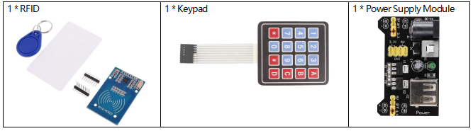
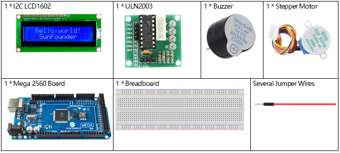
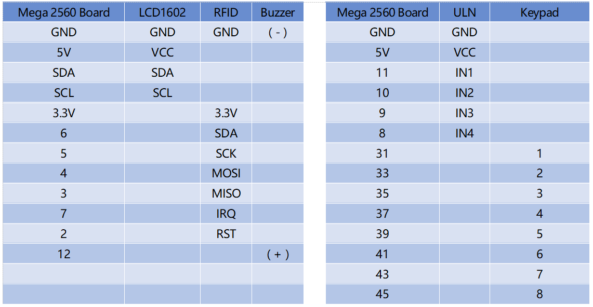
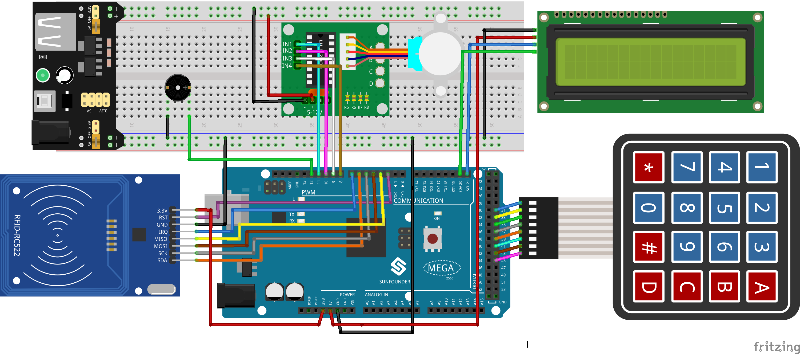
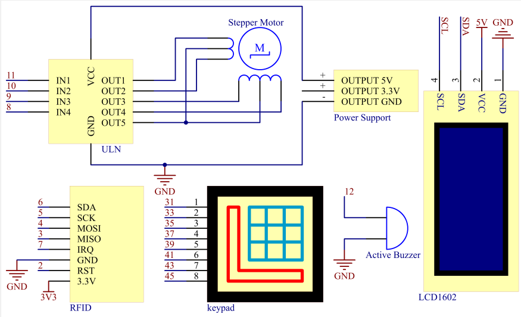
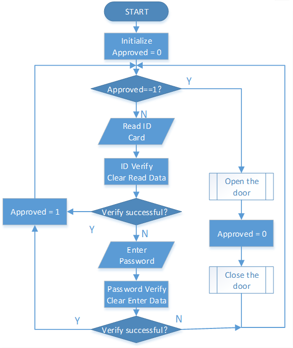
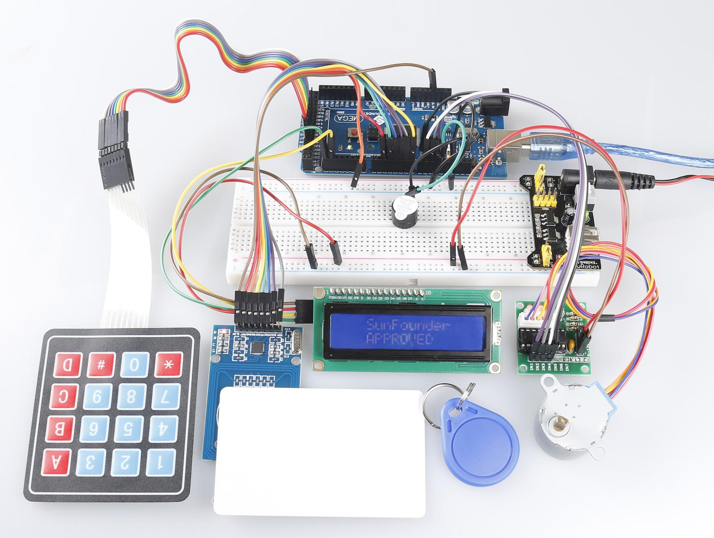

.. note:: 

    Hola, ¡bienvenido a la comunidad de entusiastas de SunFounder Raspberry Pi, Arduino y ESP32 en Facebook! Profundiza en Raspberry Pi, Arduino y ESP32 junto a otros entusiastas.

    **¿Por qué unirse?**

    - **Soporte de expertos**: Resuelve problemas posventa y desafíos técnicos con ayuda de nuestra comunidad y equipo.
    - **Aprende y Comparte**: Intercambia consejos y tutoriales para mejorar tus habilidades.
    - **Avances exclusivos**: Accede anticipadamente a anuncios de nuevos productos y adelantos.
    - **Descuentos especiales**: Disfruta de descuentos exclusivos en nuestros productos más recientes.
    - **Promociones y sorteos festivos**: Participa en sorteos y promociones especiales por festividades.

    👉 ¿Listo para explorar y crear con nosotros? Haz clic en [|link_sf_facebook|] y únete hoy mismo.

.. _ar_access_system:

3.5 Sistema de Control de Acceso
==================================

Descripción general
-----------------------

El sistema de control de acceso se utiliza para gestionar los canales de 
entrada, evolucionando a partir del cerrojo tradicional. La cerradura mecánica 
tradicional es solo un dispositivo simple y, sin importar cuán razonable sea 
su diseño estructural o cuán fuerte sea el material, siempre puede abrirse 
mediante diversos métodos. Además, el uso de llaves para acceder (por ejemplo, 
a un edificio de oficinas o a una habitación de hotel) puede resultar engorroso. 
Si se pierde o reemplaza la llave, es necesario cambiar la cerradura y la llave. 
Para resolver estos problemas, surgieron los cerrojos electrónicos de tarjeta 
magnética y los cerrojos electrónicos codificados, elevando el nivel de gestión 
de los accesos y permitiendo la entrada de estos sistemas en la era electrónica.

Componentes necesarios
-------------------------

* :ref:`cpn_mega2560`
* :ref:`cpn_breadboard`
* :ref:`cpn_wires`
* :ref:`cpn_buzzer`
* :ref:`cpn_i2c_lcd1602`
* :ref:`cpn_stepper_motor`
* :ref:`cpn_keypad`
* :ref:`cpn_power_module`

Circuito Fritzing
-----------------------

En este ejemplo, el Módulo de Alimentación se usa para suministrar energía a 
la protoboard. Conectamos el GND de la placa Mega 2560 al riel de cátodo de la 
protoboard, el GND del ULN2003 al riel de cátodo, VCC a la salida de 5V del 
Módulo de Alimentación, y el Motor Paso a Paso a las salidas OUT1-OUT5 del ULN.

Diagrama esquemático
-----------------------

Código
--------------

.. note::

   * Puedes abrir el archivo ``3.5_accessControlSystem.ino`` en la ruta ``sunfounder_vincent_kit_for_arduino\code\3.5_accessControlSystem`` directamente.
   * Aquí se utilizan las librerías ``Keypad`` y ``LiquidCrystal I2C``, que puedes instalar desde el **Administrador de Librerías**.
   * La librería ``RFID1`` también se utiliza aquí; consulta :ref:`install_lib_man` para un tutorial de instalación.

.. raw:: html

   <iframe src=https://create.arduino.cc/editor/sunfounder01/f7f9dd83-3ede-453e-806b-7420b9f7b29e/preview?embed style="height:510px;width:100%;margin:10px 0" frameborder=0></iframe>

Explicación del Ejemplo
------------------------

El flujo de trabajo del sistema de control de acceso se muestra en el diagrama de flujo.

Cuando no se identifica un ID autorizado (la variable "Approved" es igual a 0), 
el dispositivo realiza la identificación del ID y la verificación de la contraseña.

Si se identifica un ID autorizado ("Approved" es igual a 1), la puerta se abrirá. 
Después de unos segundos, la puerta se cerrará y el estado de identificación se 
restablecerá ("Approved" volverá a 0).

Además de la función central de control de acceso, el proyecto también usa una 
pantalla LCD y un zumbador activo para completar la interacción del usuario con 
el sistema de control de acceso.

Imagen del Fenómeno
------------------------

