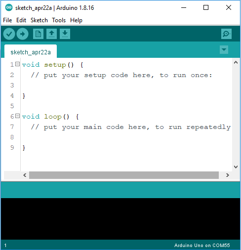
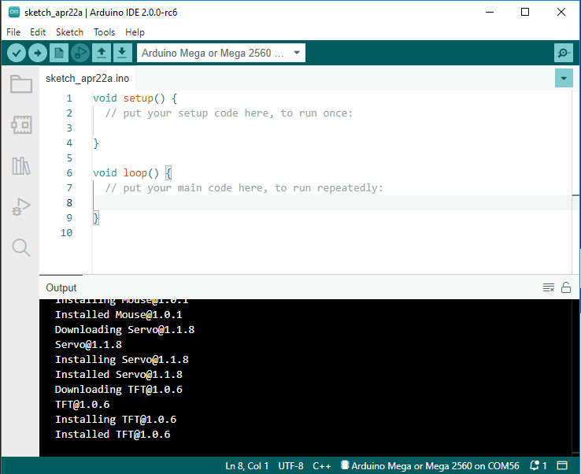
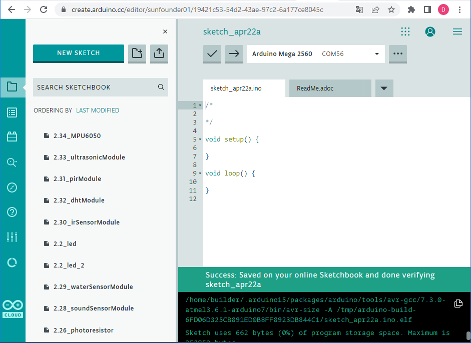
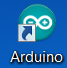

.. _install_ide:

Arduino IDE installieren und einführen
========================================

Installieren Sie die Arduino-IDE
--------------------------------------

Derzeit stehen drei Programmiertools zur Auswahl: Arduino IDE 1, Arduino IDE 2 und Arduino Web Editor.

* **Arduino IDE 1** ist der standardmäßige Offline-Editor.
* **Arduino IDE 2** ist die zukünftige Version der Arduino IDE, die schneller und noch leistungsfähiger ist.
* **Arduino Web Editor** ist eine Online-Entwicklungsumgebung.

**Arduino IDE 1**

Die Arduino Integrated Development Environment – ​​oder Arduino Software (IDE) – enthält einen Texteditor zum Schreiben von Code, einen Nachrichtenbereich, eine Textkonsole, eine Symbolleiste mit Schaltflächen für allgemeine Funktionen und eine Reihe von Menüs. Es verbindet sich mit der Arduino-Hardware, um Programme hochzuladen und mit ihnen zu kommunizieren.

Alles über **Arduino IDE 1** finden Sie unter: https://docs.arduino.cc/software/ide-v1 .

Die folgenden Links sind Tutorials für die Installation von Arduino IDE 1 für jedes Betriebssystem.

* `Windows <http://docs.arduino.cc/software/ide-v1/tutorials/Windows>`_
* `mac OS <http://docs.arduino.cc/software/ide-v1/tutorials/macOS>`_
* `Linux <http://docs.arduino.cc/software/ide-v1/tutorials/Linux>`_

**Arduino IDE 2**

Die neue Hauptversion der Arduino IDE ist schneller und noch leistungsfähiger! Neben einem moderneren Editor und einer reaktionsschnelleren Benutzeroberfläche bietet es Autovervollständigung, Codenavigation und sogar einen Live-Debugger.

Alles über **Arduino IDE 2** finden Sie unter: https://docs.arduino.cc/software/ide-v2

**Arduino Web Editor**

**Arduino Web Editor** ist eine Online-Entwicklungsumgebung mit Online-Speicher und Tausenden verfügbaren Bibliotheken und unterstützt auch neue Arduino-Boards.

Alles über den **Arduino Web Editor** finden Sie unter: https://docs.arduino.cc/cloud/web-editor

Einführung von Arduino IDE 1
-------------------------------

Doppelklicken Sie auf das Arduino-Symbol (arduino.exe), das während des Installationsvorgangs erstellt wurde.

Dann erscheint die Arduino IDE. Lassen Sie uns die Details der Software überprüfen.

.. image:: img/image23.jpeg

#. **Verifizieren**: Kompilieren Sie Ihren Code. Jedes Syntaxproblem wird mit Fehlern angezeigt.

#. **Hochladen**: Laden Sie den Code auf Ihr Board hoch. Wenn Sie auf die Schaltfläche klicken, flackern die RX- und TX-LEDs auf der Platine schnell und hören nicht auf, bis der Upload abgeschlossen ist.

#. **Neu**: Erstellt ein neues Codebearbeitungsfenster.

#. **Öffnen**: Öffnen Sie eine .ino-Skizze.

#. **Speichern**: Speichern Sie die Skizze.

#. **Serieller Monitor**: Klicken Sie auf die Schaltfläche und ein Fenster wird angezeigt. Es empfängt die von Ihrer Steuerplatine gesendeten Daten. Es ist sehr nützlich zum Debuggen.

#. **Datei**: Klicken Sie auf das Menü und eine Dropdown-Liste wird angezeigt, einschließlich Dateierstellung, Öffnen, Speichern, Schließen, Konfigurieren einiger Parameter usw.

#. **Bearbeiten**: Klicken Sie auf das Menü. In der Dropdown-Liste gibt es einige Bearbeitungsvorgänge wie Ausschneiden, Kopieren, Einfügen, Suchen usw. mit den entsprechenden Verknüpfungen.

#. **Skizze**: Umfasst Vorgänge wie Überprüfen, Hochladen, Hinzufügen von Dateien usw. Eine wichtigere Funktion ist Bibliothek einbeziehen – wo Sie Bibliotheken hinzufügen können.

#. **Tool**: Enthält einige Tools – das am häufigsten verwendete Board (das Board, das Sie verwenden) und Port (der Port, an dem sich Ihr Board befindet). Jedes Mal, wenn Sie den Code hochladen möchten, müssen Sie ihn auswählen oder überprüfen.

#. **Hilfe**: Wenn Sie ein Anfänger sind, können Sie die Optionen im Menü überprüfen und die benötigte Hilfe erhalten, einschließlich Operationen in der IDE, Einführungsinformationen, Fehlerbehebung, Codeerklärung usw.

#. In diesem Meldungsbereich erscheint immer die zusammenfassende Meldung, egal wann Sie kompilieren oder hochladen.

#. Detaillierte Meldungen beim Kompilieren und Hochladen. Zum Beispiel, in welchem ​​Pfad die verwendete Datei liegt, die Details der Fehlerabfrage.

#. **Platine und Port**: Hier können Sie eine Vorschau der Platine und des Ports sehen, die für den Code-Upload ausgewählt wurden. Sie können sie über Tools -> Board / Port erneut auswählen, falls etwas falsch ist.

#. Der Bearbeitungsbereich der IDE. Hier können Sie Code schreiben.

