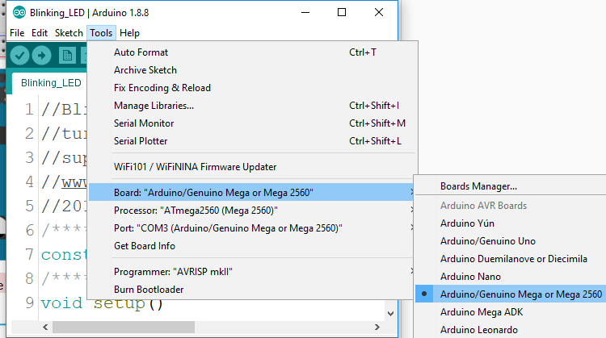
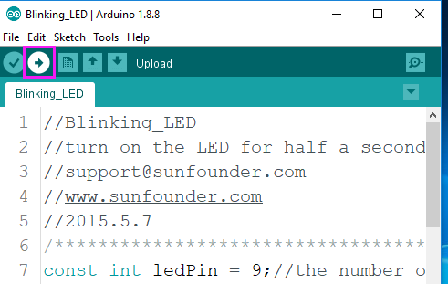
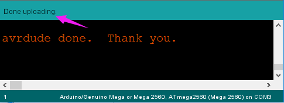
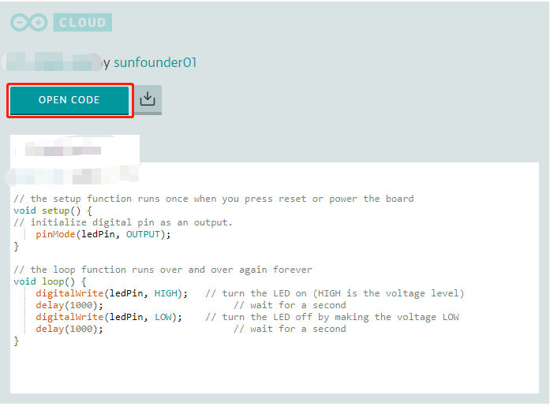
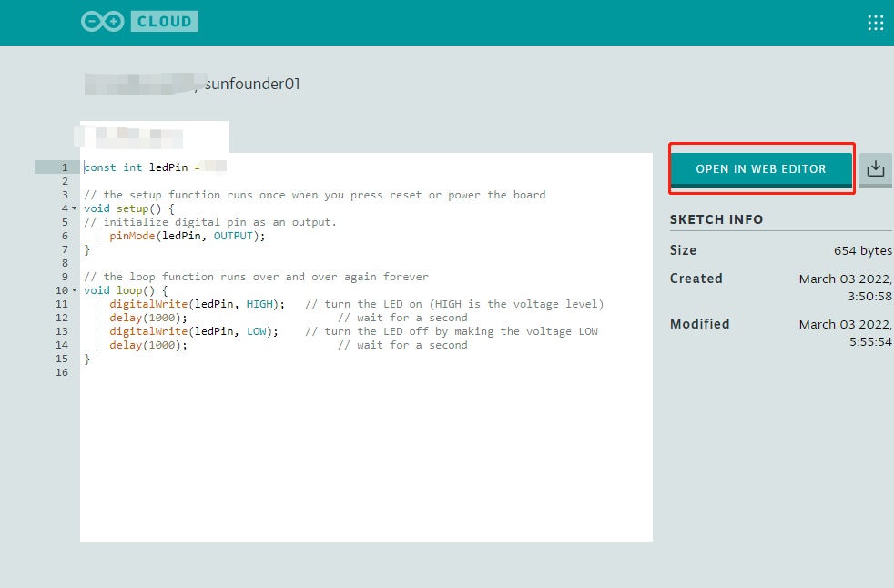

.. _ar_upload_code:

Upload the Code
=================================

For Arduino IDE 1/2
----------------------------

Click **Tools** -> **Board** -> **Arduino AVR Boards** and select **Arduino/Genuino Mega or Mega 2560**.

.. note::
    For Arduino IDE 2, you may need to install **Arduino AVR Boards** first.
    Click **Tools** -> **Board** -> **Boards Managers**, find **Arduino AVR Boards**, and then click **INSTALL**.

Then select **Tools** ->\ **Port**. Your port should be different from mine.

.. image:: img/image33.png

Click the **Upload** icon to upload the code to the control board.

If "Done uploading" appears at the bottom of the window, it means the sketch has been successfully uploaded.

For Web Editor
------------------------

In each project there is an Arduino code display window, click **Open Code**.

Click on **Open in Web Editor** or **Add to MY Sketch**.

If you have registered and logged in to your account, you will be inside the Web Editor. However, you need to install Arduino Create Agent and run it before uploading the code in Web Editor.

For detailed tutorials, please refer to: https://docs.arduino.cc/cloud/web-editor/tutorials/getting-started/getting-started-web-editor.

.. warning::
    For projects that require additional libraries, they will not work in Web Editor.
