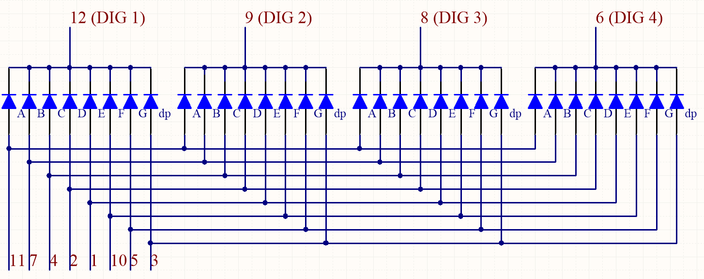

.. _cpn_4_digit:

4-stellige 7-Segment-Anzeige
==================================

Die 4-stellige 7-Segment-Anzeige besteht aus vier 7-Segment-Anzeigen, die zusammenarbeiten.

.. image:: img/4-digit-sche.png

Die 4-stellige 7-Segment-Anzeige arbeitet autark. Es verwendet das Prinzip der menschlichen visuellen Persistenz, um die Zeichen jedes 7-Segments schnell in einer Schleife anzuzeigen, um fortlaufende Zeichenfolgen zu bilden.

Wenn beispielsweise „1234“ auf dem Display angezeigt wird, wird „1“ im ersten 7-Segment angezeigt und „234“ wird nicht angezeigt. Nach einer gewissen Zeit zeigt das zweite 7-Segment „2“, das 1. 3. 4. des 7-Segments zeigt nicht und so weiter, die vier Digitalanzeigen zeigen der Reihe nach. Dieser Vorgang ist sehr kurz (typisch 5ms) und aufgrund des optischen Nachleuchteffekts und des Prinzips des visuellen Rests können wir gleichzeitig vier Zeichen sehen.

**Codes anzeigen**

Damit Sie wissen, wie 7-Segment-Anzeigen (gemeinsame Anode) Zahlen anzeigen, haben wir die folgende Tabelle gezeichnet. Zahlen sind die Zahlen 0-F, die auf der 7-Segment-Anzeige angezeigt werden; (DP) GFEDCBA bezieht sich auf die entsprechende LED auf 0 oder 1 gesetzt. Beispielsweise bedeutet 11000000, dass DP und G auf 1 gesetzt sind, während andere auf 0 gesetzt sind. Daher wird die Zahl 0 auf der 7-Segment-Anzeige angezeigt. während der HEX-Code der Hexadezimalzahl entspricht.

.. image:: img/common_anode.png

**Beispiel**

* :ref:`ar_4_digit` (Arduino-Projekt)

