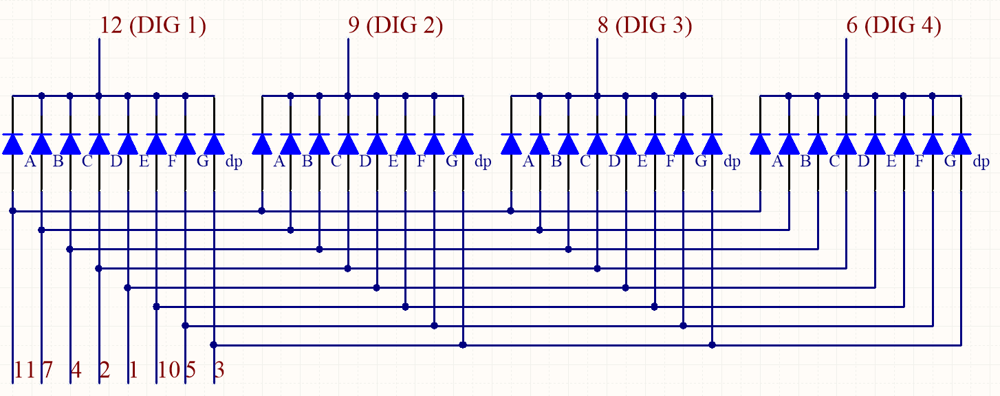

.. note:: 

    Hola, ¡bienvenido a la comunidad de entusiastas de SunFounder Raspberry Pi, Arduino y ESP32 en Facebook! Profundiza en Raspberry Pi, Arduino y ESP32 junto a otros entusiastas.

    **¿Por qué unirse?**

    - **Soporte de expertos**: Resuelve problemas posventa y desafíos técnicos con ayuda de nuestra comunidad y equipo.
    - **Aprende y Comparte**: Intercambia consejos y tutoriales para mejorar tus habilidades.
    - **Avances exclusivos**: Accede anticipadamente a anuncios de nuevos productos y adelantos.
    - **Descuentos especiales**: Disfruta de descuentos exclusivos en nuestros productos más recientes.
    - **Promociones y sorteos festivos**: Participa en sorteos y promociones especiales por festividades.

    👉 ¿Listo para explorar y crear con nosotros? Haz clic en [|link_sf_facebook|] y únete hoy mismo.

.. _cpn_4_digit:

Display de 7 Segmentos de 4 Dígitos
=======================================

El display de 7 segmentos y 4 dígitos consiste en cuatro displays de 
7 segmentos que trabajan juntos.

.. image:: img/4-digit-sche.png

El display de 7 segmentos de 4 dígitos funciona de manera independiente. 
Utiliza el principio de persistencia visual humana para mostrar rápidamente 
los caracteres de cada segmento en un bucle, formando cadenas continuas.

Por ejemplo, cuando se muestra "1234" en el display, primero se muestra "1" 
en el primer segmento de 7, mientras que "234" no se muestra. Después de un 
período breve, el segundo segmento muestra "2", y los segmentos 1, 3 y 4 no 
muestran nada. Este proceso continúa, y los cuatro dígitos se muestran de forma 
alternada. Este proceso es muy corto (generalmente 5ms), y gracias al efecto 
de pospersistencia óptica y al principio de residuo visual, podemos ver los 
cuatro caracteres al mismo tiempo.

**Códigos de Visualización**

Para ayudarle a comprender cómo las pantallas de 7 segmentos (cátodo común) muestran números, hemos elaborado la siguiente tabla. Los números son del 0 al F que se muestran en la pantalla de 7 segmentos; (DP) GFEDCBA se refiere al LED correspondiente configurado en 0 o 1. Por ejemplo, 00111111 significa que DP y G están configurados en 0, mientras que los demás están configurados en 1. Por lo tanto, el número 0 se muestra en la pantalla de 7 segmentos, mientras que el código HEX corresponde al número hexadecimal.

.. list-table:: Glyph Code
    :widths: 20 20 20
    :header-rows: 1

    *   - Numbers	
        - Binary Code
        - Hex Code  
    *   - 0	
        - 00111111	
        - 0x3f
    *   - 1	
        - 00000110	
        - 0x06
    *   - 2	
        - 01011011	
        - 0x5b
    *   - 3	
        - 01001111	
        - 0x4f
    *   - 4	
        - 01100110	
        - 0x66
    *   - 5	
        - 01101101	
        - 0x6d
    *   - 6	
        - 01111101	
        - 0x7d
    *   - 7	
        - 00000111	
        - 0x07
    *   - 8	
        - 01111111	
        - 0x7f
    *   - 9	
        - 01101111	
        - 0x6f
    *   - A	
        - 01110111	
        - 0x77
    *   - B
        - 01111100	
        - 0x7c
    *   - C	
        - 00111001	
        - 0x39
    *   - D	
        - 01011110	
        - 0x5e
    *   - E	
        - 01111001	
        - 0x79
    *   - F	
        - 01110001	
        - 0x71

**Ejemplo**

* :ref:`ar_4_digit` (Proyecto Arduino)
