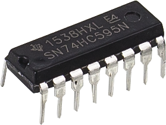
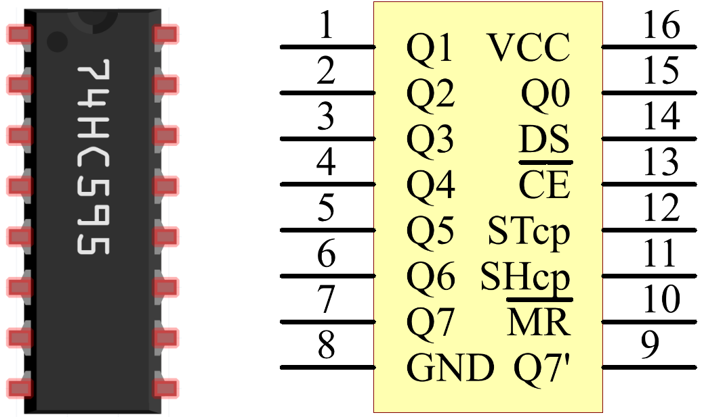

.. _cpn_74hc595:

74HC595
===========

Der 74HC595 besteht aus einem 8-Bit-Schieberegister und einem Speicherregister mit parallelen Ausgängen mit drei Zuständen. Es wandelt die serielle Eingabe in eine parallele Ausgabe um, sodass Sie IO-Ports einer MCU einsparen können. Wenn MR (Pin 10) auf hohem Pegel und OE (Pin 13) auf niedrigem Pegel ist, werden Daten bei der ansteigenden Flanke von SHcp eingegeben und gehen durch die ansteigende Flanke von SHcp in das Speicherregister. Wenn die beiden Takte zusammengeschaltet werden, ist das Schieberegister immer einen Impuls früher als das Speicherregister. Es gibt einen seriellen Shift-Eingangspin (Ds), einen seriellen Ausgangspin (Q) und eine asynchrone Reset-Taste (niedriger Pegel) im Speicherregister. Das Speicherregister gibt einen Bus mit parallelen 8 Bit und in drei Zuständen aus. Wenn OE aktiviert ist (niedriger Pegel), werden die Daten im Speicherregister an den Bus ausgegeben.

* `74HC595 Datenblatt <https://www.ti.com/lit/ds/symlink/cd74hc595.pdf?ts=1617341564801>`_

Pins von 74HC595 und ihre Funktionen:

* **Q0-Q7**: Parallele 8-Bit-Datenausgangspins, die 8 LEDs oder 8 Pins der 7-Segment-Anzeige direkt steuern können.
* **Q7'**: Reihenausgangsstift, verbunden mit DS eines anderen 74HC595, um mehrere 74HC595 in Reihe zu schalten
* **MR**: Reset-Pin, aktiv bei niedrigem Pegel;
* **SHcp**: Zeitfolgeeingang des Schieberegisters. An der ansteigenden Flanke bewegen sich die Daten im Schieberegister nacheinander um ein Bit, dh Daten in Q1 bewegen sich zu Q2 und so weiter. Während der fallenden Flanke bleiben die Daten im Schieberegister unverändert.
* **STcp**: Zeitfolgeeingang des Speicherregisters. Bei der ansteigenden Flanke werden Daten im Schieberegister in das Speicherregister verschoben.
* **CE**: Ausgangsaktivierungsstift, aktiv bei niedrigem Pegel.
* **DS**: Serieller Dateneingangsstift
* **VCC**: Positive Versorgungsspannung.
* **GND**: Masse.

**Beispiel**

* :ref:`ar_7_segment` (Arduino-Projekt)
* :ref:`ar_4_digit` (Arduino-Projekt)
* :ref:`ar_pedestrian` (Arduino-Projekt)

