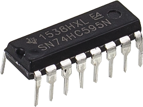

.. note:: 

    Ciao, benvenuto nella community SunFounder Raspberry Pi & Arduino & ESP32 su Facebook! Approfondisci Raspberry Pi, Arduino ed ESP32 insieme ad altri appassionati.

    **Perché unirsi?**

    - **Supporto esperto**: Risolvi problemi post-vendita e sfide tecniche con l'aiuto della nostra community e del nostro team.
    - **Impara e condividi**: Scambia suggerimenti e tutorial per migliorare le tue competenze.
    - **Anteprime esclusive**: Accedi in anteprima agli annunci di nuovi prodotti.
    - **Sconti speciali**: Approfitta di sconti esclusivi sui nostri prodotti più recenti.
    - **Promozioni e omaggi festivi**: Partecipa a omaggi e promozioni speciali durante le festività.

    👉 Pronto per esplorare e creare con noi? Clicca [|link_sf_facebook|] e unisciti oggi stesso!

.. _cpn_74hc595:

74HC595
===========

Il 74HC595 è composto da un registro a scorrimento a 8 bit e un registro di memoria con uscite parallele a tre stati. Converte l'ingresso seriale in uscita parallela, consentendo di risparmiare porte IO di un MCU. 
Quando MR (pin10) è a livello alto e OE (pin13) è a livello basso, i dati vengono immessi al fronte di salita di SHcp e passano al registro di memoria attraverso il fronte di salita di SHcp. Se i due clock sono collegati insieme, il registro a scorrimento è sempre un impulso in anticipo rispetto al registro di memoria. Nel registro di memoria è presente un pin di ingresso seriale (Ds), un pin di uscita seriale (Q) e un pulsante di reset asincrono (a livello basso). Il registro di memoria fornisce un bus con 8 bit paralleli in tre stati. Quando OE è abilitato (a livello basso), i dati nel registro di memoria vengono inviati al bus.

* `Datasheet del 74HC595 <https://www.ti.com/lit/ds/symlink/cd74hc595.pdf?ts=1617341564801>`_

.. image:: img/74hc595_pin.png
    :width: 600

Pin del 74HC595 e loro funzioni:

* **Q0-Q7**: Pin di uscita dati paralleli a 8 bit, in grado di controllare direttamente 8 LED o 8 pin di un display a 7 segmenti.
* **Q7’**: Pin di uscita seriale, collegato al DS di un altro 74HC595 per connettere più 74HC595 in serie.
* **MR**: Pin di reset, attivo a livello basso.
* **SHcp**: Ingresso temporale del registro a scorrimento. Al fronte di salita, i dati nel registro si spostano di un bit, es. i dati in Q1 si spostano in Q2, e così via. Al fronte di discesa, i dati nel registro rimangono invariati.
* **STcp**: Ingresso temporale del registro di memoria. Al fronte di salita, i dati nel registro a scorrimento vengono trasferiti nel registro di memoria.
* **CE**: Pin di abilitazione dell'uscita, attivo a livello basso.
* **DS**: Pin di ingresso dati seriali.
* **VCC**: Tensione di alimentazione positiva.
* **GND**: Massa.

**Esempio**

* :ref:`ar_4_digit` (Progetto Arduino)
* :ref:`ar_pedestrian` (Progetto Arduino)
