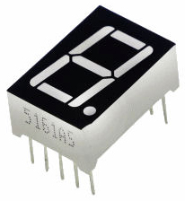
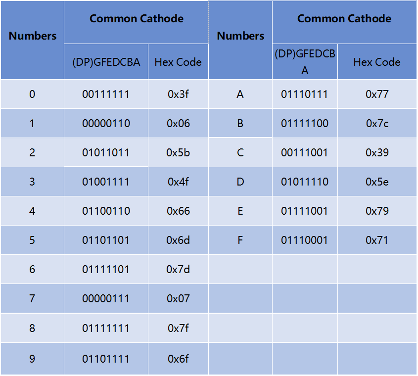

.. _cpn_7_segment:

7-Segment-Anzeige
======================

Eine 7-Segment-Anzeige ist eine 8-förmige Komponente, die 7 LEDs enthält. Jede LED wird als Segment bezeichnet - wenn sie erregt ist, bildet ein Segment einen Teil einer anzuzeigenden Ziffer.

Es gibt zwei Arten von Pin-Verbindungen: Common Cathode (CC) und Common Anode (CA). Wie der Name schon sagt, sind bei einem CC-Display alle Kathoden der 7 LEDs angeschlossen, während bei einem CA-Display alle Anoden der 7 Segmente angeschlossen sind.

In diesem Kit verwenden wir die Common Cathode 7-Segment-Anzeige, hier ist das elektronische Symbol.

.. image:: img/segment_cathode.png
    :width: 800

Jede der LEDs in der Anzeige erhält ein Positionssegment, wobei einer ihrer Anschlussstifte aus dem rechteckigen Kunststoffgehäuse herausgeführt wird. Diese LED-Pins sind mit „a“ bis „g“ gekennzeichnet und repräsentieren jede einzelne LED. Die anderen LED-Pins sind miteinander verbunden und bilden einen gemeinsamen Pin. Indem also die entsprechenden Pins der LED-Segmente in einer bestimmten Reihenfolge in Vorwärtsrichtung vorgespannt werden, werden einige Segmente heller und andere bleiben dunkel, wodurch das entsprechende Zeichen auf dem Display angezeigt wird.

**Codes anzeigen**

Damit Sie wissen, wie 7-Segment-Anzeigen (gemeinsame Kathode) Zahlen anzeigen, haben wir die folgende Tabelle gezeichnet. Zahlen sind die Zahlen 0-F, die auf der 7-Segment-Anzeige angezeigt werden; (DP) GFEDCBA bezieht sich auf die entsprechende LED, die auf 0 oder 1 gesetzt ist. Beispielsweise bedeutet 00111111, dass DP und G auf 0 gesetzt sind, während andere auf 1 gesetzt sind. Daher wird die Zahl 0 auf der 7-Segment-Anzeige angezeigt. während der HEX-Code der Hexadezimalzahl entspricht.

**Beispiel**

* :ref:`ar_7_segment` (Arduino-Projekt)
* :ref:`ar_pedestrian` (Arduino-Projekt)
