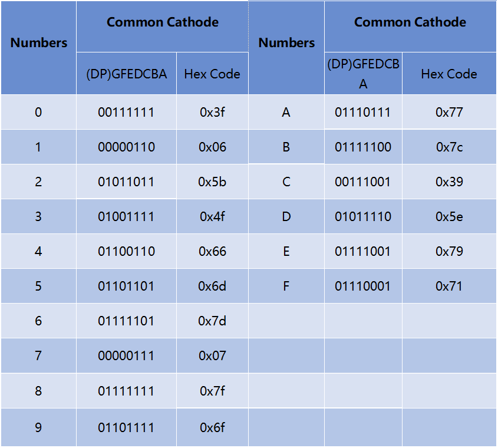

.. note:: 

    Hola, ¡bienvenido a la comunidad de entusiastas de SunFounder Raspberry Pi, Arduino y ESP32 en Facebook! Profundiza en Raspberry Pi, Arduino y ESP32 junto a otros entusiastas.

    **¿Por qué unirse?**

    - **Soporte de expertos**: Resuelve problemas posventa y desafíos técnicos con ayuda de nuestra comunidad y equipo.
    - **Aprende y Comparte**: Intercambia consejos y tutoriales para mejorar tus habilidades.
    - **Avances exclusivos**: Accede anticipadamente a anuncios de nuevos productos y adelantos.
    - **Descuentos especiales**: Disfruta de descuentos exclusivos en nuestros productos más recientes.
    - **Promociones y sorteos festivos**: Participa en sorteos y promociones especiales por festividades.

    👉 ¿Listo para explorar y crear con nosotros? Haz clic en [|link_sf_facebook|] y únete hoy mismo.

.. _cpn_7_segment:

Display de 7 Segmentos
======================

.. image:: img/7-seg.jpg

Un display de 7 segmentos es un componente con forma de "8" que empaqueta 7 LEDs. Cada LED se denomina un segmento; cuando está energizado, un segmento forma parte de un número que se muestra.

Existen dos tipos de conexión de pines: Cátodo Común (CC) y Ánodo Común (CA). Como su nombre indica, un display CC tiene todos los cátodos de los 7 LEDs conectados, mientras que un display CA tiene todos los ánodos de los 7 segmentos conectados.

En este kit, utilizamos un display de 7 segmentos de Cátodo Común. Aquí está su símbolo electrónico:

.. image:: img/segment_cathode.png
    :width: 800

Cada uno de los LEDs en el display tiene un segmento posicional con uno de sus pines de conexión extendido desde el paquete plástico rectangular. Estos pines de los LEDs están etiquetados de "a" a "g", representando cada LED individual. Los demás pines de los LEDs están conectados en común formando un pin común. Por lo tanto, al polarizar directamente los pines adecuados de los segmentos LED en un orden particular, algunos segmentos se iluminan y otros permanecen apagados, mostrando así el carácter correspondiente en el display.

**Códigos de Visualización**

Para ayudarte a comprender cómo los displays de 7 segmentos (Cátodo Común) muestran números, hemos elaborado la siguiente tabla. Los números representan los valores del 0 al F que se muestran en el display de 7 segmentos; (DP) GFEDCBA se refiere a los LEDs correspondientes configurados en 0 o 1. Por ejemplo, 00111111 significa que DP y G están configurados en 0, mientras que los demás están configurados en 1. Por lo tanto, el número 0 se muestra en el display de 7 segmentos, mientras que el Código HEX corresponde al número en formato hexadecimal.

**Ejemplo**

* :ref:`ar_7_segment` (Proyecto Arduino)
* :ref:`ar_pedestrian` (Proyecto Arduino)
