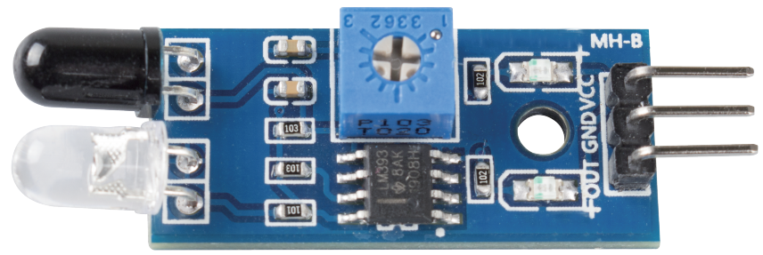

.. _cpn_avoid:

Hindernisvermeidungsmodul
===========================================

* **VCC**: Stromversorgung, 3.3 ~ 5V DC.
* **GND**: Masse
* **OUT**: Signalstift, normalerweise hoher Pegel und niedriger Pegel, wenn ein Hindernis erkannt wird.

Das IR-Hindernisvermeidungsmodul hat eine starke Anpassungsfähigkeit an Umgebungslicht, es hat ein Paar Infrarot-Sende- und -Empfangsröhren.

Die Senderöhre emittiert Infrarotfrequenz, wenn die Erkennungsrichtung auf ein Hindernis trifft, wird die Infrarotstrahlung von der Empfangsröhre empfangen, nach der Verarbeitung der Komparatorschaltung leuchtet die grüne Anzeige auf und gibt ein Signal mit niedrigem Pegel aus.

Der Erkennungsabstand kann per Potentiometer eingestellt werden, der effektive Entfernungsbereich 2-30 cm.

.. image:: img/IR_module.png
    :width: 600
    :align: center

**Beispiel**

* :ref:`ar_avoid` (Arduino-Projekt)
* :ref:`shooting` (Scratch-Projekt)

