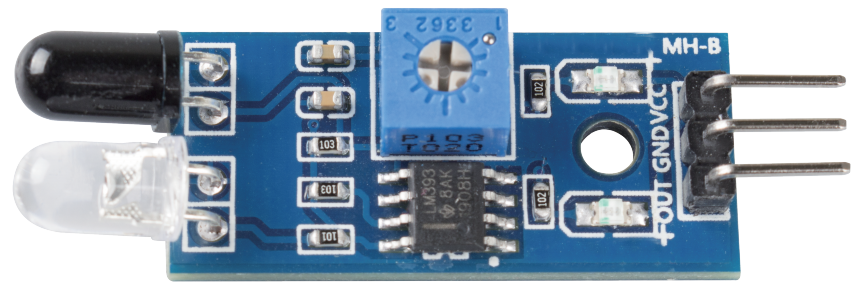

.. note::

    Hallo und willkommen in der SunFounder Raspberry Pi & Arduino & ESP32 Enthusiasten-Gemeinschaft auf Facebook! Tauchen Sie tiefer ein in die Welt von Raspberry Pi, Arduino und ESP32 mit anderen Enthusiasten.

    **Warum beitreten?**

    - **Expertenunterstützung**: Lösen Sie Nachverkaufsprobleme und technische Herausforderungen mit Hilfe unserer Gemeinschaft und unseres Teams.
    - **Lernen & Teilen**: Tauschen Sie Tipps und Anleitungen aus, um Ihre Fähigkeiten zu verbessern.
    - **Exklusive Vorschauen**: Erhalten Sie frühzeitigen Zugang zu neuen Produktankündigungen und exklusiven Einblicken.
    - **Spezialrabatte**: Genießen Sie exklusive Rabatte auf unsere neuesten Produkte.
    - **Festliche Aktionen und Gewinnspiele**: Nehmen Sie an Gewinnspielen und Feiertagsaktionen teil.

    👉 Sind Sie bereit, mit uns zu erkunden und zu erschaffen? Klicken Sie auf [|link_sf_facebook|] und treten Sie heute bei!

.. _cpn_avoid:

Hindernisvermeidungsmodul
===========================================

* **VCC**: Stromversorgung, 3.3 ~ 5V DC.
* **GND**: Masse
* **OUT**: Signalstift, normalerweise hoher Pegel und niedriger Pegel, wenn ein Hindernis erkannt wird.

Das IR-Hindernisvermeidungsmodul hat eine starke Anpassungsfähigkeit an Umgebungslicht, es hat ein Paar Infrarot-Sende- und -Empfangsröhren.

Die Senderöhre emittiert Infrarotfrequenz, wenn die Erkennungsrichtung auf ein Hindernis trifft, wird die Infrarotstrahlung von der Empfangsröhre empfangen, nach der Verarbeitung der Komparatorschaltung leuchtet die grüne Anzeige auf und gibt ein Signal mit niedrigem Pegel aus.

Der Erkennungsabstand kann per Potentiometer eingestellt werden, der effektive Entfernungsbereich 2-30 cm.

.. image:: img/IR_module.png
    :width: 600
    :align: center

**Beispiel**

* :ref:`ar_avoid` (Arduino-Projekt)
* :ref:`shooting` (Scratch-Projekt)

