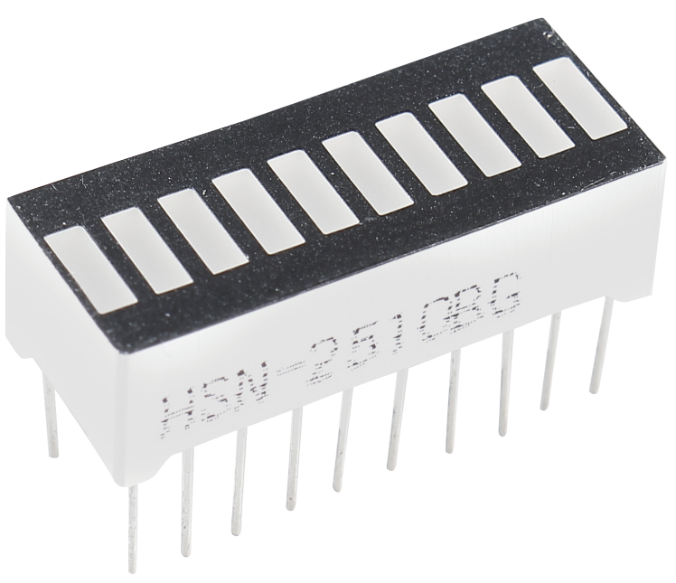
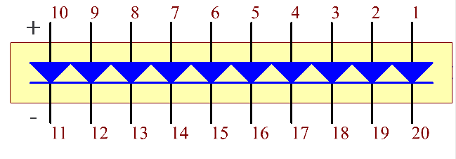

.. _cpn_bar_graph:

LED-Balkendiagramm
======================

LED Bar Graph ist ein LED-Array, das zur Verbindung mit einer elektronischen Schaltung oder einem Mikrocontroller verwendet wird. Es ist einfach, LED-Balkendiagramme mit der Schaltung zu verbinden, als würden 10 einzelne LEDs mit 10 Ausgangspins verbunden. Im Allgemeinen können wir das LED-Balkendiagramm als Batteriestandsanzeige, Audiogeräte und industrielle Steuertafeln verwenden. Es gibt viele andere Anwendungen von LED-Balkendiagrammen.

Das Folgende ist das interne Schema des LED-Balkendiagramms. Im Allgemeinen ist die Seite mit dem Etikett die Anode und die andere Seite die Kathode.

**Beispiel**

* :ref:`ar_bar_graph` (Arduino-Projekt)
* :ref:`shooting` (Scratch-Projekt)