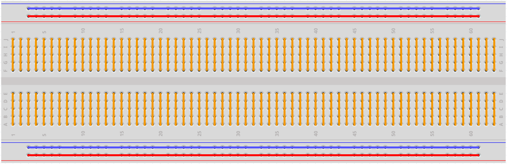

.. _cpn_breadboard:

Brotschneidebrett
==========================

.. image:: img/breadboard.png
    :width: 600

Ein Steckbrett ist eine Konstruktionsbasis für das Prototyping von Elektronik. Ursprünglich bezog sich das Wort auf ein buchstäbliches Brotbrett, ein poliertes Stück Holz, das zum Schneiden von Brot verwendet wurde.[1] In den 1970er Jahren wurde das lötfreie Steckbrett (auch bekannt als Plugboard, ein Terminal-Array-Board) verfügbar und heutzutage wird der Begriff „Breadboard“ allgemein verwendet, um sich darauf zu beziehen.

Es wird verwendet, um Schaltungen schnell aufzubauen und zu testen, bevor ein Schaltungsdesign fertiggestellt wird. Und es hat viele Löcher, in die oben erwähnte Komponenten wie ICs und Widerstände sowie Schaltdrähte eingesetzt werden können. Das Steckbrett ermöglicht das einfache Einstecken und Entfernen von Komponenten.

Das Bild zeigt den inneren Aufbau eines Steckbretts. Obwohl diese Löcher auf dem Steckbrett scheinbar unabhängig voneinander sind, sind sie tatsächlich intern durch Metallstreifen miteinander verbunden.

Wenn Sie mehr über Steckbretter erfahren möchten, lesen Sie: `So verwenden Sie ein Steckbrett – Science Buddies <https://www.sciencebuddies.org/science-fair-projects/references/how-to-use-a-breadboard#pth-smd>`_.

