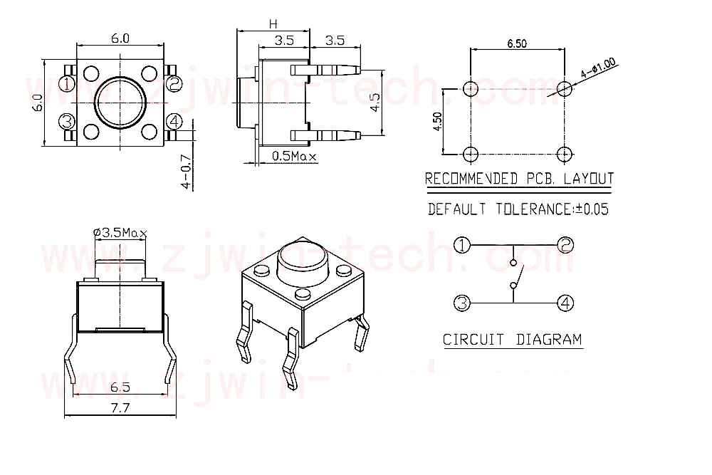

.. _cpn_button:

Taste
==========

.. image:: img/button.png
    :width: 400
    :align: center

Tasten sind eine gängige Komponente zur Steuerung elektronischer Geräte. Sie werden normalerweise als Schalter zum Verbinden oder Unterbrechen von Stromkreisen verwendet. Obwohl es Knöpfe in verschiedenen Größen und Formen gibt, wird hier ein 6-mm-Miniknopf verwendet, wie in den folgenden Bildern gezeigt. Pin 1 ist mit Pin 2 und Pin 3 mit Pin 4 verbunden. Sie müssen also nur entweder Pin 1 und Pin 2 mit Pin 3 oder Pin 4 verbinden.

Das Folgende ist die interne Struktur einer Schaltfläche. Das Symbol unten rechts wird normalerweise verwendet, um einen Knopf in Schaltungen darzustellen.

.. image:: img/button_symbol.png
    :width: 400
    :align: center

Da Pin 1 mit Pin 2 und Pin 3 mit Pin 4 verbunden ist, werden beim Drücken der Taste die 4 Pins verbunden, wodurch der Stromkreis geschlossen wird.

**Beispiel**

* :ref:`ar_button` (Arduino-Projekt)
* :ref:`ar_overheat_monitor` (Arduino-Projekt)
* :ref:`doorbell` (Scratch-Projekt)
* :ref:`eat_apple` (Scratch-Projekt)
* :ref:`fishing` (Scratch-Projekt)

