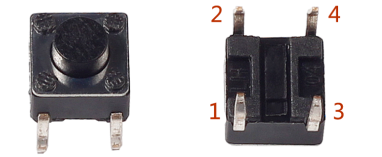
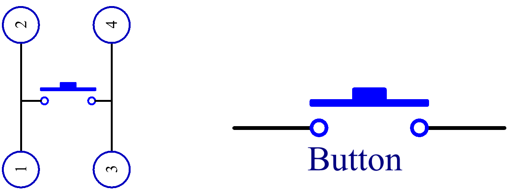
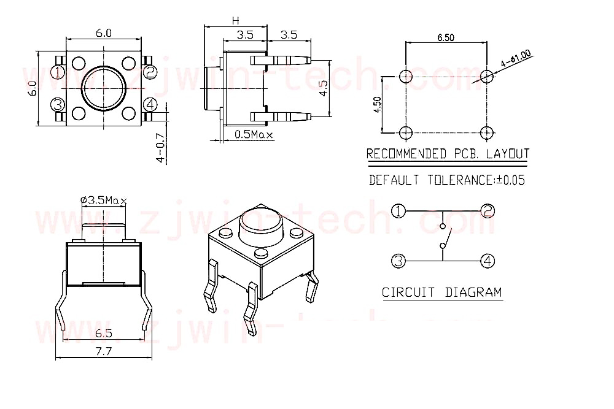

.. note:: 

    Bonjour et bienvenue dans la communauté des passionnés de Raspberry Pi, Arduino et ESP32 sur Facebook, animée par SunFounder ! Plongez plus profondément dans l'univers de Raspberry Pi, Arduino et ESP32 avec d'autres passionnés.

    **Pourquoi nous rejoindre ?**

    - **Support d'experts** : Résolvez vos problèmes après-vente et vos défis techniques avec l'aide de notre communauté et de notre équipe.
    - **Apprendre et partager** : Échangez astuces et tutoriels pour améliorer vos compétences.
    - **Aperçus exclusifs** : Bénéficiez d'un accès anticipé aux annonces de nouveaux produits et aperçus.
    - **Réductions spéciales** : Profitez de réductions exclusives sur nos produits les plus récents.
    - **Promotions festives et concours** : Participez à des concours et promotions pendant les fêtes.

    👉 Prêt à explorer et à créer avec nous ? Cliquez sur [|link_sf_facebook|] et rejoignez-nous dès aujourd'hui !

.. _cpn_button:

Bouton
==========

Les boutons sont des composants courants utilisés pour contrôler des dispositifs électroniques. Ils servent généralement de commutateurs pour connecter ou interrompre des circuits. Bien que les boutons existent sous différentes tailles et formes, celui utilisé ici est un bouton miniature de 6 mm, comme illustré dans les images suivantes.
La broche 1 est connectée à la broche 2, et la broche 3 à la broche 4. Il suffit donc de connecter la broche 1 ou la broche 2 à la broche 3 ou 4.

Voici la structure interne d'un bouton. Le symbole à droite est couramment utilisé pour représenter un bouton dans les circuits.

Étant donné que la broche 1 est connectée à la broche 2, et la broche 3 à la broche 4, lorsque le bouton est pressé, les 4 broches sont connectées, fermant ainsi le circuit.

**Exemple**

* :ref:`ar_button` (Arduino Project)
* :ref:`ar_overheat_monitor` (Arduino Project)
* :ref:`doorbell` (Scratch Project)
* :ref:`eat_apple` (Scratch Project)
* :ref:`fishing` (Scratch Project)

