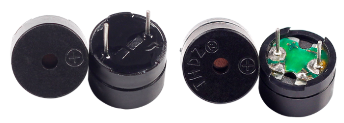

.. note:: 

    Bonjour et bienvenue dans la communauté des passionnés de Raspberry Pi, Arduino et ESP32 sur Facebook, animée par SunFounder ! Plongez dans l'univers de Raspberry Pi, Arduino et ESP32 avec d'autres passionnés.

    **Pourquoi nous rejoindre ?**

    - **Support d'experts** : Résolvez vos problèmes après-vente et vos défis techniques avec l'aide de notre communauté et de notre équipe.
    - **Apprendre et partager** : Échangez astuces et tutoriels pour améliorer vos compétences.
    - **Aperçus exclusifs** : Bénéficiez d'un accès anticipé aux annonces de nouveaux produits et aperçus.
    - **Réductions spéciales** : Profitez de réductions exclusives sur nos produits les plus récents.
    - **Promotions festives et concours** : Participez à des concours et promotions pendant les fêtes.

    👉 Prêt à explorer et à créer avec nous ? Cliquez sur [|link_sf_facebook|] et rejoignez-nous dès aujourd'hui !

.. _cpn_buzzer:

Buzzer
==========

Les buzzers, qui font partie des dispositifs électroniques avec une structure intégrée, sont alimentés par courant continu (DC) et sont largement utilisés dans les ordinateurs, imprimantes, photocopieurs, alarmes, jouets électroniques, dispositifs électroniques automobiles, téléphones, minuteurs et autres produits électroniques ou dispositifs vocaux.

Les buzzers peuvent être classés en actifs et passifs (voir l'image ci-dessous). Placez le buzzer de manière à ce que ses broches soient orientées vers le haut. Le buzzer avec une carte de circuit imprimé verte est un buzzer passif, tandis que celui enveloppé dans un ruban noir est un buzzer actif.

La différence entre un buzzer actif et un buzzer passif : 

Un buzzer actif possède une source d'oscillation intégrée, il émet donc des sons lorsqu'il est alimenté. En revanche, un buzzer passif ne dispose pas d'une telle source et ne produira pas de son avec des signaux DC. Pour le faire fonctionner, il est nécessaire d'utiliser des ondes carrées dont la fréquence se situe entre 2 kHz et 5 kHz. Le buzzer actif est généralement plus cher que le buzzer passif en raison de ses circuits oscillants intégrés.

Voici le symbole électrique d'un buzzer. Il possède deux broches, l'une étant positive (anode) et l'autre négative (cathode). Le signe + sur la surface représente l'anode, l'autre étant la cathode. 

.. image:: img/buzzer_symbol.png
    :width: 150

Vous pouvez vérifier les broches du buzzer : la broche la plus longue est l'anode, et la broche la plus courte est la cathode. Veuillez ne pas les inverser lors de la connexion, sinon le buzzer ne produira pas de son.

`Buzzer - Wikipedia <https://en.wikipedia.org/wiki/Buzzer>`_

**Exemple**

* :ref:`ar_active_buzzer` (Arduino Project)
* :ref:`ar_passive_buzzer` (Arduino Project)

