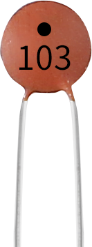
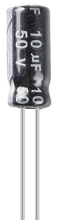

.. _cpn_capacitor:

Kondensator
=============

CKondensator bezieht sich auf die Menge der Ladungsspeicherung unter einer bestimmten Potentialdifferenz, die als C bezeichnet wird, und die internationale Einheit ist Farad (F). Allgemein gesagt bewegen sich elektrische Ladungen unter Krafteinwirkung in einem elektrischen Feld. Wenn sich zwischen Leitern ein Medium befindet, wird die Bewegung elektrischer Ladungen behindert und die elektrischen Ladungen sammeln sich auf den Leitern an, was zu einer Akkumulation elektrischer Ladungen führt.

Die Menge der gespeicherten elektrischen Ladungen wird als Kapazität bezeichnet. Da Kondensatoren eine der am häufigsten verwendeten elektronischen Komponenten in elektronischen Geräten sind, werden sie häufig in Gleichstromisolierung, Kopplung, Umgehung, Filterung, Abstimmschleifen, Energieumwandlung und Steuerschaltungen verwendet. Kondensatoren werden in Elektrolytkondensatoren, Feststoffkondensatoren usw. unterteilt.

Kondensatoren können nach Materialeigenschaften unterteilt werden in: Aluminium-Elektrolytkondensatoren, Folienkondensatoren, Tantalkondensatoren, Keramikkondensatoren, Superkondensatoren usw.

In diesem Bausatz werden Keramikkondensatoren und Elektrolytkondensatoren verwendet.

* `Keramikkondensator – Wikipedia <https://en.wikipedia.org/wiki/Ceramic_capacitor>`_
* `Elektrolytkondensator – Wikipedia <https://en.wikipedia.org/wiki/Electrolytic_capacitor>`_

Auf den Keramikkondensatoren befinden sich 103- oder 104-Etiketten, die den Kapazitätswert darstellen, 103 = 10 x 10 ^ 3 pF, 104 = 10 x 10 ^ 4 pF

**Einheitenumrechnung**

    1F=10^3mF=10^6uF=10^9nF=10^12pF

**Beispiel**

* :ref:`ar_button` (Arduino-Projekt)
* :ref:`ar_slide` (Arduino-Projekt)
* :ref:`doorbell` (Scratch-Projekt)
* :ref:`eat_apple` (Scratch-Projekt)
* :ref:`fishing` (Scratch-Projekt)

