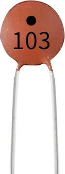
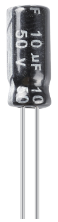

.. note:: 

    Ciao, benvenuto nella community SunFounder Raspberry Pi & Arduino & ESP32 su Facebook! Approfondisci Raspberry Pi, Arduino ed ESP32 insieme ad altri appassionati.

    **Perché unirsi?**

    - **Supporto esperto**: Risolvi problemi post-vendita e sfide tecniche con l'aiuto della nostra community e del nostro team.
    - **Impara e condividi**: Scambia suggerimenti e tutorial per migliorare le tue competenze.
    - **Anteprime esclusive**: Accedi in anteprima agli annunci di nuovi prodotti.
    - **Sconti speciali**: Approfitta di sconti esclusivi sui nostri prodotti più recenti.
    - **Promozioni e omaggi festivi**: Partecipa a omaggi e promozioni speciali durante le festività.

    👉 Pronto per esplorare e creare con noi? Clicca [|link_sf_facebook|] e unisciti oggi stesso!

.. _cpn_capacitor:

Condensatore
===============

Il condensatore rappresenta la quantità di carica immagazzinata sotto una determinata differenza di potenziale, indicata come C, con unità di misura internazionale farad (F). 
Generalmente, le cariche elettriche si muovono sotto forza in un campo elettrico. Quando c'è un mezzo tra i conduttori, il movimento delle cariche è ostacolato e queste si accumulano sui conduttori, determinando un accumulo di cariche.

La quantità di carica accumulata è chiamata capacità. Poiché i condensatori sono tra i componenti elettronici più utilizzati, trovano ampio impiego in applicazioni come isolamento in corrente continua, accoppiamento, bypass, filtraggio, circuiti di sintonizzazione, conversione energetica e controllo. I condensatori si dividono in condensatori elettrolitici, condensatori solidi, ecc.

Secondo le caratteristiche del materiale, i condensatori possono essere classificati in: condensatori elettrolitici in alluminio, condensatori a film, condensatori al tantalio, condensatori ceramici, supercondensatori, ecc.

In questo kit, vengono utilizzati condensatori ceramici ed elettrolitici.

* `Ceramic Capacitor - Wikipedia <https://en.wikipedia.org/wiki/Ceramic_capacitor>`_

* `Electrolytic Capacitor - Wikipedia <https://en.wikipedia.org/wiki/Electrolytic_capacitor>`_

Sui condensatori ceramici sono presenti le etichette 103 o 104, che rappresentano il valore della capacità: 103=10x10^3pF, 104=10x10^4pF.

**Conversione unità**

    1F=10^3mF=10^6uF=10^9nF=10^12pF

**Esempi**

* :ref:`ar_button` (Progetto Arduino)
* :ref:`ar_slide` (Progetto Arduino)
* :ref:`doorbell` (Progetto Scratch)
* :ref:`eat_apple` (Progetto Scratch)
* :ref:`fishing` (Progetto Scratch)
