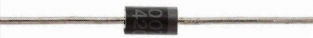
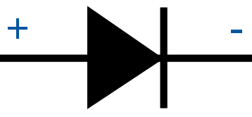
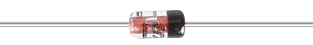
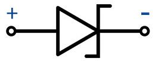

.. _cpn_diode:

Diode
=================

Eine Diode ist ein elektronisches Bauteil mit zwei Elektroden. Es lässt Strom nur in eine Richtung fließen, was oft als „Gleichrichtungsfunktion“ bezeichnet wird. Somit kann man sich eine Diode als elektronische Version eines Rückschlagventils vorstellen.

Aufgrund ihrer unidirektionalen Leitfähigkeit wird die Diode in fast allen elektronischen Schaltungen einiger Komplexität verwendet. Es ist eines der ersten Halbleiterbauelemente und hat ein breites Anwendungsspektrum.

Entsprechend seiner Verwendungsklassifikation kann es in Detektordioden, Gleichrichterdioden, Begrenzerdioden, Spannungsreglerdioden usw. unterteilt werden.

Gleichrichterdioden und Spannungsreglerdioden sind in diesem Kit enthalten.

**Gleichrichterdiode**

Eine Gleichrichterdiode ist eine Halbleiterdiode, die verwendet wird, um AC (Wechselstrom) in DC (Gleichstrom) unter Verwendung der Gleichrichterbrückenanwendung gleichzurichten. Die Alternative der Gleichrichterdiode durch die Schottky-Barriere wird hauptsächlich in der digitalen Elektronik geschätzt. Diese Diode ist in der Lage, Stromwerte zu leiten, die sich von mA bis zu einigen kA und Spannungen bis zu einigen kV ändern.

Die Konstruktion von Gleichrichterdioden kann mit Siliziummaterial erfolgen und sie sind in der Lage, hohe elektrische Stromwerte zu leiten. Diese Dioden sind keine berühmten, aber immer noch verwendeten Halbleiterdioden auf Ge- oder Galliumarsenidbasis. Ge-Dioden haben eine geringere zulässige Sperrspannung sowie eine geringere zulässige Sperrschichttemperatur. Die Ge-Diode hat im Vergleich zur Si-Diode den Vorteil, dass sie einen niedrigen Schwellenspannungswert hat, während sie in Durchlassrichtung betrieben wird.

* `1N400x Allzweckdiode – Wikipedia <https://en.wikipedia.org/wiki/1N400x_general-purpose_diode>`_

**Zener-Diode**

Eine Zenerdiode ist ein spezieller Diodentyp, der dafür ausgelegt ist, Strom zuverlässig „rückwärts“ fließen zu lassen, wenn eine bestimmte Sperrspannung, die sogenannte Zenerspannung, erreicht wird.

Diese Diode ist ein Halbleiterbauelement, das bis zur kritischen Durchbruchspannung einen sehr hohen Widerstand hat. An diesem kritischen Durchbruchspunkt wird der Rückwärtswiderstand auf einen sehr kleinen Wert reduziert und der Strom steigt an, während die Spannung in diesem niederohmigen Bereich konstant bleibt.

* `Zener diode - Wikipedia <https://en.wikipedia.org/wiki/Zener_diode>`_

