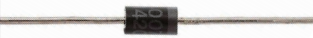
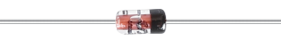

.. note:: 

    Ciao, benvenuto nella community SunFounder Raspberry Pi & Arduino & ESP32 su Facebook! Approfondisci Raspberry Pi, Arduino ed ESP32 insieme ad altri appassionati.

    **Perché unirsi?**

    - **Supporto esperto**: Risolvi problemi post-vendita e sfide tecniche con l'aiuto della nostra community e del nostro team.
    - **Impara e condividi**: Scambia suggerimenti e tutorial per migliorare le tue competenze.
    - **Anteprime esclusive**: Accedi in anteprima agli annunci di nuovi prodotti.
    - **Sconti speciali**: Approfitta di sconti esclusivi sui nostri prodotti più recenti.
    - **Promozioni e omaggi festivi**: Partecipa a omaggi e promozioni speciali durante le festività.

    👉 Pronto per esplorare e creare con noi? Clicca [|link_sf_facebook|] e unisciti oggi stesso!

.. _cpn_diode:

Diodo
=================

Un diodo è un componente elettronico con due elettrodi. Consente il 
flusso di corrente in una sola direzione, caratteristica nota come 
funzione di "rettifica". Pertanto, il diodo può essere considerato 
una versione elettronica di una valvola di non ritorno.

Grazie alla sua conduttività unidirezionale, il diodo è utilizzato in quasi 
tutti i circuiti elettronici di una certa complessità. È uno dei primi dispositivi 
a semiconduttore e trova applicazione in una vasta gamma di ambiti.

Secondo la classificazione per uso, i diodi possono essere suddivisi in diodi 
rivelatori, diodi rettificatori, diodi limitatori, diodi regolatori di tensione, ecc.

In questo kit sono inclusi diodi rettificatori e diodi Zener.

**Diodo rettificatore**

.. image:: img/symbol_rectifier_diode.png
    :width: 200

Un diodo rettificatore è un diodo a semiconduttore utilizzato per rettificare la corrente alternata (AC) in corrente continua (DC) tramite l'applicazione di un ponte rettificatore. L'uso alternativo del diodo rettificatore attraverso la barriera di Schottky è particolarmente apprezzato nell'elettronica digitale. Questo diodo è in grado di condurre valori di corrente che variano da pochi mA a qualche kA e tensioni fino a qualche kV.

I diodi rettificatori sono progettati principalmente con materiale in silicio e sono capaci di condurre valori elevati di corrente elettrica. Anche se meno comuni, vengono ancora utilizzati diodi a semiconduttore basati su Ge (germanio) o arsenico di gallio. I diodi in Ge hanno una tensione inversa e una temperatura di giunzione inferiore rispetto ai diodi in Si. Tuttavia, il vantaggio del diodo in Ge rispetto al diodo in Si è la bassa tensione di soglia durante il funzionamento in polarizzazione diretta.

* `1N400x general-purpose diode  - Wikipedia <https://en.wikipedia.org/wiki/1N400x_general-purpose_diode>`_

**Diodo Zener**

Un diodo Zener è un tipo speciale di diodo progettato per consentire in modo affidabile il flusso di corrente "al contrario" quando viene raggiunta una determinata tensione inversa nota come tensione Zener.

Questo diodo è un dispositivo a semiconduttore che presenta un'alta resistenza fino al punto di tensione critica di rottura inversa. A questo punto critico, la resistenza inversa si riduce a un valore molto basso e la corrente aumenta mentre la tensione rimane costante in questa regione di bassa resistenza.

.. image:: img/symbol-zener-diode.jpg

* `Zener diode - Wikipedia <https://en.wikipedia.org/wiki/Zener_diode>`_
