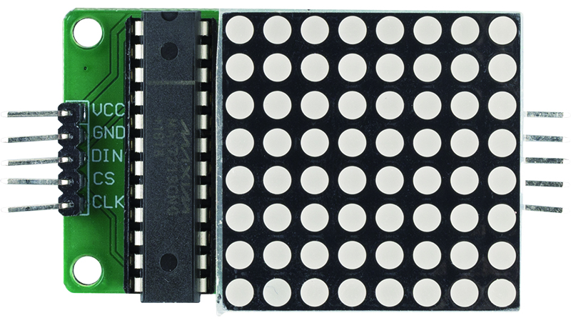
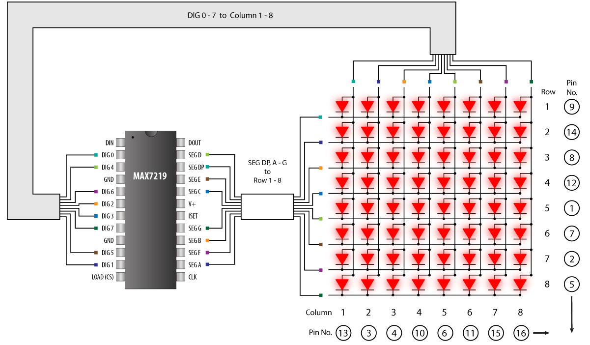

.. note:: 

    Hola, ¡bienvenido a la comunidad de entusiastas de SunFounder Raspberry Pi, Arduino y ESP32 en Facebook! Profundiza en Raspberry Pi, Arduino y ESP32 junto a otros entusiastas.

    **¿Por qué unirse?**

    - **Soporte de expertos**: Resuelve problemas posventa y desafíos técnicos con ayuda de nuestra comunidad y equipo.
    - **Aprende y Comparte**: Intercambia consejos y tutoriales para mejorar tus habilidades.
    - **Avances exclusivos**: Accede anticipadamente a anuncios de nuevos productos y adelantos.
    - **Descuentos especiales**: Disfruta de descuentos exclusivos en nuestros productos más recientes.
    - **Promociones y sorteos festivos**: Participa en sorteos y promociones especiales por festividades.

    👉 ¿Listo para explorar y crear con nosotros? Haz clic en [|link_sf_facebook|] y únete hoy mismo.

.. _cpn_matrix_module:

Módulo de Matriz LED
==============================

Este es un módulo de matriz de puntos 8x8 de cátodo común impulsado por el MAX7219. El voltaje de operación del módulo es de 5V, con un tamaño de 50mm x 32mm x 15mm. El puerto de entrada se encuentra en el lado izquierdo y el puerto de salida en el derecho, y admite la conexión en cascada de múltiples módulos.

* **VCC**: Voltaje positivo de alimentación. Conectar a +5V.
* **GND**: Tierra (ambos pines GND deben estar conectados).
* **DIN**: Entrada de datos en serie. Los datos se cargan en el registro de desplazamiento interno de 16 bits en el flanco ascendente de CLK.
* **CS**: Entrada de selección de chip. Los datos en serie se cargan en el registro de desplazamiento mientras CS está en bajo. Los últimos 16 bits de datos en serie se retienen en el flanco ascendente de CS.
* **CLK**: Entrada de reloj en serie. Máxima tasa de 10MHz. En el flanco ascendente de CLK, los datos se desplazan al registro de desplazamiento interno. En el flanco descendente de CLK, los datos se desplazan desde DOUT. En el MAX7221, la entrada CLK está activa solo mientras CS está en bajo.

**MAX7219**

El MAX7219 es un controlador compacto de entrada/salida en serie para displays de cátodo común, que permite la conexión de microprocesadores (µPs) a displays LED numéricos de 7 segmentos de hasta 8 dígitos, displays de barras o 64 LEDs individuales. Incluye un decodificador de código BCD, circuitería de escaneo de multiplexado, controladores de segmentos y dígitos, y una memoria RAM estática de 8x8 que almacena cada dígito.

Solo se requiere una resistencia externa para ajustar la corriente de todos los LEDs. El MAX7221 es compatible con SPI™, QSPI™ y MICROWIRE™, y tiene controladores de segmento de velocidad limitada para reducir EMI.

Una interfaz de serie conveniente de 4 hilos se conecta a todos los µPs comunes. Los dígitos individuales pueden direccionarse y actualizarse sin reescribir todo el display. El MAX7219/MAX7221 también permite al usuario seleccionar la decodificación en código B o sin decodificación para cada dígito.

* `Ficha técnica del MAX7219 <https://datasheets.maximintegrated.com/en/ds/MAX7219-MAX7221.pdf>`_

**Ejemplo**

* :ref:`ar_matrix_module` (Proyecto Arduino)
