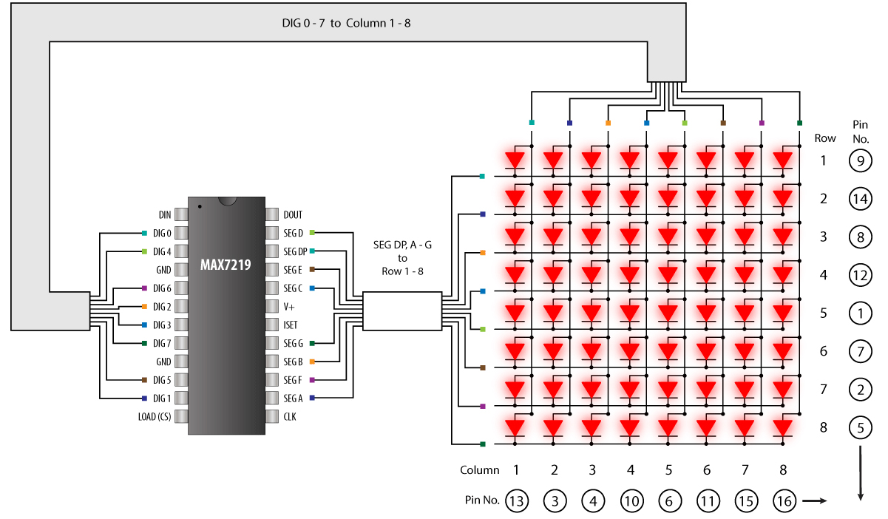

.. _cpn_matrix_module:

LED-Matrix-Modul
==============================

Dies ist ein 8x8-Punktmatrixmodul mit gemeinsamer Kathode, das von MAX7219 angesteuert wird, die Betriebsspannung des Moduls beträgt 5 V, die Größe beträgt 50 mm x 32 mm x 15 mm, die linke Seite ist der Eingangsport, die rechte Seite ist der Ausgangsport, unterstützt mehrere Module in Kaskade.

* **VCC**: Positive Versorgungsspannung. An +5V anschließen.
* **GND**: Masse (beide GND-Pins müssen verbunden sein)
* **DIN**: Serieller Dateneingang. Daten werden in das interne 16-Bit-Schieberegister auf der ansteigenden Flanke von CLK geladen.
* **CS**: Chip-Select-Eingang. Serielle Daten werden in das Schieberegister geladen, während CS niedrig ist. Die letzten 16 Bits der seriellen Daten werden an der ansteigenden Flanke von CS zwischengespeichert.
* **CLK**: Serieller Takteingang. 10 MHz maximale Rate. Auf der ansteigenden Flanke von CLK werden Daten in das interne Schieberegister geschoben. Auf der fallenden Flanke von CLK werden Daten aus DOUT getaktet. Beim MAX7221 ist der CLK-Eingang nur aktiv, während CS niedrig ist.

**MAX7219**

Der MAX7219 ist ein kompakter, serieller Eingang/Ausgang-Anzeigetreiber mit gemeinsamer Kathode, der Mikroprozessoren (µPs) mit numerischen 7-Segment-LED-Anzeigen mit bis zu 8 Stellen, Balkendiagrammanzeigen oder 64 einzelnen LEDs verbindet. Auf dem Chip enthalten sind ein BCD-Code-B-Decoder, eine Multiplex-Scan-Schaltung, Segment- und Zifferntreiber und ein statisches 8x8-RAM, das jede Ziffer speichert.

Es wird nur ein externer Widerstand benötigt, um den Segmentstrom für alle LEDs einzustellen. Der MAX7221 ist mit SPI™, QSPI™ und MICROWIRE™ kompatibel und verfügt über slewrate-begrenzte Segmenttreiber zur Reduzierung von EMI.

Eine bequeme serielle 4-Draht-Schnittstelle verbindet sich mit allen gängigen µPs. Einzelne Ziffern können adressiert und aktualisiert werden, ohne die gesamte Anzeige neu zu schreiben. Der MAX7219/MAX7221 ermöglicht dem Benutzer auch, für jede Ziffer CodeB-Decodierung oder No-Decodierung auszuwählen.

* `MAX7219 Datasheet <https://datasheets.maximintegrated.com/en/ds/MAX7219-MAX7221.pdf>`_

**Beispiel**

* :ref:`ar_matrix_module` (Arduino-Projekt)
