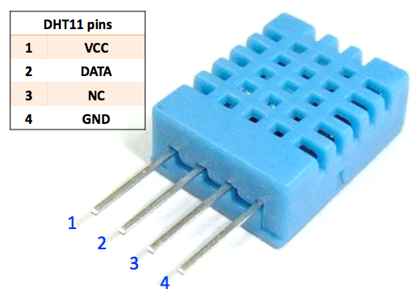

.. note:: 

    Ciao, benvenuto nella community di appassionati di SunFounder Raspberry Pi, Arduino ed ESP32 su Facebook! Approfondisci Raspberry Pi, Arduino ed ESP32 insieme ad altri appassionati.

    **Perché unirsi?**

    - **Supporto esperto**: Risolvi problemi post-vendita e sfide tecniche con l'aiuto della nostra community e del nostro team.
    - **Impara e condividi**: Scambia suggerimenti e tutorial per migliorare le tue competenze.
    - **Anteprime esclusive**: Accedi in anteprima agli annunci di nuovi prodotti.
    - **Sconti speciali**: Approfitta di sconti esclusivi sui nostri prodotti più recenti.
    - **Promozioni e omaggi festivi**: Partecipa a omaggi e promozioni speciali durante le festività.

    👉 Pronto per esplorare e creare con noi? Clicca [|link_sf_facebook|] e unisciti oggi stesso!

.. _cpn_humiture:

Modulo Sensore di Temperatura e Umidità
=============================================

.. image:: img/dht11_pic.png
    :width: 400
    :align: center

Il sensore digitale di temperatura e umidità DHT11 è un sensore composito che fornisce un'uscita digitale calibrata di temperatura e umidità. 
La tecnologia di raccolta di moduli digitali dedicati e la tecnologia di rilevamento di temperatura e umidità vengono applicate per garantire un'alta affidabilità e un'eccellente stabilità a lungo termine.

Sono disponibili solo tre pin per l'uso: **VCC**, **GND** e **DATA**. 
Il processo di comunicazione inizia con la linea **DATA** che invia segnali di avvio al DHT11, il quale riceve i segnali e restituisce un segnale di risposta. 
Successivamente, l'host riceve il segnale di risposta e inizia a ricevere i 40 bit di dati di umidità e temperatura (8 bit per l'umidità intera + 8 bit per l'umidità decimale + 8 bit per la temperatura intera + 8 bit per la temperatura decimale + 8 bit per il checksum).

* `Datasheet del DHT11 <https://components101.com/sites/default/files/component_datasheet/DHT11-Temperature-Sensor.pdf>`_

**Esempio**

* :ref:`ar_humiture` (Progetto Arduino)
* :ref:`humiture` (Progetto Scratch)
