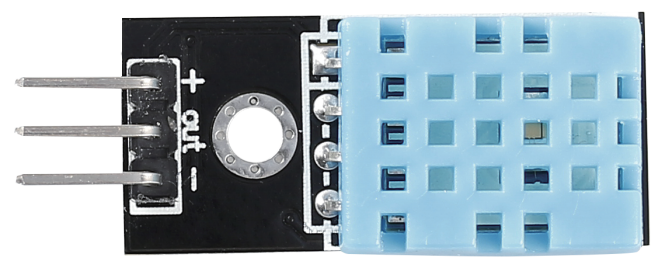

.. _cpn_humiture:

Feuchtigkeitssensormodul
=============================

Der digitale Temperatur- und Feuchtigkeitssensor DHT11 ist ein zusammengesetzter Sensor, der einen kalibrierten digitalen Signalausgang für Temperatur und Feuchtigkeit enthält. Die Technologie einer speziellen Sammlung digitaler Module und die Temperatur- und Feuchtigkeitsmesstechnologie werden angewendet, um sicherzustellen, dass das Produkt eine hohe Zuverlässigkeit und ausgezeichnete Langzeitstabilität aufweist.

Es stehen nur drei Pins zur Verfügung: VCC, GND und DATA. Der Kommunikationsvorgang beginnt damit, dass die DATA-Leitung Startsignale an DHT11 sendet, und DHT11 empfängt die Signale und sendet ein Antwortsignal zurück. Dann empfängt der Host das Antwortsignal und beginnt mit dem Empfang von 40-Bit-Feuchtigkeitsdaten (8-Bit-Feuchtigkeits-Ganzzahl + 8-Bit-Feuchtigkeits-Dezimalzahl + 8-Bit-Temperatur-Ganzzahl + 8-Bit-Temperatur-Dezimalzahl + 8-Bit-Prüfsumme).

.. image:: img/Dht11.png

* `DHT11 Datenblatt <https://components101.com/sites/default/files/component_datasheet/DHT11-Temperature-Sensor.pdf>`_

**Beispiel**

* :ref:`ar_humiture` (Arduino-Projekt)
* :ref:`humiture` (Scratch-Projekt)