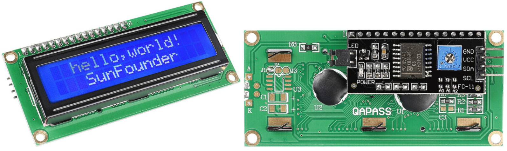

.. _cpn_i2c_lcd1602:

I2C LCD1602
==============

* **GND**: Masse
* **VCC**: Spannungsversorgung, 5V.
* **SDA**: Serielle Datenleitung. Über einen Pullup-Widerstand mit VCC verbinden.
* **SCL**: Serielle Taktleitung. Über einen Pullup-Widerstand mit VCC verbinden.

Wie wir alle wissen, bereichern LCD- und einige andere Displays zwar die Mensch-Maschine-Interaktion, haben aber eine gemeinsame Schwäche. Wenn sie mit einem Controller verbunden sind, werden mehrere IOs des Controllers belegt, der nicht so viele äußere Ports hat. Außerdem schränkt es andere Funktionen des Controllers ein.

Daher wurde LCD1602 mit einem I2C-Modul entwickelt, um das Problem zu lösen. Das I2C-Modul verfügt über einen eingebauten PCF8574 I2C-Chip, der serielle I2C-Daten in parallele Daten für das LCD-Display umwandelt.

* `PCF8574 Datenblatt <https://www.ti.com/lit/ds/symlink/pcf8574.pdf?ts=1627006546204&ref_url=https%253A%252F%252Fwww.google.com%252F>`_

**I2C-Adresse**

Die Standardadresse ist grundsätzlich 0x27, in einigen Fällen kann es 0x3F sein.

Am Beispiel der Standardadresse 0x27 kann die Geräteadresse geändert werden, indem die Pads A0/A1/A2 kurzgeschlossen werden; Im Standardzustand ist A0/A1/A2 1, und wenn das Pad kurzgeschlossen ist, ist A0/A1/A2 0.

.. image:: img/i2c_address.jpg
    :width: 600

**Hintergrundbeleuchtung/Kontrast**

Die Hintergrundbeleuchtung kann über eine Jumperkappe aktiviert werden. Ziehen Sie die Jumperkappe ab, um die Hintergrundbeleuchtung zu deaktivieren. Das blaue Potentiometer auf der Rückseite.

.. image:: img/back_lcd1602.jpg

* **Kurzschlusskappe**: Die Hintergrundbeleuchtung kann durch diese Kappe aktiviert werden. Ziehen Sie diese Kappe ab, um die Hintergrundbeleuchtung zu deaktivieren.
* **Potentiometer**: Wird verwendet, um den Kontrast (die Klarheit des angezeigten Textes) einzustellen, der im Uhrzeigersinn erhöht und im Gegenuhrzeigersinn verringert wird.

**Beispiel**

* :ref:`ar_lcd1602` (Arduino-Projekt)
* :ref:`ar_access_system` (Arduino-Projekt)
* :ref:`ar_guess_number` (Arduino-Projekt)
* :ref:`ar_overheat_monitor` (Arduino-Projekt)
* :ref:`lcd1602` (Scratch-Projekt)
