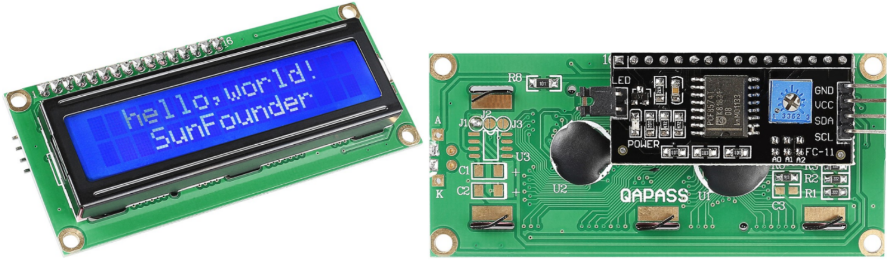
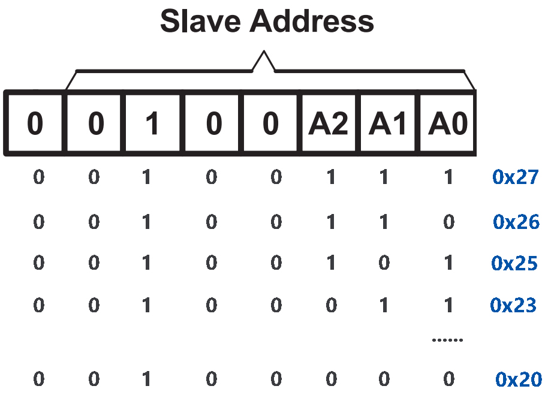
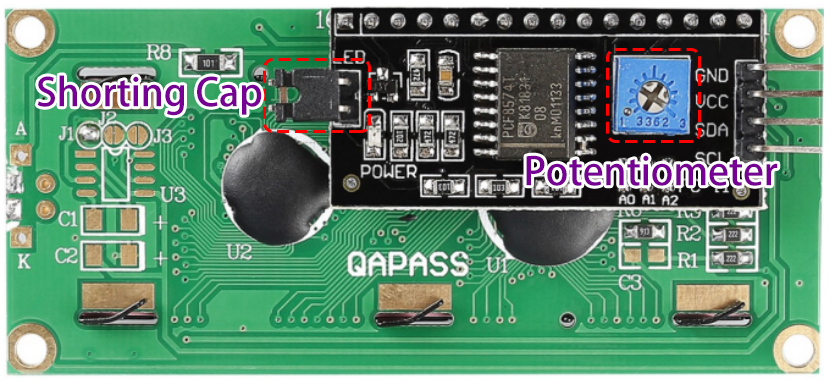

.. note:: 

    Bonjour et bienvenue dans la communauté des passionnés de Raspberry Pi, Arduino et ESP32 sur Facebook, animée par SunFounder ! Plongez plus profondément dans l'univers de Raspberry Pi, Arduino et ESP32 avec d'autres passionnés.

    **Pourquoi nous rejoindre ?**

    - **Support d'experts** : Résolvez vos problèmes après-vente et vos défis techniques avec l'aide de notre communauté et de notre équipe.
    - **Apprendre et partager** : Échangez astuces et tutoriels pour améliorer vos compétences.
    - **Aperçus exclusifs** : Bénéficiez d'un accès anticipé aux annonces de nouveaux produits et aperçus.
    - **Réductions spéciales** : Profitez de réductions exclusives sur nos produits les plus récents.
    - **Promotions festives et concours** : Participez à des concours et promotions pendant les fêtes.

    👉 Prêt à explorer et à créer avec nous ? Cliquez sur [|link_sf_facebook|] et rejoignez-nous dès aujourd'hui !

.. _cpn_i2c_lcd1602:

I2C LCD1602
================

* **GND** : Masse
* **VCC** : Alimentation, 5V.
* **SDA** : Ligne de données série. Connectez-la à VCC via une résistance de tirage.
* **SCL** : Ligne d'horloge série. Connectez-la à VCC via une résistance de tirage.

Comme nous le savons tous, bien que les écrans LCD et d'autres types d'affichages améliorent considérablement l'interaction homme-machine, ils présentent une faiblesse commune. Lorsqu'ils sont connectés à un contrôleur, plusieurs E/S sont occupées, et ces contrôleurs n'ont pas forcément un grand nombre de ports externes disponibles. Cela limite également les autres fonctionnalités du contrôleur.

Pour résoudre ce problème, le LCD1602 avec module I2C a été développé. Le module I2C est équipé d'un chip PCF8574 intégré qui convertit les données série I2C en données parallèles pour l'affichage LCD.

* `PCF8574 Datasheet <https://www.ti.com/lit/ds/symlink/pcf8574.pdf?ts=1627006546204&ref_url=https%253A%252F%252Fwww.google.com%252F>`_

**Adresse I2C**

L'adresse par défaut est généralement 0x27, mais dans certains cas, elle peut être 0x3F.

En prenant l'adresse par défaut 0x27 comme exemple, l'adresse de l'appareil peut être modifiée en reliant les pads A0/A1/A2 ; dans l'état par défaut, A0/A1/A2 est à 1, et si les pads sont reliés, A0/A1/A2 devient 0.

**Rétroéclairage/Contraste**

Le rétroéclairage peut être activé par un capuchon de pont, et il est désactivé en retirant ce capuchon. Le potentiomètre bleu à l'arrière permet d'ajuster le contraste.

* **Capuchon de pont** : Le rétroéclairage peut être activé ou désactivé à l'aide de ce capuchon.
* **Potentiomètre** : Il sert à ajuster le contraste (la clarté du texte affiché). Tournez-le dans le sens des aiguilles d'une montre pour augmenter le contraste, et dans le sens inverse pour le diminuer.

**Exemple**

* :ref:`ar_lcd1602` (Arduino Project)
* :ref:`ar_access_system` (Arduino Project)
* :ref:`ar_guess_number` (Arduino Project)
* :ref:`ar_overheat_monitor` (Arduino Project)
* :ref:`lcd1602` (Scratch Project)
