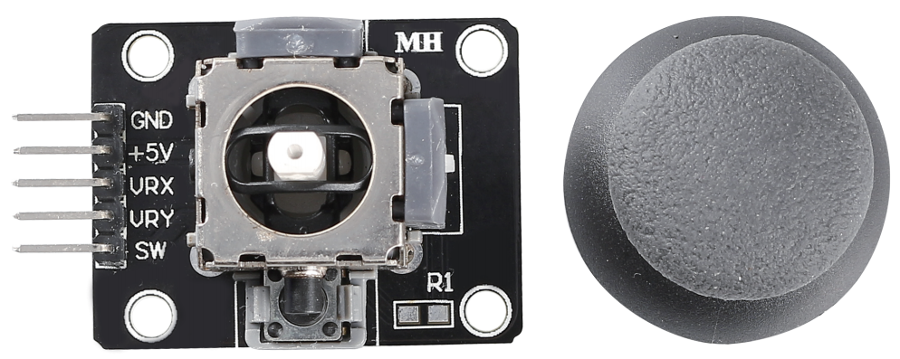

.. _cpn_joystick:

Joystick-Modul
=======================

Die Grundidee eines Joysticks besteht darin, die Bewegung eines Sticks in elektronische Informationen zu übersetzen, die ein Computer verarbeiten kann.

Um dem Computer den vollen Bewegungsbereich mitzuteilen, muss ein Joystick die Position des Sticks auf zwei Achsen messen – der X-Achse (von links nach rechts) und der Y-Achse (oben und unten). Wie in der Grundgeometrie bestimmen die XY-Koordinaten exakt die Position des Sticks.

Um die Position des Steuerknüppels zu bestimmen, überwacht das Joystick-Steuersystem einfach die Position jeder Welle. Das herkömmliche analoge Joystick-Design tut dies mit zwei Potentiometern oder variablen Widerständen.

Der Joystick hat auch einen digitalen Eingang, der aktiviert wird, wenn der Joystick gedrückt wird.

.. image:: img/joystick318.png
    :align: center
    :width: 600
	
**Beispiel**

* :ref:`ar_joystick` (Arduino-Projekt)
* :ref:`star_crossed` (Scratch-Projekt)
* :ref:`dragon` (Scratch-Projekt)