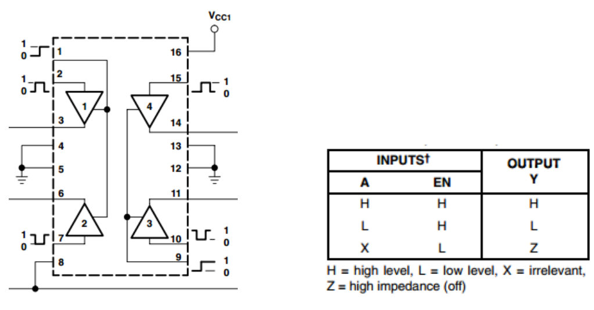

.. _cpn_l293d:

L293D 
=================

L293D ist ein 4-Kanal-Motortreiber, der durch einen Chip mit hoher Spannung und hohem Strom integriert ist. Es ist für den Anschluss an Standard-DTL-, TTL-Logikpegel und zum Ansteuern induktiver Lasten (wie Relaisspulen, Gleichstrom, Schrittmotoren) und Leistungsschalttransistoren usw. ausgelegt. Gleichstrommotoren sind Geräte, die elektrische Gleichstromenergie in mechanische Energie umwandeln. Sie werden aufgrund ihrer überlegenen Leistung bei der Drehzahlregelung häufig in Elektroantrieben eingesetzt.

Siehe die Abbildung der Stifte unten. L293D hat zwei Pins (Vcc1 und Vcc2) für die Stromversorgung. Vcc2 wird verwendet, um den Motor mit Strom zu versorgen, während Vcc1 den Chip versorgt. Da hier ein kleiner Gleichstrommotor verwendet wird, verbinden Sie beide Pins mit +5V.

.. image:: img/l293d111.png

Das Folgende ist die interne Struktur von L293D. Pin EN ist ein Enable-Pin und funktioniert nur mit High-Pegel; A steht für Input und Y für Output. Sie können die Beziehung zwischen ihnen unten rechts sehen. Wenn Pin EN High-Pegel ist, wenn A High ist, gibt Y High-Pegel aus; wenn A Low ist, gibt Y Low-Pegel aus. Wenn Pin EN auf Low-Pegel ist, funktioniert der L293D nicht.

* `L293D Datenblatt <https://www.ti.com/lit/ds/symlink/l293d.pdf?ts=1627004062301&ref_url=https%253A%252F%252Fwww.ti.com%252Fproduct%252FL293D>`_

**Beispiel**

* :ref:`ar_motor` (Arduino-Projekt)
* :ref:`rotating_fan` (Scratch-Projekt)