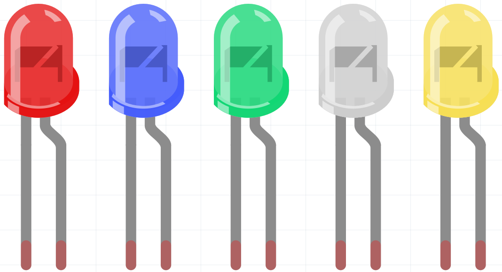

.. note:: 

    Hola, ¡bienvenido a la comunidad de entusiastas de SunFounder Raspberry Pi, Arduino y ESP32 en Facebook! Profundiza en Raspberry Pi, Arduino y ESP32 junto a otros entusiastas.

    **¿Por qué unirse?**

    - **Soporte de expertos**: Resuelve problemas posventa y desafíos técnicos con ayuda de nuestra comunidad y equipo.
    - **Aprende y Comparte**: Intercambia consejos y tutoriales para mejorar tus habilidades.
    - **Avances exclusivos**: Accede anticipadamente a anuncios de nuevos productos y adelantos.
    - **Descuentos especiales**: Disfruta de descuentos exclusivos en nuestros productos más recientes.
    - **Promociones y sorteos festivos**: Participa en sorteos y promociones especiales por festividades.

    👉 ¿Listo para explorar y crear con nosotros? Haz clic en [|link_sf_facebook|] y únete hoy mismo.

.. _cpn_led:

LED
==========

El diodo emisor de luz (LED, por sus siglas en inglés) es un tipo de componente semiconductor que puede convertir energía eléctrica en energía luminosa a través de uniones PN. Según su longitud de onda, se puede clasificar en diodos láser, diodos emisores de luz infrarroja y diodos emisores de luz visible, conocidos comúnmente como LED.

El diodo tiene una conductividad unidireccional, por lo que la corriente fluirá en la dirección indicada por la flecha en el símbolo del circuito. Solo puedes suministrar energía positiva al ánodo y negativa al cátodo para que el LED encienda.

.. image:: img/led_symbol.png

Un LED tiene dos pines. El más largo es el ánodo y el más corto es el cátodo. Es importante no conectarlos al revés. El LED tiene una caída de voltaje fija en su dirección de avance, por lo que no puede conectarse directamente al circuito porque el voltaje de suministro podría superar esta caída y quemar el LED. El voltaje de avance de los LED rojos, amarillos y verdes es de 1.8 V, mientras que el del blanco es de 2.6 V. La mayoría de los LED pueden soportar un máximo de 20 mA de corriente, por lo que es necesario conectar una resistencia limitadora de corriente en serie.

La fórmula para calcular el valor de la resistencia es la siguiente:

    R = (Vsupply – VD)/I

**R** representa el valor de la resistencia limitadora de corriente, **Vsupply** el voltaje de suministro, **VD** la caída de voltaje y **I** la corriente de trabajo del LED.

Aquí tienes una introducción detallada sobre los LED: `LED - Wikipedia <https://en.wikipedia.org/wiki/Light-emitting_diode>`_.

**Ejemplo**

* :ref:`ar_led` (Proyecto Arduino)
* :ref:`breathing_led` (Proyecto Scratch)
* :ref:`table_lamp` (Proyecto Scratch)
