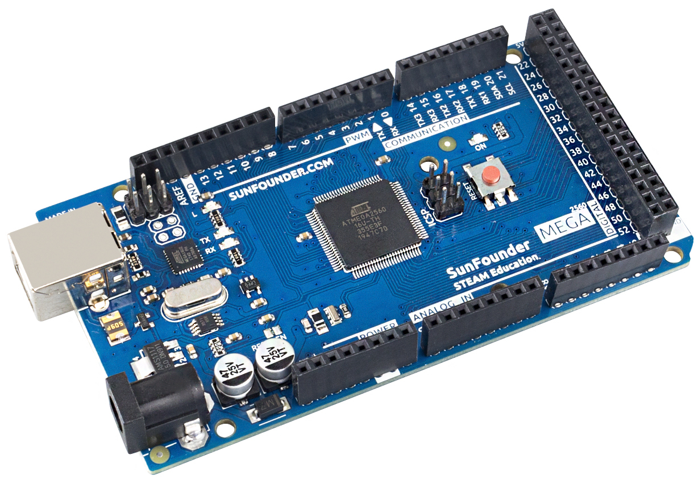
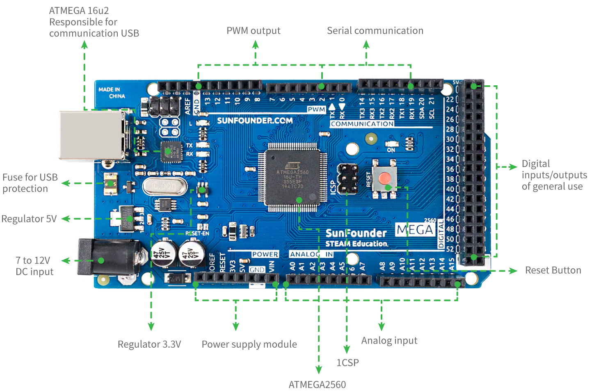

.. _cpn_mega2560:

SunFounder Mega Board
==============================

.. note::
    Das SunFounder Mega Board ist ein Mainboard mit fast den gleichen Funktionen wie das `Arduino Mega 2560 Rev3 <https://store-usa.arduino.cc/products/arduino-mega-2560-rev3?selectedStore=us>`_, und die beiden Boards können austauschbar verwendet werden.

Das SunFounder Mega Board ist ein Mikrocontroller-Board basierend auf dem ATmega2560 (`​​Datenblatt <http://ww1.microchip.com/downloads/en/DeviceDoc/ATmega640-1280-1281-2560-2561-Datasheet-DS40002211A.pdf>`_). Es verfügt über 54 digitale Ein-/Ausgangspins (von denen 15 als PWM-Ausgänge verwendet werden können), 16 analoge Eingänge, 4 UARTs (Hardware Serial Ports), einen 16-MHz-Quarzoszillator, einen USB-Anschluss, eine Strombuchse, einen ICSP-Header, und eine Reset-Taste. Es enthält alles, was zur Unterstützung des Mikrocontrollers benötigt wird; Schließen Sie es einfach mit einem USB-Kabel an einen Computer an oder betreiben Sie es mit einem AC-zu-DC-Adapter oder einer Batterie, um loszulegen. Das SunFounder Mega Board Board ist mit den meisten Schilden kompatibel, die für das Uno und die früheren Boards Duemilanove oder Diecimila entwickelt wurden.

**Technische Parameter**

* MIKROCONTROLLER: ATmega2560
* BETRIEBSSPANNUNG: 5V
* EINGANGSSPANNUNG (EMPFOHLEN): 7-12V
* EINGANGSSPANNUNG (GRENZE): 6-20 V
* DIGITAL I/O PINS: 54 (0-53, davon 15 mit PWM-Ausgang (2-13, 44-46))
* PINS FÜR ANALOGE EINGÄNGE: 16 (A0-A15)
* GLEICHSTROM PRO E/A-PIN: 20 mA
* GLEICHSTROM FÜR 3,3-V-STIFT: 50 mA
* FLASH-SPEICHER: 256 KB, davon 8 KB vom Bootloader verwendet
* SRAM: 8 KB
* EEPROM: 4 KB
* TAKTGESCHWINDIGKEIT: 16 MHz
* LED_EINGEBAUT: 13
* LÄNGE: 101,52 mm
* BREITE: 53,3 mm
* GEWICHT: 37 g
* I2C-Anschluss: A4 (SDA), A5 (SCL); 20(SDA), 21(SCL)

**What's More**

* `Arduino-IDE <https://www.arduino.cc/en/software>`_
* `Referenz zur Arduino-Programmiersprache <https://www.arduino.cc/reference/en/>`_
* :ref:`get_started_ar`
* `ATmega2560 Datasheet <http://ww1.microchip.com/downloads/en/DeviceDoc/ATmega640-1280-1281-2560-2561-Datasheet-DS40002211A.pdf>`_