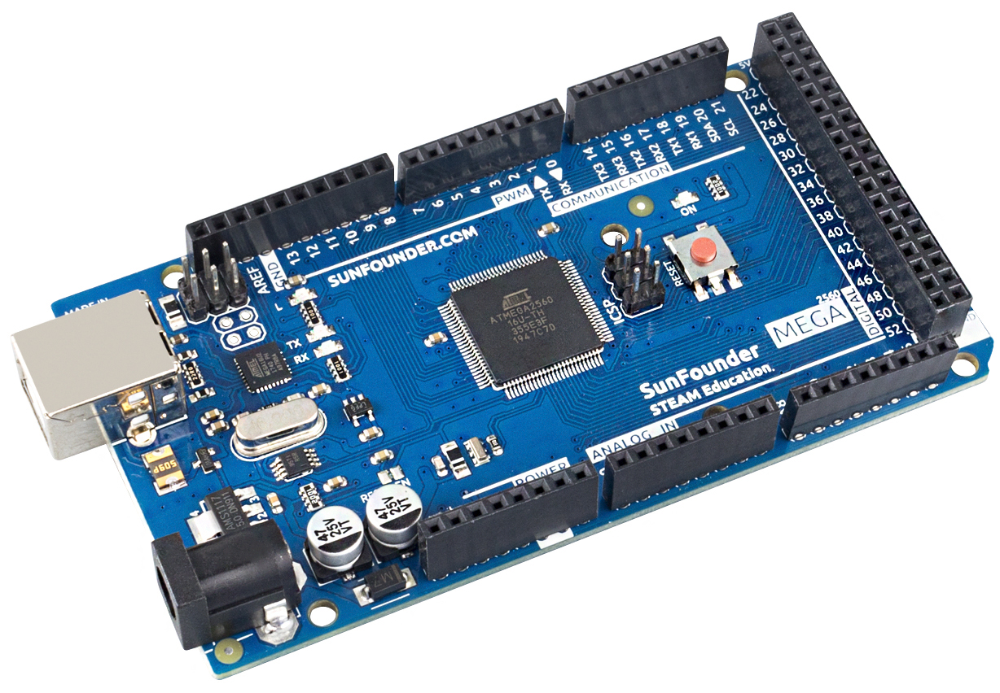
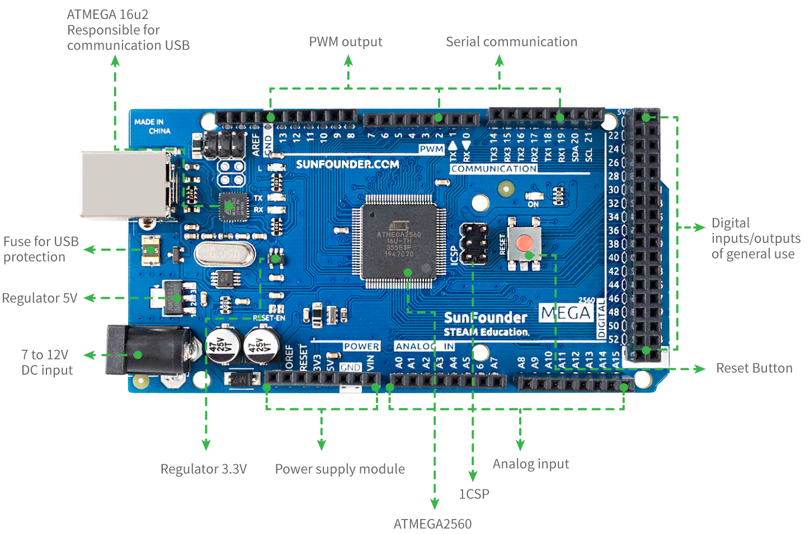

.. note:: 

    Hola, ¡bienvenido a la comunidad de entusiastas de SunFounder Raspberry Pi, Arduino y ESP32 en Facebook! Profundiza en Raspberry Pi, Arduino y ESP32 junto a otros entusiastas.

    **¿Por qué unirse?**

    - **Soporte de expertos**: Resuelve problemas posventa y desafíos técnicos con ayuda de nuestra comunidad y equipo.
    - **Aprende y Comparte**: Intercambia consejos y tutoriales para mejorar tus habilidades.
    - **Avances exclusivos**: Accede anticipadamente a anuncios de nuevos productos y adelantos.
    - **Descuentos especiales**: Disfruta de descuentos exclusivos en nuestros productos más recientes.
    - **Promociones y sorteos festivos**: Participa en sorteos y promociones especiales por festividades.

    👉 ¿Listo para explorar y crear con nosotros? Haz clic en [|link_sf_facebook|] y únete hoy mismo.

.. _cpn_mega2560:

Placa SunFounder Mega
==============================

.. note::

    La placa SunFounder Mega es una placa principal con casi las mismas funciones que la `Arduino Mega 2560 Rev3 <https://store-usa.arduino.cc/products/arduino-mega-2560-rev3?selectedStore=us>`_, y ambas pueden usarse de manera intercambiable.

La placa SunFounder Mega es una placa microcontroladora basada en el ATmega2560 (`datasheet <http://ww1.microchip.com/downloads/en/DeviceDoc/ATmega640-1280-1281-2560-2561-Datasheet-DS40002211A.pdf>`_). Cuenta con 54 pines de entrada/salida digitales (de los cuales 15 se pueden usar como salidas PWM), 16 entradas analógicas, 4 UARTs (puertos seriales por hardware), un oscilador de cristal de 16 MHz, una conexión USB, un conector de alimentación, un encabezado ICSP y un botón de reinicio. Contiene todo lo necesario para soportar el microcontrolador; simplemente conéctalo a una computadora con un cable USB o aliméntalo con un adaptador de CA a CC o una batería para comenzar. La placa SunFounder Mega es compatible con la mayoría de los shields diseñados para las placas Uno, Duemilanove o Diecimila anteriores.

**Parámetros Técnicos**

* MICROCONTROLADOR: ATmega2560
* VOLTAJE DE OPERACIÓN: 5V
* VOLTAJE DE ENTRADA (RECOMENDADO): 7-12V
* VOLTAJE DE ENTRADA (LÍMITE): 6-20V
* PINES DE ENTRADA/SALIDA DIGITALES: 54 (0-53, de los cuales 15 proporcionan salida PWM (2-13, 44-46))
* PINES DE ENTRADA ANALÓGICA: 16 (A0-A15)
* CORRIENTE DC POR PIN DE I/O: 20 mA
* CORRIENTE DC PARA PIN DE 3.3V: 50 mA
* MEMORIA FLASH: 256 KB, de los cuales 8 KB son utilizados por el bootloader
* SRAM: 8 KB
* EEPROM: 4 KB
* VELOCIDAD DEL RELOJ: 16 MHz
* LED_BUILTIN: 13
* LONGITUD: 101.52 mm
* ANCHO: 53.3 mm
* PESO: 37 g
* Puerto I2C: A4(SDA), A5(SCL); 20(SDA), 21(SCL)

**Más Información**

* `Arduino IDE <https://www.arduino.cc/en/software>`_
* `Referencia del Lenguaje de Programación Arduino <https://www.arduino.cc/reference/en/>`_
* :ref:`get_started_ar`
* `Datasheet del ATmega2560 <http://ww1.microchip.com/downloads/en/DeviceDoc/ATmega640-1280-1281-2560-2561-Datasheet-DS40002211A.pdf>`_
