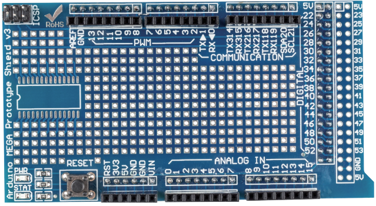

.. _cpn_prototype:

Prototyp-Schild
===========================

Das Prototype Shield macht es Ihnen leicht, benutzerdefinierte Schaltungen zu entwerfen. Sie können Teile in den Prototyping-Bereich löten, um Ihr Projekt zu erstellen, oder es mit einem Tiny-Steckbrett verwenden, um Schaltungsideen schnell zu testen, ohne löten zu müssen. Es verfügt über zusätzliche Anschlüsse für alle Arduino-E/A-Pins und bietet Platz für die Montage von integrierten Schaltkreisen für die Durchsteckmontage und die Oberflächenmontage. Es ist eine bequeme Möglichkeit, Ihre benutzerdefinierte Schaltung und Arduino in einem einzigen Modul zu machen.

**Spezifikationen**

* Es kann direkt auf das Sunfounder Mega2560-Board aufgelegt werden. Ein kleines Steckbrett wird mitgeliefert, mit dem Sie einige einfache Experimente durchführen können.

* Geben Sie einen Footprint für SOP28 an.

* Es hat zusätzliche Anschlüsse für alle Arduino I / O-Pins

* Wir bieten Ihnen Pin22-Pin53 Bondpad an und Sie können damit das Bauteil direkt verschweißen.
