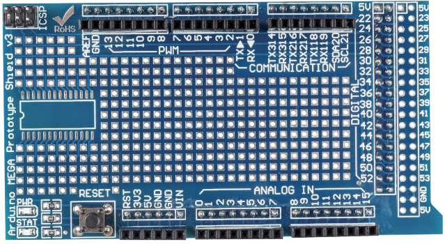

.. note:: 

    Hola, ¡bienvenido a la comunidad de entusiastas de SunFounder Raspberry Pi, Arduino y ESP32 en Facebook! Profundiza en Raspberry Pi, Arduino y ESP32 junto a otros entusiastas.

    **¿Por qué unirse?**

    - **Soporte de expertos**: Resuelve problemas posventa y desafíos técnicos con ayuda de nuestra comunidad y equipo.
    - **Aprende y Comparte**: Intercambia consejos y tutoriales para mejorar tus habilidades.
    - **Avances exclusivos**: Accede anticipadamente a anuncios de nuevos productos y adelantos.
    - **Descuentos especiales**: Disfruta de descuentos exclusivos en nuestros productos más recientes.
    - **Promociones y sorteos festivos**: Participa en sorteos y promociones especiales por festividades.

    👉 ¿Listo para explorar y crear con nosotros? Haz clic en [|link_sf_facebook|] y únete hoy mismo.

.. _cpn_prototype:

Protoboard
===========================

El protoboard facilita el diseño de circuitos personalizados. Puedes soldar 
componentes en el área de prototipos para crear tu proyecto o usarlo con una 
pequeña protoboard para probar rápidamente ideas de circuitos sin necesidad de 
soldadura. Tiene conexiones adicionales para todos los pines de E/S de Arduino 
y espacio para montar circuitos integrados de orificio pasante y de montaje en 
superficie. Es una forma conveniente de convertir tu circuito personalizado y 
Arduino en un solo módulo.

**Especificaciones**

-  Puede superponerse directamente en la placa Sunfounder Mega2560. Se proporciona 
   una pequeña protoboard que puedes usar para realizar algunos experimentos sencillos.

-  Incluye una huella para SOP28.

-  Tiene conexiones adicionales para todos los pines de E/S de Arduino.

-  Ofrecemos una almohadilla de conexión para los pines 22-53 que puedes utilizar 
   para soldar componentes directamente.
