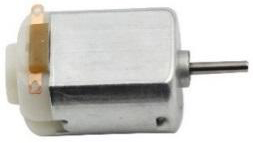

.. note::

    Bonjour et bienvenue dans la communauté des passionnés de Raspberry Pi, Arduino et ESP32 sur Facebook, animée par SunFounder ! Plongez plus profondément dans l'univers du Raspberry Pi, Arduino et ESP32 avec d'autres passionnés.

    **Pourquoi nous rejoindre ?**

    - **Support d'experts** : Résolvez vos problèmes après-vente et défis techniques grâce à l'aide de notre communauté et de notre équipe.
    - **Apprendre et partager** : Échangez des astuces et des tutoriels pour développer vos compétences.
    - **Aperçus exclusifs** : Bénéficiez d'un accès anticipé aux annonces de nouveaux produits et aperçus exclusifs.
    - **Réductions spéciales** : Profitez de réductions exclusives sur nos produits les plus récents.
    - **Promotions festives et concours** : Participez à des concours et promotions pendant les fêtes.

    👉 Prêt à explorer et créer avec nous ? Cliquez sur [|link_sf_facebook|] et rejoignez-nous dès aujourd'hui !

.. _cpn_motor:

DC Motor
===================

Voici un moteur à courant continu (DC) de 3V. Lorsque vous appliquez un niveau haut et un niveau bas aux deux bornes, il commence à tourner.

* **Dimensions** : 25*20*15MM
* **Tension de fonctionnement** : 1-6V
* **Courant à vide** (3V) : 70mA
* **Vitesse à vide** (3V) : 13000 RPM
* **Courant de blocage** (3V) : 800mA
* **Diamètre de l'arbre** : 2mm

Un moteur à courant continu (DC) est un actionneur continu qui convertit l'énergie électrique en énergie mécanique. Les moteurs à courant continu font fonctionner des pompes rotatives, des ventilateurs, des compresseurs, des impulsions et d'autres dispositifs en produisant une rotation angulaire continue.

Un moteur à courant continu se compose de deux parties : la partie fixe du moteur, appelée **stator**, et la partie interne du moteur, appelée **rotor** (ou **armature** d'un moteur DC), qui tourne pour produire le mouvement. 
L'élément clé pour générer le mouvement est de positionner l'armature à l'intérieur du champ magnétique du aimant permanent (dont le champ s'étend du pôle nord au pôle sud). L'interaction du champ magnétique et des particules chargées en mouvement (le fil conducteur qui génère le champ magnétique) produit le couple qui fait tourner l'armature.

.. image:: img/motor_sche.png
    :align: center

Le courant circule du terminal positif de la batterie à travers le circuit, passant par les balais en cuivre vers le collecteur, puis jusqu'à l'armature.
Mais en raison des deux intervalles dans le collecteur, ce flux s'inverse au milieu de chaque rotation complète.
Cette inversion continue convertit essentiellement l'énergie DC de la batterie en AC, permettant à l'armature de subir un couple dans la bonne direction au bon moment pour maintenir la rotation.

* `DC Motor - MagLab <https://nationalmaglab.org/education/magnet-academy/watch-play/interactive/dc-motor>`_

**Exemple**

* :ref:`ar_motor` (Arduino Project)
* :ref:`rotating_fan` (Scratch Project)