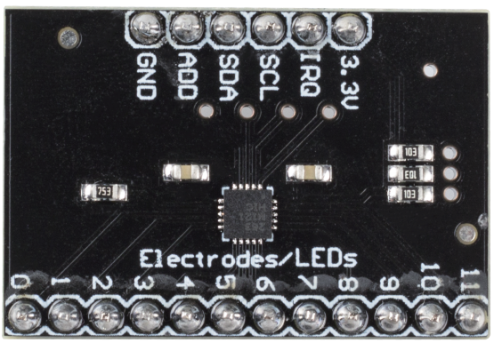

.. _cpn_mpr121:

MPR121
===========================

* **3.3V**: Stromversorgung
* **IRQ**: Open-Collector-Interrupt-Ausgangspin, aktiv niedrig
* **SCL**: I2C-Uhr
* **SDA**: I2C-Daten
* **HINZUFÜGEN**: I2C-Adresse Wählen Sie den Eingangs-Pin aus. Verbinden Sie den ADDR-Pin mit der VSS-, VDD-, SDA- oder SCL-Leitung, die resultierenden I2C-Adressen sind 0x5A, 0x5B, 0x5C bzw. 0x5D
* **GND**: Masse
* **0~11**: Elektrode 0~11, Elektrode ist ein Berührungssensor. Typischerweise können Elektroden nur ein Stück Metall oder ein Draht sein. Aber manchmal, abhängig von der Länge unseres Drahtes oder dem Material, auf dem sich die Elektrode befindet, kann es das Auslösen des Sensors erschweren. Aus diesem Grund können Sie mit dem MPR121 konfigurieren, was zum Triggern und Detriggern einer Elektrode erforderlich ist.

**MPR121 ÜBERSICHT**

Der MPR121 ist der kapazitive Berührungssensor-Controller der zweiten Generation nach der ersten Veröffentlichung der Geräte der MPR03x-Serie. Der MPR121 verfügt über eine erhöhte interne Intelligenz, einige der wichtigsten Ergänzungen umfassen eine erhöhte Elektrodenanzahl, eine hardwarekonfigurierbare I2C-Adresse, ein erweitertes Filtersystem mit Entprellung und vollständig unabhängige Elektroden mit integrierter automatischer Konfiguration. Das Gerät verfügt auch über eine 13. simulierte Erfassung Dedizierter Kanal für die Näherungserkennung unter Verwendung der Multiplex-Erfassungseingänge.

* `MPR121 Datenblatt <https://cdn-shop.adafruit.com/datasheets/MPR121.pdf>`_

**Merkmale**

* Betrieb mit geringer Leistung
    * 1.71 V bis 3.6 V Versorgungsbetrieb
    * 29 μA Versorgungsstrom bei 16 ms Abtastintervall

    * 3 μA Strom im Stoppmodus

* 12 Kapazitätserfassungseingänge
    * 8 Eingänge sind multifunktional für LED-Treiber und GPIO

* Vollständige Berührungserkennung
    * Automatische Konfiguration für jeden Sensoreingang
    * Automatische Kalibrierung für jeden Sensoreingang
    * Berührungs-/Freigabeschwelle und Entprellung für die Berührungserkennung

* I2C-Schnittstelle, mit Interrupt-Ausgang
* 3 mm x 3 mm x 0,65 mm 20-poliges QFN-Gehäuse
* -40 °C bis +85 °C Betriebstemperaturbereich

**Beispiel**

* :ref:`ar_mpr121` (Arduino-Projekt)