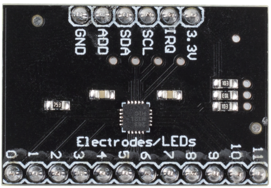

.. note::

    Bonjour et bienvenue dans la communauté des passionnés de Raspberry Pi, Arduino et ESP32 sur Facebook, animée par SunFounder ! Plongez plus profondément dans l'univers du Raspberry Pi, Arduino et ESP32 avec d'autres passionnés.

    **Pourquoi nous rejoindre ?**

    - **Support d'experts** : Résolvez vos problèmes après-vente et défis techniques grâce à l'aide de notre communauté et de notre équipe.
    - **Apprendre et partager** : Échangez des astuces et des tutoriels pour développer vos compétences.
    - **Aperçus exclusifs** : Bénéficiez d'un accès anticipé aux annonces de nouveaux produits et aperçus exclusifs.
    - **Réductions spéciales** : Profitez de réductions exclusives sur nos produits les plus récents.
    - **Promotions festives et concours** : Participez à des concours et promotions pendant les fêtes.

    👉 Prêt à explorer et créer avec nous ? Cliquez sur [|link_sf_facebook|] et rejoignez-nous dès aujourd'hui !

.. _cpn_mpr121:

MPR121
===========================

* **3.3V** : Alimentation
* **IRQ** : Pin de sortie d'interruption à collecteur ouvert, actif à faible niveau
* **SCL** : Horloge I2C
* **SDA** : Données I2C
* **ADD** : Pin de sélection de l'adresse I2C. Connectez la broche ADDR à la ligne VSS, VDD, SDA ou SCL. Les adresses I2C résultantes seront respectivement 0x5A, 0x5B, 0x5C et 0x5D.
* **GND** : Masse
* **0~11** : Électrodes 0~11, une électrode est un capteur tactile. En général, les électrodes peuvent être simplement un morceau de métal ou un fil. Cependant, selon la longueur de notre fil ou le matériau sur lequel l'électrode est fixée, il peut être difficile de déclencher le capteur. Pour cette raison, le MPR121 vous permet de configurer ce qui est nécessaire pour activer ou désactiver une électrode.

**APERÇU DU MPR121**

Le MPR121 est le contrôleur de capteurs tactiles capacitatifs de deuxième 
génération, successeur de la série MPR03x. Le MPR121 intègre une intelligence 
interne accrue, avec plusieurs ajouts majeurs, tels qu'une augmentation du 
nombre d'électrodes, une adresse I2C configurable matériellement, un système 
de filtrage étendu avec anti-rebond et des électrodes entièrement indépendantes 
avec configuration automatique. L'appareil dispose également d'un 13e canal de 
détection simulée, dédié à la détection de proximité, utilisant les entrées de 
détection multiplexées.

* `MPR121 Datasheet <https://cdn-shop.adafruit.com/datasheets/MPR121.pdf>`_

**Caractéristiques**

* Fonctionnement à faible consommation
    • Alimentation de 1,71 V à 3,6 V
    • Consommation de 29 μA avec un intervalle d'échantillonnage de 16 ms
    • Consommation en mode arrêt : 3 μA
* 12 entrées de détection capacitive
    • 8 entrées multifonction pour pilotes LED et GPIO
* Détection complète du toucher
    • Configuration automatique pour chaque entrée de détection
    • Calibration automatique pour chaque entrée de détection
    • Seuils de détection du toucher/déclenchement et anti-rebond pour la détection tactile
* Interface I2C, avec sortie d'interruption
* Boîtier QFN de 20 broches, 3 mm x 3 mm x 0,65 mm
* Température de fonctionnement : de -40°C à +85°C

**Exemple**

* :ref:`ar_mpr121` (Arduino Project)