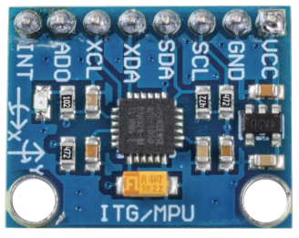

.. _cpn_mpu6050:

MPU6050-Modul
===================

Das MPU-6050 ist ein 6-Achsen-Bewegungsverfolgungsgerät (kombiniert 3-Achsen-Gyroskop, 3-Achsen-Beschleunigungsmesser).

Seine drei Koordinatensysteme sind wie folgt definiert:

Legen Sie MPU6050 flach auf den Tisch, stellen Sie sicher, dass die Seite mit dem Etikett nach oben zeigt und ein Punkt auf dieser Oberfläche sich in der oberen linken Ecke befindet. Dann ist die senkrechte Richtung nach oben die z-Achse des Chips. Die Richtung von links nach rechts wird als X-Achse betrachtet. Dementsprechend wird die Richtung von hinten nach vorne als Y-Achse definiert.

.. image:: img/mpu223.png

**3-Achsen-Beschleunigungsmesser**

Der Beschleunigungsmesser arbeitet nach dem Prinzip des piezoelektrischen Effekts, der Fähigkeit bestimmter Materialien, als Reaktion auf angelegte mechanische Belastung eine elektrische Ladung zu erzeugen.

Stellen Sie sich hier eine quaderförmige Schachtel vor, in der sich eine kleine Kugel befindet, wie im Bild oben. Die Wände dieser Box bestehen aus piezoelektrischen Kristallen. Immer wenn Sie die Kiste kippen, wird die Kugel aufgrund der Schwerkraft gezwungen, sich in Richtung der Neigung zu bewegen. Die Wand, mit der die Kugel kollidiert, erzeugt winzige piezoelektrische Ströme. In einem Quader gibt es insgesamt drei Paare gegenüberliegender Wände. Jedes Paar entspricht einer Achse im 3D-Raum: X-, Y- und Z-Achse. Abhängig vom Strom, der von den piezoelektrischen Wänden erzeugt wird, können wir die Richtung der Neigung und ihre Größe bestimmen.

.. image:: img/mpu224.png

Wir können die MPU6050 verwenden, um ihre Beschleunigung auf jeder Koordinatenachse zu erfassen (im stationären Desktop-Zustand beträgt die Beschleunigung der Z-Achse 1 Gravitationseinheit und die X- und Y-Achse sind 0). Bei Schräglage oder schwerelosem/übergewichtigem Zustand verändert sich der entsprechende Messwert.

Es gibt vier Arten von Messbereichen, die programmgesteuert ausgewählt werden können: +/-2 g, +/-4 g, +/-8 g und +/-16 g (standardmäßig 2 g) entsprechend jeder Genauigkeit. Die Werte reichen von -32768 bis 32767.

Der Messwert des Beschleunigungsmessers wird in einen Beschleunigungswert umgewandelt, indem der Messwert vom Lesebereich auf den Messbereich abgebildet wird.

    Beschleunigung = (Rohdaten der Beschleunigungsmesserachse / 65536 * vollständiger Beschleunigungsbereich) g

Nehmen Sie die X-Achse als Beispiel, wenn die Rohdaten der Beschleunigungsmesser-X-Achse 16384 betragen und der Bereich als +/-2 g ausgewählt ist:

    Beschleunigung entlang der X-Achse = (16384 / 65536 * 4) g = 1 g

**3-Achsen-Gyroskop**

Gyroskope arbeiten nach dem Prinzip der Coriolis-Beschleunigung. Stellen Sie sich vor, dass es eine gabelartige Struktur gibt, die sich in ständiger Hin- und Herbewegung befindet. Es wird mit piezoelektrischen Kristallen an Ort und Stelle gehalten. Wann immer Sie versuchen, diese Anordnung zu kippen, erfahren die Kristalle eine Kraft in Neigungsrichtung. Dies wird durch die Trägheit der sich bewegenden Gabel verursacht. Die Kristalle erzeugen somit einen Strom im Einklang mit dem piezoelektrischen Effekt, und dieser Strom wird verstärkt.

.. image:: img/mpu225.png

Das Gyroskop hat auch vier Arten von Messbereichen: +/- 250, +/- 500, +/- 1000, +/- 2000. Die Berechnungsmethode und die Beschleunigung sind grundsätzlich konsistent.

Die Formel zur Umrechnung des Messwerts in Winkelgeschwindigkeit lautet wie folgt:

    Winkelgeschwindigkeit = (Rohdaten der Kreiselachse / 65536 * vollständiger Kreiselbereich) °/s

Die X-Achse, zum Beispiel, die Rohdaten der X-Achse des Beschleunigungsmessers sind 16384 und reichen von + / - 250 ° / s:

    Winkelgeschwindigkeit entlang der X-Achse = (16384 / 65536 * 500)°/s =125°/s

**Beispiel**

* :ref:`ar_mpu6050` (Arduino-Projekt)